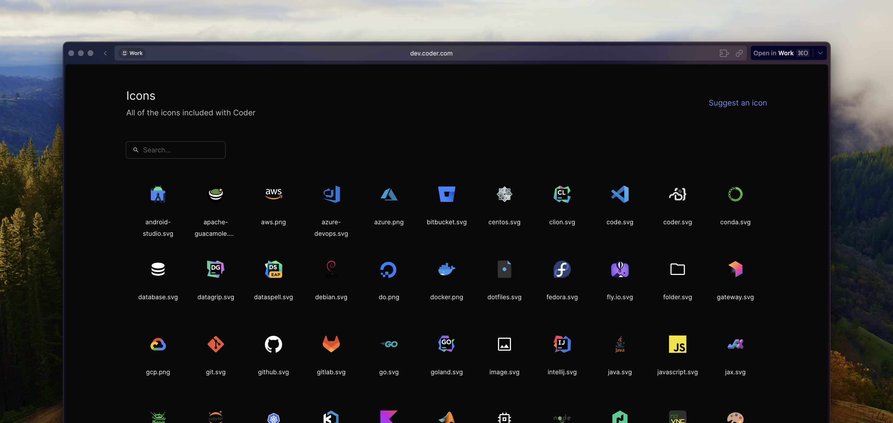

# Icons

Coder uses icons in several places, including ones that can be configured
throughout the app, or specified in your Terraform. They're specified by a URL,
which can be to an image hosted on a CDN of your own, or one of the icons that
come bundled with your Coder deployment.

- **Template Icons**:

  - Make templates and workspaces visually recognizable with a relevant or
    memorable icon

- [**Terraform**](https://registry.terraform.io/providers/coder/coder/latest/docs):

  - [`coder_app`](https://registry.terraform.io/providers/coder/coder/latest/docs/resources/app#icon-1)
  - [`coder_parameter`](https://registry.terraform.io/providers/coder/coder/latest/docs/data-sources/parameter#icon-1)
    and
    [`option`](https://registry.terraform.io/providers/coder/coder/latest/docs/data-sources/parameter#nested-schema-for-option)
    blocks
  - [`coder_script`](https://registry.terraform.io/providers/coder/coder/latest/docs/resources/script#icon-1)
  - [`coder_metadata`](https://registry.terraform.io/providers/coder/coder/latest/docs/resources/metadata#icon-1)

  These can all be configured to use an icon by setting the `icon` field.

  ```tf
  data "coder_parameter" "my_parameter" {
    icon = "/icon/coder.svg"

    option {
      icon = "/emojis/1f3f3-fe0f-200d-26a7-fe0f.png"
    }
  }
  ```

- [**Authentication Providers**](https://coder.com/docs/admin/external-auth):

  - Use icons for external authentication providers to make them recognizable.
    You can set an icon for each provider by setting the
    `CODER_EXTERNAL_AUTH_X_ICON` environment variable, where `X` is the number
    of the provider.

    ```env
    CODER_EXTERNAL_AUTH_0_ICON=/icon/github.svg
    CODER_EXTERNAL_AUTH_1_ICON=/icon/google.svg
    ```

- [**Support Links**](../../setup/appearance.md#support-links):

  - Use icons for support links to make them recognizable. You can set the
    `icon` field for each link in `CODER_SUPPORT_LINKS` array.

## Bundled icons

Coder is distributed with a bundle of icons for popular cloud providers and
programming languages. You can see all of the icons (or suggest new ones) in our
repository on
[GitHub](https://github.com/coder/coder/tree/main/site/static/icon).

You can also view the entire list, with search and previews, by navigating to
`/icons` on your Coder deployment (for example,
`https://coder.example.com/icons`). This can be particularly useful in airgapped
deployments.



## External icons

You can use any image served over HTTPS as an icon, by specifying the full URL
of the image. We recommend that you use a CDN that you control, but it can be
served from any source that you trust.

You can also embed an image by using data: URLs.

- Only the https: and data: protocols are supported in icon URLs (not http:)

- Be careful when using images hosted by someone else; they might disappear or
  change!

- Be careful when using data: URLs. They can get rather large, and can
  negatively impact loading times for pages and queries they appear in. Only use
  them for very small icons that compress well.
