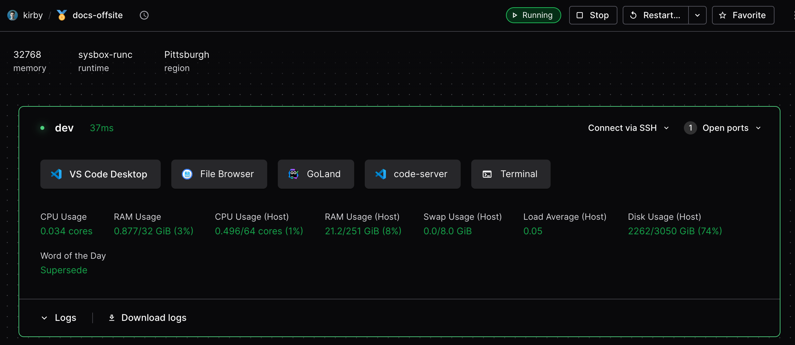
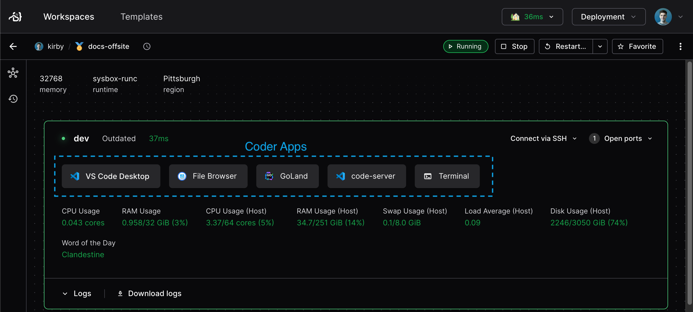

# Extending templates

There are a variety of Coder-native features to extend the configuration of your
development environments. Many of the following features are defined in your
templates using the
[Coder Terraform provider](https://registry.terraform.io/providers/coder/coder/latest/docs).
The provider docs will provide code examples for usage; alternatively, you can
view our
[example templates](https://github.com/coder/coder/tree/main/examples/templates)
to get started.

## Workspace agents

For users to connect to a workspace, the template must include a
[`coder_agent`](https://registry.terraform.io/providers/coder/coder/latest/docs/resources/agent).
The associated agent will facilitate
[workspace connections](../../../user-guides/workspace-access/index.md) via SSH,
port forwarding, and IDEs. The agent may also display real-time
[workspace metadata](./agent-metadata.md) like resource usage.

```tf
resource "coder_agent" "dev" {
  os   = "linux"
  arch = "amd64"
  dir  = "/workspace"
  display_apps {
    vscode = true
  }
}
```

You can also leverage [resource metadata](./resource-metadata.md) to display
static resource information from your template.

Templates must include some computational resource to start the agent. All
processes on the workspace are then spawned from the agent. It also provides all
information displayed in the dashboard's workspace view.



Multiple agents may be used in a single template or even a single resource. Each
agent may have its own apps, startup script, and metadata. This can be used to
associate multiple containers or VMs with a workspace.

## Resource persistence

The resources you define in a template may be _ephemeral_ or _persistent_.
Persistent resources stay provisioned when workspaces are stopped, where as
ephemeral resources are destroyed and recreated on restart. All resources are
destroyed when a workspace is deleted.

> You can read more about how resource behavior and workspace state in the
> [workspace lifecycle documentation](../../../user-guides/workspace-lifecycle.md).

Template resources follow the
[behavior of Terraform resources](https://developer.hashicorp.com/terraform/language/resources/behavior#how-terraform-applies-a-configuration)
and can be further configured  using the
[lifecycle argument](https://developer.hashicorp.com/terraform/language/meta-arguments/lifecycle).

A common configuration is a template whose only persistent resource is the home
directory. This allows the developer to retain their work while ensuring the
rest of their environment is consistently up-to-date on each workspace restart.

When a workspace is deleted, the Coder server essentially runs a
[terraform destroy](https://www.terraform.io/cli/commands/destroy) to remove all
resources associated with the workspace.

> Terraform's
> [prevent-destroy](https://www.terraform.io/language/meta-arguments/lifecycle#prevent_destroy)
> and
> [ignore-changes](https://www.terraform.io/language/meta-arguments/lifecycle#ignore_changes)
> meta-arguments can be used to prevent accidental data loss.

## Coder apps

Additional IDEs, documentation, or services can be associated to your workspace
using the
[`coder_app`](https://registry.terraform.io/providers/coder/coder/latest/docs/resources/app)
resource.



Note that some apps are associated to the agent by default as
[`display_apps`](https://registry.terraform.io/providers/coder/coder/latest/docs/resources/agent#nested-schema-for-display_apps)
and can be hidden directly in the
[`coder_agent`](https://registry.terraform.io/providers/coder/coder/latest/docs/resources/agent)
resource. You can arrange the display orientation of Coder apps in your template
using [resource ordering](./resource-ordering.md).

Check out our [module registry](https://registry.coder.com/modules) for
additional Coder apps from the team and our OSS community.

<children></children>
