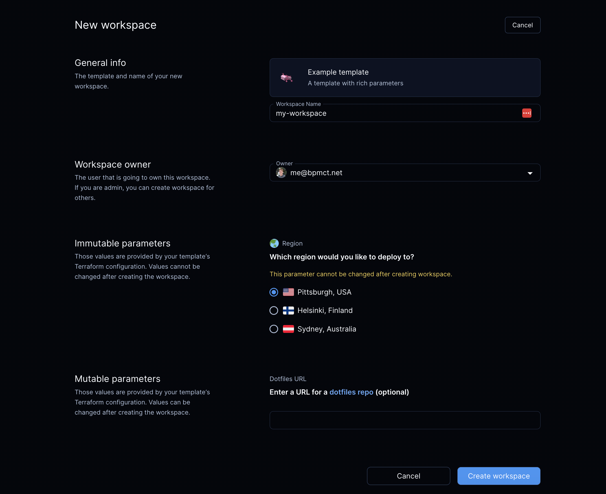
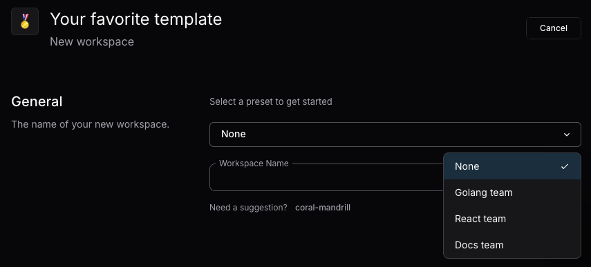

# Parameters

A template can prompt the user for additional information when creating
workspaces with
[_parameters_](https://registry.terraform.io/providers/coder/coder/latest/docs/data-sources/parameter).



The user can set parameters in the dashboard UI and CLI.

You'll likely want to hardcode certain template properties for workspaces, such
as security group. But you can let developers specify other properties with
parameters like instance size, geographical location, repository URL, etc.

This example lets a developer choose a Docker host for the workspace:

```tf
data "coder_parameter" "docker_host" {
  name        = "Region"
  description = "Which region would you like to deploy to?"
  icon        = "/emojis/1f30f.png"
  type        = "string"
  default     = "tcp://100.94.74.63:2375"

  option {
    name = "Pittsburgh, USA"
    value = "tcp://100.94.74.63:2375"
    icon = "/emojis/1f1fa-1f1f8.png"
  }

  option {
    name = "Helsinki, Finland"
    value = "tcp://100.117.102.81:2375"
    icon = "/emojis/1f1eb-1f1ee.png"
  }

  option {
    name = "Sydney, Australia"
    value = "tcp://100.127.2.1:2375"
    icon = "/emojis/1f1e6-1f1f9.png"
  }
}
```

From there, a template can refer to a parameter's value:

```tf
provider "docker" {
  host = data.coder_parameter.docker_host.value
}
```

## Types

A Coder parameter can have one of these types:

- `string`
- `bool`
- `number`
- `list(string)`

To specify a default value for a parameter with the `list(string)` type, use a
JSON array and the Terraform
[jsonencode](https://developer.hashicorp.com/terraform/language/functions/jsonencode)
function. For example:

```tf
data "coder_parameter" "security_groups" {
  name        = "Security groups"
  icon        = "/icon/aws.png"
  type        = "list(string)"
  description = "Select appropriate security groups."
  mutable     = true
  default = jsonencode([
    "Web Server Security Group",
    "Database Security Group",
    "Backend Security Group"
  ])
}
```

> [!NOTE]
> Overriding a `list(string)` on the CLI is tricky because:
>
> - `--parameter "parameter_name=parameter_value"` is parsed as CSV.
> - `parameter_value` is parsed as JSON.
>
> So, to properly specify a `list(string)` with the `--parameter` CLI argument,
> you will need to take care of both CSV quoting and shell quoting.
>
> For the above example, to override the default values of the `security_groups`
> parameter, you will need to pass the following argument to `coder create`:
>
> ```shell
> --parameter "\"security_groups=[\"\"DevOps Security Group\"\",\"\"Backend Security Group\"\"]\""
> ```
>
> Alternatively, you can use `--rich-parameter-file` to work around the above
> issues. This allows you to specify parameters as YAML. An equivalent parameter
> file for the above `--parameter` is provided below:
>
> ```yaml
> security_groups:
>   - DevOps Security Group
>   - Backend Security Group
> ```

## Options

A `string` parameter can provide a set of options to limit the user's choices:

```tf
data "coder_parameter" "docker_host" {
  name        = "Region"
  description = "Which region would you like to deploy to?"
  type        = "string"
  default     = "tcp://100.94.74.63:2375"

  option {
    name = "Pittsburgh, USA"
    value = "tcp://100.94.74.63:2375"
    icon = "/emojis/1f1fa-1f1f8.png"
  }

  option {
    name = "Helsinki, Finland"
    value = "tcp://100.117.102.81:2375"
    icon = "/emojis/1f1eb-1f1ee.png"
  }

  option {
    name = "Sydney, Australia"
    value = "tcp://100.127.2.1:2375"
    icon = "/emojis/1f1e6-1f1f9.png"
  }
}
```

### Incompatibility in Parameter Options for Workspace Builds

When creating Coder templates, authors have the flexibility to modify parameter
options associated with rich parameters. Such modifications can involve adding,
substituting, or removing a parameter option. It's important to note that making
these changes can lead to discrepancies in parameter values utilized by ongoing
workspace builds.

Consequently, workspace users will be prompted to select the new value from a
pop-up window or by using the command-line interface. While this additional
interactive step might seem like an interruption, it serves a crucial purpose.
It prevents workspace users from becoming trapped with outdated template
versions, ensuring they can smoothly update their workspace without any
hindrances.

Example:

- Bob creates a workspace using the `python-dev` template. This template has a
  parameter `image_tag`, and Bob selects `1.12`.
- Later, the template author Alice is notified of a critical vulnerability in a
  package installed in the `python-dev` template, which affects the image tag
  `1.12`.
- Alice remediates this vulnerability, and pushes an updated template version
  that replaces option `1.12` with `1.13` for the `image_tag` parameter. She
  then notifies all users of that template to update their workspace
  immediately.
- Bob saves their work, and selects the `Update` option in the UI. As their
  workspace uses the now-invalid option `1.12`, for the `image_tag` parameter,
  they are prompted to select a new value for `image_tag`.

## Required and optional parameters

A parameter is _required_ if it doesn't have the `default` property. The user
**must** provide a value to this parameter before creating a workspace:

```tf
data "coder_parameter" "account_name" {
  name        = "Account name"
  description = "Cloud account name"
  mutable     = true
}
```

If a parameter contains the `default` property, Coder will use this value if the
user does not specify any:

```tf
data "coder_parameter" "base_image" {
  name        = "Base image"
  description = "Base machine image to download"
  default     = "ubuntu:latest"
}
```

Admins can also set the `default` property to an empty value so that the
parameter field can remain empty:

```tf
data "coder_parameter" "dotfiles_url" {
  name        = "dotfiles URL"
  description = "Git repository with dotfiles"
  mutable     = true
  default     = ""
}
```

## Mutability

Immutable parameters can only be set in these situations:

- Creating a workspace for the first time.
- Updating a workspace to a new template version. This sets the initial value
  for required parameters.

The idea is to prevent users from modifying fragile or persistent workspace
resources like volumes, regions, and so on.

Example:

```tf
data "coder_parameter" "region" {
  name        = "Region"
  description = "Region where the workspace is hosted"
  mutable     = false
  default     = "us-east-1"
}
```

You can modify a parameter's `mutable` attribute state anytime. In case of
emergency, you can temporarily allow for changing immutable parameters to fix an
operational issue, but it is not advised to overuse this opportunity.

## Ephemeral parameters

Ephemeral parameters are introduced to users in order to model specific
behaviors in a Coder workspace, such as reverting to a previous image, restoring
from a volume snapshot, or building a project without using cache. These
parameters are only settable when starting, updating, or restarting a workspace
and do not persist after the workspace is stopped.

Since these parameters are ephemeral in nature, subsequent builds proceed in the
standard manner:

```tf
data "coder_parameter" "force_rebuild" {
  name         = "force_rebuild"
  type         = "bool"
  description  = "Rebuild the Docker image rather than use the cached one."
  mutable      = true
  default      = false
  ephemeral    = true
}
```

## Validating parameters

Coder supports rich parameters with multiple validation modes: min, max,
monotonic numbers, and regular expressions.

### Number

You can limit a `number` parameter to `min` and `max` boundaries.

You can also specify its monotonicity as `increasing` or `decreasing` to verify
the current and new values. Use the `monotonic` attribute for resources that
can't be shrunk or grown without implications, like disk volume size.

```tf
data "coder_parameter" "instances" {
  name        = "Instances"
  type        = "number"
  description = "Number of compute instances"
  validation {
    min       = 1
    max       = 8
    monotonic = "increasing"
  }
}
```

It is possible to override the default `error` message for a `number` parameter,
along with its associated `min` and/or `max` properties. The following message
placeholders are available `{min}`, `{max}`, and `{value}`.

```tf
data "coder_parameter" "instances" {
  name        = "Instances"
  type        = "number"
  description = "Number of compute instances"
  validation {
    min       = 1
    max       = 4
    error     = "Sorry, we can't provision too many instances - maximum limit: {max}, wanted: {value}."
  }
}
```

> [!NOTE]
> As of
> [`terraform-provider-coder` v0.19.0](https://registry.terraform.io/providers/coder/coder/0.19.0/docs),
> `options` can be specified in `number` parameters; this also works with
> validations such as `monotonic`.

### String

You can validate a `string` parameter to match a regular expression. The `regex`
property requires a corresponding `error` property.

```tf
data "coder_parameter" "project_id" {
  name        = "Project ID"
  description = "Alpha-numeric project ID"
  validation {
    regex = "^[a-z0-9]+$"
    error = "Unfortunately, this isn't a valid project ID"
  }
}
```

## Workspace presets (beta)

Workspace presets allow you to configure commonly used combinations of parameters
into a single option, which makes it easier for developers to pick one that fits
their needs.



Use `coder_workspace_preset` to define the preset parameters.
After you save the template file, the presets will be available for all new
workspace deployments.

<details><summary>Expand for an example</summary>

```tf
data "coder_workspace_preset" "goland-gpu" {
  name        = "GoLand with GPU"
  parameters = {
    "machine_type"  = "n1-standard-1"
    "attach_gpu"    = "true"
    "gcp_region"    = "europe-west4-c"
    "jetbrains_ide" = "GO"
  }
}

data "coder_parameter" "machine_type" {
  name          = "machine_type"
  display_name  = "Machine Type"
  type          = "string"
  default       = "n1-standard-2"
}

data "coder_parameter" "attach_gpu" {
  name          = "attach_gpu"
  display_name  = "Attach GPU?"
  type          = "bool"
  default       = "false"
}

data "coder_parameter" "gcp_region" {
  name          = "gcp_region"
  display_name  = "Machine Type"
  type          = "string"
  default       = "n1-standard-2"
}

data "coder_parameter" "jetbrains_ide" {
  name          = "jetbrains_ide"
  display_name  = "Machine Type"
  type          = "string"
  default       = "n1-standard-2"
}
```

</details>

## Create Autofill

When the template doesn't specify default values, Coder may still autofill
parameters.

You need to enable `auto-fill-parameters` first:

```shell
coder server --experiments=auto-fill-parameters
```
Or set the [environment variable](../../setup/index.md), `CODER_EXPERIMENTS=auto-fill-parameters`
With the feature enabled:

1. Coder will look for URL query parameters with form `param.<name>=<value>`.
   This feature enables platform teams to create pre-filled template creation
   links.
2. Coder will populate recently used parameter key-value pairs for the user.
   This feature helps reduce repetition when filling common parameters such as
   `dotfiles_url` or `region`.
