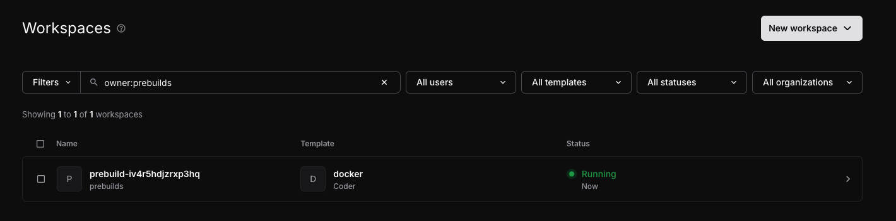
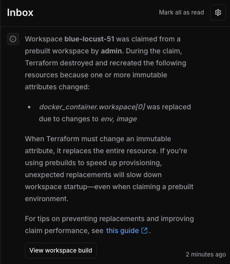

# Prebuilt workspaces (beta)

## Overview

Prebuilt workspaces let you pre-provision and maintain a pool of ready-to-claim workspaces.
When a developer requests a workspace matching a preset, Coder assigns an existing instance instead of creating a new
one, reducing setup time significantly.

## Prerequisites

- Premium license
- Use `coder/coder` Terraform provider `>= 2.3.0-pre2` in your template (**TODO: update with latest version**)
- Enable the `workspace-prebuilds` [experiment](https://coder.com/docs/reference/cli/server#--experiments)

## Configuration

1. In your Terraform template, add a `prebuilds` block within a `coder_workspace_preset` block:

   ```hcl
   data "coder_workspace_preset" "goland" {
     name = "GoLand: Large"
     parameters = {
       jetbrains_ide = "GO"
       cpus          = 8
       memory        = 16
     }
     prebuilds {
       instances = 3
     }
   }
   ```

2. Publish and import the template
3. An internal reconciliation loop maintains exactly the specified `instances` of prebuilt workspaces.

_This model of declarative configuration plus a reconciliation loop is similar to Kubernetes._

## Ownership

When prebuilt workspaces are created, they are owned by the pseudo-user `prebuilds`. This user has no permissions, and
is simply a mechanism to identify unclaimed prebuilt workspaces.

The `prebuilds` user is as a member of the `Everyone` group, and can be added to other groups.

## Viewing prebuilt workspaces

Given that prebuilt workspaces are just regular workspaces, you can view them in the **Workspaces** view in the
frontend:



## Claiming

A prebuilt workspace is automatically and transparently assigned to a user when the following occurs:

1. The user creates a new workspace via the API or the Coder web UI
2. The user selected a preset in #1 which has been configured for prebuilds
3. A prebuilt workspace is in eligible state

The ownership of the prebuilt workspace will change to the requesting user, and this is referred to as a "claim".

## Eligibility

When a prebuilt workspace is running, and its agent has completed all of its bootstrap procedures and executed its
startup scripts, the workspace will be marked eligible to be claimed.

## Relationship to workspace presets

[Workspace presets](https://coder.com/docs/admin/templates/extending-templates/parameters#workspace-presets-beta) allow
you to configure commonly used combinations of parameters into a single option, which makes it easier for developers to
pick one that fits
their needs.

Prebuilt workspaces need to have a preset defined to match the _base configuration_ of a workspace, i.e. the preset
needs to define all the required parameters needed to build a workspace. These parameters are necessary in order to
build workspaces in the background.

Parameters which are not required or not part of a preset can still be used with prebuilt workspaces. The preset defines
the minimum required set of parameters, and these are immutable.

## Invalidation

Prebuilt workspaces are _never_ updated after they are created.

Whenever a template version changes, all prebuilt workspaces relating to an inactive template version will be destroyed.
New prebuilt workspaces will be provisioned for the active template version.

Invalidating prebuilt workspaces is useful when your template version does not change but a referenced dependency does,
which is necessary for running an up-to-date workspace. For example, if
an [AMI](https://docs.aws.amazon.com/AWSEC2/latest/UserGuide/AMIs.html) which is referenced by your template is updated,
you can simply delete the prebuilt workspaces, and they will be recreated with the latest AMI.

_In future releases, we will allow operators to invalidate their prebuilt workspaces programmatically._

## Quotas

Prebuilt workspaces can be used in conjunction with [Resource Quotas](https://coder.com/docs/admin/users/quotas). Given
that all unclaimed prebuilt workspaces are [owned](#ownership) by the `prebuilds` user, you may configure a quota for
any group which this user appears in.

Once the quota is exceeded, prebuilt workspaces will fail provisioning like regular workspaces would.

## Current Limitations

### Organizations

Prebuilt workspaces can only be utilized by the default organization.

https://github.com/coder/internal/issues/364 is open to track this feature, and will be implemented in a future release.

### Autoscaling

Prebuilt workspaces will remain running indefinitely until they are claimed. We do not at present have an autoscaling
mechanism to reduce the number of instances after working hours.

https://github.com/coder/internal/issues/312 is open to track this feature, and will be implemented in a future release.

## Gotchas

### Resource Replacement

When a prebuilt workspace is created, it is initially [owned](#ownership) by the `prebuilds` user and a random name
is generated for it. When `terraform apply` runs, it will provide these values during provisioning in the
[`coder_workspace`](https://registry.terraform.io/providers/coder/coder/latest/docs/data-sources/workspace) and
[`coder_workspace_owner`](https://registry.terraform.io/providers/coder/coder/latest/docs/data-sources/workspace_owner)
datasources.

Once a prebuilt workspace is claimed, the ownership of that workspace changes to the requesting user and
`terraform apply` is run again, now with updated values for the aforementioned datasources.

If your template has used these datasources in immutable fields (i.e. the
[`user_data`](https://registry.terraform.io/providers/hashicorp/aws/latest/docs/resources/instance#user_data-1) field in
an `aws_instance` resource), Terraform will interpret these changes as _drift_ and will therefore destroy and recreate
the resource.

This is obviously undesirable because the prebuilt workspace will now have to provision _again_, while the user waits,
eliminating the value of the prior pre-provisioning.

Should this occur when a prebuilt workspace is claimed, all Template Admins will receive a notification which will
link them to the build logs to investigate which resource was being replaced.



To avoid this problem, you will need to add a `lifecycle` block to your resource:

```hcl
resource "docker_container" "workspace" {
  lifecycle {
    ignore_changes = all
  }

  count = data.coder_workspace.me.start_count
  name  = "coder-${data.coder_workspace_owner.me.name}-${lower(data.coder_workspace.me.name)}"
  ...
}
```

In the above example, the `docker_container` would be created with a `name` attribute which includes references to the
initial owner (i.e. `prebuilds`), and will never change - even when the values of `data.coder_workspace_owner.me.name`
and `data.coder_workspace.me.name` change in the above example. `name` is immutable like `user_data` above.

You can read more about `ignore_changes`
here: https://developer.hashicorp.com/terraform/language/meta-arguments/lifecycle#ignore_changes

Should certain mutable attributes be required to change, you can use a more targeted approach by providing a list of
attributes to `ignore_changes`:

```hcl
resource "docker_container" "workspace" {
  lifecycle {
    ignore_changes = [name]
  }

  count = data.coder_workspace.me.start_count
  name  = "coder-${data.coder_workspace_owner.me.name}-${lower(data.coder_workspace.me.name)}"
  ...
}
```

## Troubleshooting

### Metrics

- `coderd_prebuilt_workspaces_created_total` (counter): Total number of prebuilt workspaces that have been created to
  meet the desired instance count of each template preset
- `coderd_prebuilt_workspaces_failed_total` (counter): Total number of prebuilt workspaces that failed to build
- `coderd_prebuilt_workspaces_claimed_total` (counter): Total number of prebuilt workspaces which were claimed by users.
  Claiming refers to creating a workspace with a preset selected for which eligible prebuilt workspaces are available
  and one is reassigned to a user
- `coderd_prebuilt_workspaces_desired` (gauge): Target number of prebuilt workspaces that should be available for each
  template preset
- `coderd_prebuilt_workspaces_running` (gauge): Current number of prebuilt workspaces that are in a running state. These
  workspaces have started successfully but may not yet be claimable by users (see `coderd_prebuilt_workspaces_eligible`)
- `coderd_prebuilt_workspaces_eligible` (gauge): Current number of prebuilt workspaces that are eligible to be claimed
  by users. These are workspaces that have completed their build process with their agent reporting 'ready' status

### Logs

Search for `coderd.prebuilds:` to gain insight into the behaviour of the reconciliation loop
