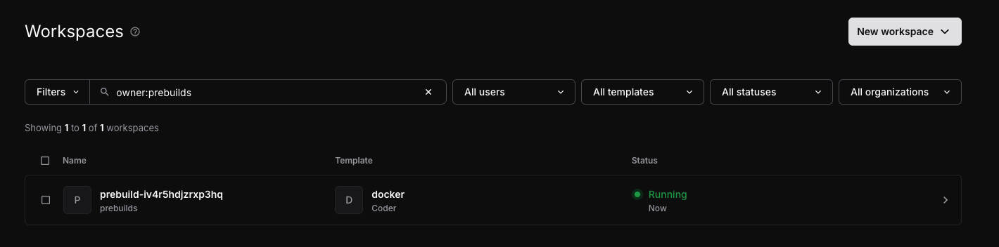
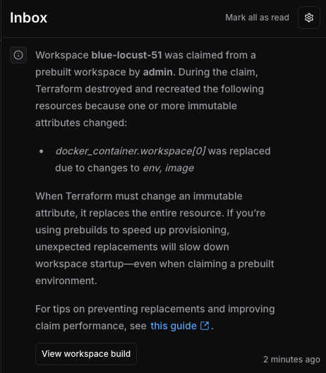

# Prebuilt workspaces

Prebuilt workspaces allow template administrators to improve the developer experience by reducing workspace
creation time with an automatically maintained pool of ready-to-use workspaces for specific parameter presets.

The template administrator configures a template to provision prebuilt workspaces in the background, and then when a developer creates
a new workspace that matches the preset, Coder assigns them an existing prebuilt instance.
Prebuilt workspaces significantly reduce wait times, especially for templates with complex provisioning or lengthy startup procedures.

Prebuilt workspaces are:

- Created and maintained automatically by Coder to match your specified preset configurations.
- Claimed transparently when developers create workspaces.
- Monitored and replaced automatically to maintain your desired pool size.

## Relationship to workspace presets

Prebuilt workspaces are tightly integrated with [workspace presets](./parameters.md#workspace-presets-beta):

1. Each prebuilt workspace is associated with a specific template preset.
1. The preset must define all required parameters needed to build the workspace.
1. The preset parameters define the base configuration and are immutable once a prebuilt workspace is provisioned.
1. Parameters that are not defined in the preset can still be customized by users when they claim a workspace.

## Prerequisites

- [**Premium license**](../../licensing/index.md)
- **Compatible Terraform provider**: Use `coder/coder` Terraform provider `>= 2.3.0-pre2`. (**TODO: update with latest version**)
- **Feature flag**: Enable the `workspace-prebuilds` [experiment](../../../reference/cli/server.md#--experiments).

## Enable prebuilt workspaces for template presets

In your template, add a `prebuilds` block within a `coder_workspace_preset` definition to identify the number of prebuilt
instances your Coder deployment should maintain:

   ```hcl
   data "coder_workspace_preset" "goland" {
     name = "GoLand: Large"
     parameters = {
       jetbrains_ide = "GO"
       cpus          = 8
       memory        = 16
     }
     prebuilds {
       instances = 3  # Number of prebuilt workspaces to maintain
     }
   }
   ```

After you publish a new template version, Coder will automatically provision and maintain prebuilt workspaces through an
internal reconciliation loop (similar to Kubernetes) to ensure the defined `instances` count are running.

## Prebuilt workspace lifecycle

Prebuilt workspaces follow a specific lifecycle from creation through eligibility to claiming.

1. After you configure a preset with prebuilds and publish the template, Coder provisions the prebuilt workspace(s).

   1. Coder automatically creates the defined `instances` count of prebuilt workspaces.
   1. Each new prebuilt workspace is initially owned by an unprivileged system pseudo-user named `prebuilds`.
      - The `prebuilds` user belongs to the `Everyone` group (you can add it to additional groups if needed).
   1. Each prebuilt workspace receives a randomly generated name for identification.
   1. The workspace is provisioned like a regular workspace; only its ownership distinguishes it as a prebuilt workspace.

1. Prebuilt workspaces start up and become eligible to be claimed by a developer.

   Before a prebuilt workspace is available to users:

   1. The workspace is provisioned.
   1. The agent starts up and connects to coderd.
   1. The agent starts its bootstrap procedures and completes its startup scripts.
   1. The agent reports `ready` status.

      After the agent reports `ready`, the prebuilt workspace considered eligible to be claimed.

   Prebuilt workspaces that fail during provisioning are retried with a backoff to prevent transient failures.

1. When a developer requests a new workspace, the claiming process occurs:

   1. Developer selects a template and preset that has prebuilt workspaces configured.
   1. If an eligible prebuilt workspace exists, ownership transfers from the `prebuilds` user to the requesting user.
   1. The workspace name changes to the user's requested name.
   1. `terraform apply` is executed using the new ownership details, which may affect the [`coder_workspace`](https://registry.terraform.io/providers/coder/coder/latest/docs/data-sources/workspace) and
      [`coder_workspace_owner`](https://registry.terraform.io/providers/coder/coder/latest/docs/data-sources/workspace_owner)
      datasources (see [Preventing resource replacement](#preventing-resource-replacement) for further considerations).

   The process is invisible to the developer - their workspace is ready faster than usual.

You can view available prebuilt workspaces in the **Workspaces** view in the Coder dashboard:


_Note the search term `owner:prebuilds`._

### Template updates and the prebuilt workspace lifecycle

Prebuilt workspaces are not updated after they are provisioned.

When a template's active version is updated:

1. Prebuilt workspaces for old versions are automatically deleted.
1. New prebuilt workspaces are created for the active template version.
1. If dependencies change (e.g., an [AMI](https://docs.aws.amazon.com/AWSEC2/latest/UserGuide/AMIs.html) update) without a template version change:
   - You may delete the existing prebuilt workspaces manually.
   - Coder will automatically create new prebuilt workspaces with the updated dependencies.

The system always maintains the desired number of prebuilt workspaces for the active template version.

## Administration and troubleshooting

### Managing resource quotas

Prebuilt workspaces can be used in conjunction with [resource quotas](../../users/quotas.md).
Because unclaimed prebuilt workspaces are owned by the `prebuilds` user, you can:

1. Configure quotas for any group that includes this user.
1. Set appropriate limits to balance prebuilt workspace availability with resource constraints.

If a quota is exceeded, the prebuilt workspace will fail provisioning the same way other workspaces do.

### Template configuration best practices

#### Preventing resource replacement

When a prebuilt workspace is claimed, another `terraform apply` run occurs with new values for the workspace owner and name.

This can cause issues in the following scenario:

1. The workspace is initially created with values from the `prebuilds` user and a random name.
1. After claiming, various workspace properties change (ownership, name, and potentially other values), which Terraform sees as configuration drift.
1. If these values are used in immutable fields, Terraform will destroy and recreate the resource, eliminating the benefit of prebuilds.

For example, when these values are used in immutable fields like the AWS instance `user_data`, you'll see resource replacement during claiming:



To prevent this, add a `lifecycle` block with `ignore_changes`:

```hcl
resource "docker_container" "workspace" {
  lifecycle {
    ignore_changes = all
  }

  count = data.coder_workspace.me.start_count
  name  = "coder-${data.coder_workspace_owner.me.name}-${lower(data.coder_workspace.me.name)}"
  ...
}
```

For more targeted control, specify which attributes to ignore:

```hcl
resource "docker_container" "workspace" {
  lifecycle {
    ignore_changes = [name]
  }

  count = data.coder_workspace.me.start_count
  name  = "coder-${data.coder_workspace_owner.me.name}-${lower(data.coder_workspace.me.name)}"
  ...
}
```

Learn more about `ignore_changes` in the [Terraform documentation](https://developer.hashicorp.com/terraform/language/meta-arguments/lifecycle#ignore_changes).

### Current limitations

The prebuilt workspaces feature has these current limitations:

- **Organizations**

  Prebuilt workspaces can only be used with the default organization.

  [coder/internal#364](https://github.com/coder/internal/issues/364)

- **Autoscaling**

  Prebuilt workspaces remain running until claimed. There's no automated mechanism to reduce instances during off-hours.

  [coder/internal#312](https://github.com/coder/internal/issues/312)

### Monitoring and observability

#### Available metrics

Coder provides several metrics to monitor your prebuilt workspaces:

- `coderd_prebuilt_workspaces_created_total` (counter): Total number of prebuilt workspaces created to meet the desired instance count.
- `coderd_prebuilt_workspaces_failed_total` (counter): Total number of prebuilt workspaces that failed to build.
- `coderd_prebuilt_workspaces_claimed_total` (counter): Total number of prebuilt workspaces claimed by users.
- `coderd_prebuilt_workspaces_desired` (gauge): Target number of prebuilt workspaces that should be available.
- `coderd_prebuilt_workspaces_running` (gauge): Current number of prebuilt workspaces in a `running` state.
- `coderd_prebuilt_workspaces_eligible` (gauge): Current number of prebuilt workspaces eligible to be claimed.

#### Logs

Search for `coderd.prebuilds:` in your logs to track the reconciliation loop's behavior.

These logs provide information about:

1. Creation and deletion attempts for prebuilt workspaces.
1. Backoff events after failed builds.
1. Claiming operations.
