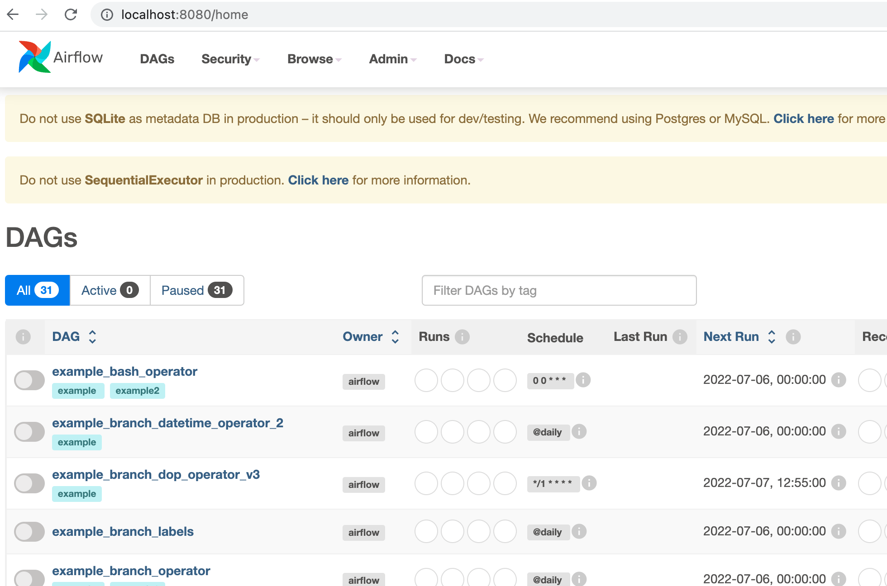
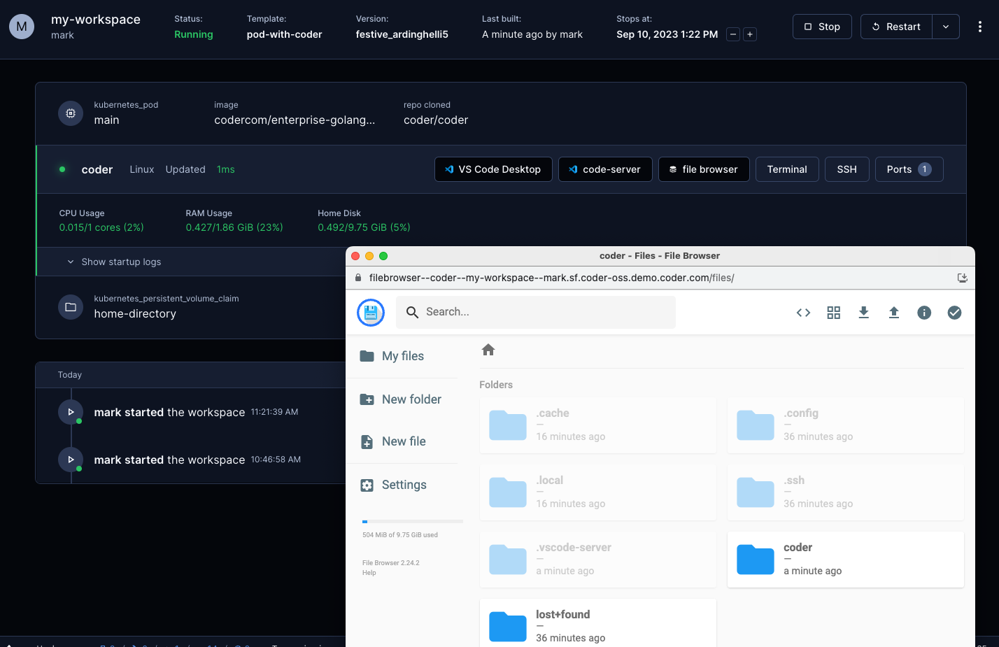

# Web IDEs

In Coder, web IDEs are defined as
[coder_app](https://registry.terraform.io/providers/coder/coder/latest/docs/resources/app)
resources in the template. With our generic model, any web application can be
used as a Coder application. For example:

```tf
# Add button to open Portainer in the workspace dashboard
# Note: Portainer must be already running in the workspace
resource "coder_app" "portainer" {
  agent_id      = coder_agent.main.id
  slug          = "portainer"
  display_name  = "Portainer"
  icon          = "https://simpleicons.org/icons/portainer.svg"
  url           = "https://localhost:9443/api/status"

  healthcheck {
    url       = "https://localhost:9443/api/status"
    interval  = 6
    threshold = 10
  }
}
```

## code-server

[code-server](https://github.com/coder/code-server) is our supported method of running
VS Code in the web browser. A simple way to install code-server in Linux/macOS
workspaces is via the Coder agent in your template:

```console
# edit your template
cd your-template/
vim main.tf
```

```tf
resource "coder_agent" "main" {
    arch           = "amd64"
    os             = "linux"
    startup_script = <<EOF
    #!/bin/sh
    # install code-server
    # add '-s -- --version x.x.x' to install a specific code-server version
    curl -fsSL https://code-server.dev/install.sh | sh -s -- --method=standalone --prefix=/tmp/code-server

    # start code-server on a specific port
    # authn is off since the user already authn-ed into the coder deployment
    # & is used to run the process in the background
    /tmp/code-server/bin/code-server --auth none --port 13337 &
    EOF
}
```

For advanced use, we recommend installing code-server in your VM snapshot or
container image. Here's a Dockerfile which leverages some special
[code-server features](https://coder.com/docs/code-server/):

```Dockerfile
FROM codercom/enterprise-base:ubuntu

# install the latest version
USER root
RUN curl -fsSL https://code-server.dev/install.sh | sh
USER coder

# pre-install VS Code extensions
RUN code-server --install-extension eamodio.gitlens

# directly start code-server with the agent's startup_script (see above),
# or use a process manager like supervisord
```

You'll also need to specify a `coder_app` resource related to the agent. This is
how code-server is displayed on the workspace page.

```tf
resource "coder_app" "code-server" {
  agent_id     = coder_agent.main.id
  slug         = "code-server"
  display_name = "code-server"
  url          = "http://localhost:13337/?folder=/home/coder"
  icon         = "/icon/code.svg"
  subdomain    = false

  healthcheck {
    url       = "http://localhost:13337/healthz"
    interval  = 2
    threshold = 10
  }

}
```


## VS Code Web

VS Code supports launching a local web client using the `code serve-web`
command. To add VS Code web as a web IDE, you have two options.

1. Install using the
   [vscode-web module](https://registry.coder.com/modules/vscode-web) from the
   coder registry.

   ```tf
   module "vscode-web" {
     source         = "registry.coder.com/modules/vscode-web/coder"
     version        = "1.0.14"
     agent_id       = coder_agent.main.id
     accept_license = true
   }
   ```

2. Install and start in your `startup_script` and create a corresponding
   `coder_app`

   ```tf
   resource "coder_agent" "main" {
       arch           = "amd64"
       os             = "linux"
       startup_script = <<EOF
       #!/bin/sh
       # install VS Code
       curl -Lk 'https://code.visualstudio.com/sha/download?build=stable&os=cli-alpine-x64' --output vscode_cli.tar.gz
       mkdir -p /tmp/vscode-cli
       tar -xf vscode_cli.tar.gz -C /tmp/vscode-cli
       rm vscode_cli.tar.gz
       # start the web server on a specific port
       /tmp/vscode-cli/code serve-web --port 13338 --without-connection-token  --accept-server-license-terms >/tmp/vscode-web.log 2>&1 &
       EOF
   }
   ```

   > `code serve-web` was introduced in version 1.82.0 (August 2023).

   You also need to add a `coder_app` resource for this.

   ```tf
   # VS Code Web
   resource "coder_app" "vscode-web" {
     agent_id     = coder_agent.coder.id
     slug         = "vscode-web"
     display_name = "VS Code Web"
     icon         = "/icon/code.svg"
     url          = "http://localhost:13338?folder=/home/coder"
     subdomain    = true  # VS Code Web does currently does not work with a subpath https://github.com/microsoft/vscode/issues/192947
     share        = "owner"
   }
   ```

## Jupyter Notebook

To use Jupyter Notebook in your workspace, you can install it by using the
[Jupyter Notebook module](https://registry.coder.com/modules/jupyter-notebook)
from the Coder registry:

```tf
module "jupyter-notebook" {
  source   = "registry.coder.com/modules/jupyter-notebook/coder"
  version  = "1.0.19"
  agent_id = coder_agent.example.id
}
```


## JupyterLab

Configure your agent and `coder_app` like so to use Jupyter. Notice the
`subdomain=true` configuration:

```tf
data "coder_workspace" "me" {}

resource "coder_agent" "coder" {
  os             = "linux"
  arch           = "amd64"
  dir            = "/home/coder"
  startup_script = <<-EOF
pip3 install jupyterlab
$HOME/.local/bin/jupyter lab --ServerApp.token='' --ip='*'
EOF
}

resource "coder_app" "jupyter" {
  agent_id     = coder_agent.coder.id
  slug         = "jupyter"
  display_name = "JupyterLab"
  url          = "http://localhost:8888"
  icon         = "/icon/jupyter.svg"
  share        = "owner"
  subdomain    = true

  healthcheck {
    url       = "http://localhost:8888/healthz"
    interval  = 5
    threshold = 10
  }
}
```

Or Alternatively, you can use the JupyterLab module from the Coder registry:

```tf
module "jupyter" {
  source   = "registry.coder.com/modules/jupyter-lab/coder"
  version  = "1.0.0"
  agent_id = coder_agent.main.id
}
```

If you cannot enable a
[wildcard subdomain](../../../admin/setup/index.md#wildcard-access-url), you can
configure the template to run Jupyter on a path. There is however
[security risk](../../../reference/cli/server.md#--dangerous-allow-path-app-sharing)
running an app on a path and the template code is more complicated with coder
value substitution to recreate the path structure.


## RStudio

Configure your agent and `coder_app` like so to use RStudio. Notice the
`subdomain=true` configuration:

```tf
resource "coder_agent" "coder" {
  os             = "linux"
  arch           = "amd64"
  dir            = "/home/coder"
  startup_script = <<EOT
#!/bin/bash
# start rstudio
/usr/lib/rstudio-server/bin/rserver --server-daemonize=1 --auth-none=1 &
EOT
}

resource "coder_app" "rstudio" {
  agent_id      = coder_agent.coder.id
  slug          = "rstudio"
  display_name  = "R Studio"
  icon          = "https://upload.wikimedia.org/wikipedia/commons/d/d0/RStudio_logo_flat.svg"
  url           = "http://localhost:8787"
  subdomain     = true
  share         = "owner"

  healthcheck {
    url       = "http://localhost:8787/healthz"
    interval  = 3
    threshold = 10
  }
}
```

If you cannot enable a
[wildcard subdomain](https://coder.com/docs/admin/setup#wildcard-access-url),
you can configure the template to run RStudio on a path using an NGINX reverse
proxy in the template. There is however
[security risk](https://coder.com/docs/reference/cli/server#--dangerous-allow-path-app-sharing)
running an app on a path and the template code is more complicated with coder
value substitution to recreate the path structure.

[This](https://github.com/sempie/coder-templates/tree/main/rstudio) is a
community template example.


## Airflow

Configure your agent and `coder_app` like so to use Airflow. Notice the
`subdomain=true` configuration:

```tf
resource "coder_agent" "coder" {
  os   = "linux"
  arch = "amd64"
  dir  = "/home/coder"
  startup_script = <<EOT
#!/bin/bash
# install and start airflow
pip3 install apache-airflow
/home/coder/.local/bin/airflow standalone &
EOT
}

resource "coder_app" "airflow" {
  agent_id      = coder_agent.coder.id
  slug          = "airflow"
  display_name  = "Airflow"
  icon          = "/icon/airflow.svg"
  url           = "http://localhost:8080"
  subdomain     = true
  share         = "owner"

  healthcheck {
    url       = "http://localhost:8080/healthz"
    interval  = 10
    threshold = 60
  }
}
```

or use the [Airflow module](https://registry.coder.com/modules/apache-airflow)
from the Coder registry:

```tf
module "airflow" {
  source   = "registry.coder.com/modules/airflow/coder"
  version  = "1.0.13"
  agent_id = coder_agent.main.id
}
```



## File Browser

To access the contents of a workspace directory in a browser, you can use File
Browser. File Browser is a lightweight file manager that allows you to view and
manipulate files in a web browser.

Show and manipulate the contents of the `/home/coder` directory in a browser.

```tf
resource "coder_agent" "coder" {
  os   = "linux"
  arch = "amd64"
  dir  = "/home/coder"
  startup_script = <<EOT
#!/bin/bash

curl -fsSL https://raw.githubusercontent.com/filebrowser/get/master/get.sh | bash
filebrowser --noauth --root /home/coder --port 13339 >/tmp/filebrowser.log 2>&1 &

EOT
}

resource "coder_app" "filebrowser" {
  agent_id     = coder_agent.coder.id
  display_name = "file browser"
  slug         = "filebrowser"
  url          = "http://localhost:13339"
  icon         = "https://raw.githubusercontent.com/matifali/logos/main/database.svg"
  subdomain    = true
  share        = "owner"

  healthcheck {
    url       = "http://localhost:13339/healthz"
    interval  = 3
    threshold = 10
  }
}
```

Or alternatively, you can use the
[`filebrowser`](https://registry.coder.com/modules/filebrowser) module from the
Coder registry:

```tf
module "filebrowser" {
  source   = "registry.coder.com/modules/filebrowser/coder"
  version  = "1.0.8"
  agent_id = coder_agent.main.id
}
```



## SSH Fallback

If you prefer to run web IDEs in localhost, you can port forward using
[SSH](../../../user-guides/workspace-access/index.md#ssh) or the Coder CLI
`port-forward` sub-command. Some web IDEs may not support URL base path
adjustment so port forwarding is the only approach.
