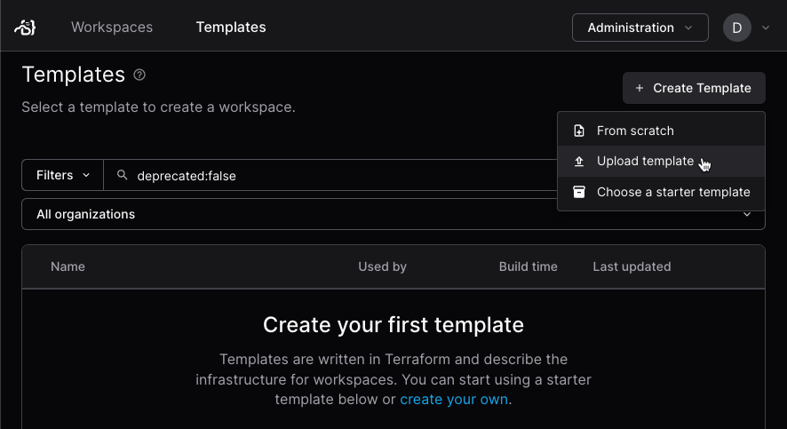
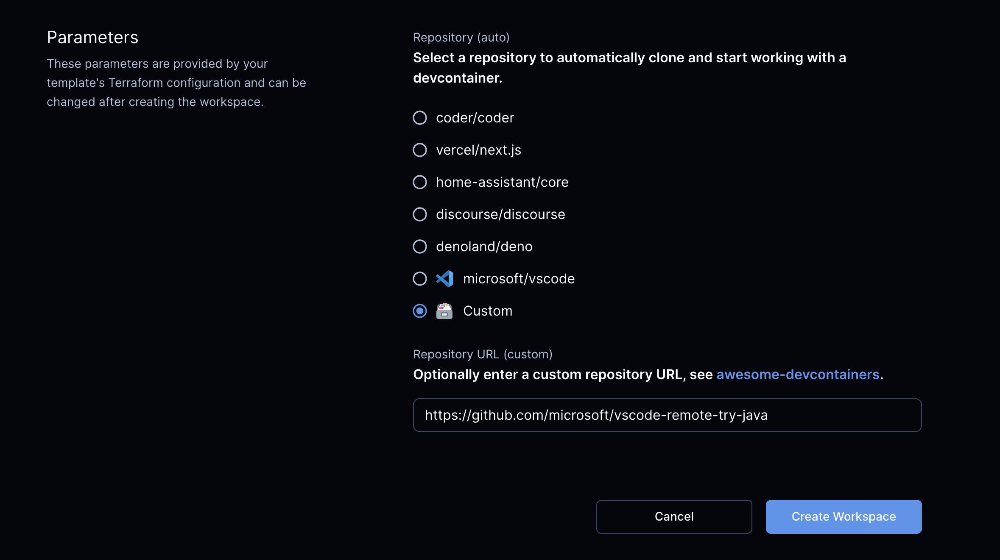

# Add a dev container template to Coder

A Coder administrator adds a dev container-compatible template to Coder
(Envbuilder). This allows the template to prompt for the developer for their dev
container repository's URL as a
[parameter](../../extending-templates/parameters.md) when they create their
workspace. Envbuilder clones the repo and builds a container from the
`devcontainer.json` specified in the repo.

You can create template files through the Coder dashboard, CLI, or you can
choose a template from the
[Coder registry](https://registry.coder.com/templates):

<div class="tabs">

## Dashboard

1. In the Coder dashboard, select **Templates** then **Create Template**.
1. Use a
   [starter template](https://github.com/coder/coder/tree/main/examples/templates)
   or create a new template:

   - Starter template:

     1. Select **Choose a starter template**.
     1. Choose a template from the list or select **Devcontainer** from the
        sidebar to display only dev container-compatible templates.
     1. Select **Use template**, enter the details, then select **Create
        template**.

   - To create a new template, select **From scratch** and enter the templates
     details, then select **Create template**.

1. Edit the template files to fit your deployment.

## CLI

1. Use the `template init` command to initialize your choice of image:

   ```shell
   coder template init --id kubernetes-devcontainer
   ```

   A list of available templates is shown in the
   [templates_init](../../../../reference/cli/templates.md) reference.

1. `cd` into the directory and push the template to your Coder deployment:

   ```shell
   cd kubernetes-devcontainer && coder templates push
   ```

   You can also edit the files or make changes to the files before you push them
   to Coder.

## Registry

1. Go to the [Coder registry](https://registry.coder.com/templates) and select a
   dev container-compatible template.

1. Copy the files to your local device, then edit them to fit your needs.

1. Upload them to Coder through the CLI or dashboard:

   - CLI:

   ```shell
   coder templates push <template-name> -d <path to folder containing main.tf>
   ```

   - Dashboard:

   1. Create a `.zip` of the template files:

      - On Mac or Windows, highlight the files and then right click. A
        "compress" option is available through the right-click context menu.

      - To zip the files through the command line:

        ```shell
        zip templates.zip Dockerfile main.tf
        ```

   1. Select **Templates**.
   1. Select **Create Template**, then **Upload template**:

      

   1. Drag the `.zip` file into the **Upload template** section and fill out the
      details, then select **Create template**.

      

</div>

To set variables such as the namespace, go to the template in your Coder
dashboard and select **Settings** from the **⋮** (vertical ellipsis) menu:

<Image height="255px" src="../../../../images/templates/template-menu-settings.png" alt="Choose Settings from the template's menu" align="center" />

## Envbuilder Terraform provider

When using the
[Envbuilder Terraform provider](https://registry.terraform.io/providers/coder/envbuilder/latest/docs),
a previously built and cached image can be reused directly, allowing dev
containers to start instantaneously.

Developers can edit the `devcontainer.json` in their workspace to customize
their development environments:

```json
# …
{
  "features": {
      "ghcr.io/devcontainers/features/common-utils:2": {}
  }
}
# …
```

## Example templates

| Template                                                                                                            | Description                                                                                                                                                         |
|---------------------------------------------------------------------------------------------------------------------|---------------------------------------------------------------------------------------------------------------------------------------------------------------------|
| [Docker dev containers](https://github.com/coder/coder/tree/main/examples/templates/docker-devcontainer)            | Docker provisions a development container.                                                                                                                          |
| [Kubernetes dev containers](https://github.com/coder/coder/tree/main/examples/templates/kubernetes-devcontainer)    | Provisions a development container on the Kubernetes cluster.                                                                                                       |
| [Google Compute Engine dev container](https://github.com/coder/coder/tree/main/examples/templates/gcp-devcontainer) | Runs a development container inside a single GCP instance. It also mounts the Docker socket from the VM inside the container to enable Docker inside the workspace. |
| [AWS EC2 dev container](https://github.com/coder/coder/tree/main/examples/templates/aws-devcontainer)               | Runs a development container inside a single EC2 instance. It also mounts the Docker socket from the VM inside the container to enable Docker inside the workspace. |

Your template can prompt the user for a repo URL with
[parameters](../../extending-templates/parameters.md):



## Dev container lifecycle scripts

The `onCreateCommand`, `updateContentCommand`, `postCreateCommand`, and
`postStartCommand` lifecycle scripts are run each time the container is started.
This could be used, for example, to fetch or update project dependencies before
a user begins using the workspace.

Lifecycle scripts are managed by project developers.

## Next steps

- [Dev container security and caching](./devcontainer-security-caching.md)
