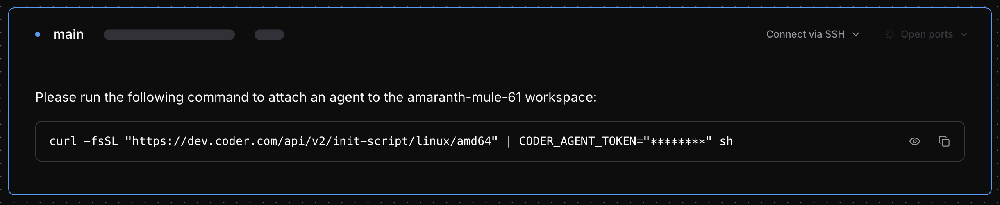

# External Workspaces

External workspaces allow you to seamlessly connect externally managed infrastructure as Coder workspaces. This enables you to integrate existing servers, on-premises systems, or any capable machine with the Coder environment, ensuring a smooth and efficient development workflow without requiring Coder to provision additional compute resources.

## Prerequisites

- Access to external compute resources that can run the Coder agent:
  - **Windows**: amd64 or arm64 architecture
  - **Linux**: amd64, arm64, or armv7 architecture
  - **macOS**: amd64 or arm64 architecture
  - **Examples**: VMs, bare-metal servers, Kubernetes nodes, or any machine meeting the above requirements.
- Networking access to your Coder deployment.
- A workspace template that includes a [`coder_external_agent`](https://registry.terraform.io/providers/coder/coder/latest/docs/resources/external_agent) resource.

We provide an example template on how to set up external workspaces in the [Coder Registry](https://registry.coder.com/templates/coder-labs/externally-managed-workspace)

## Benefits

External workspaces offer flexibility and control in complex environments:

- **Incremental adoption of Coder**

  Integrate with existing infrastructure gradually without needing to migrate everything at once. This is particularly useful when gradually migrating workloads to Coder without refactoring current infrastructure.

- **Flexibility**

  Attach cloud, hybrid, or on-premises machines as developer workspaces. This enables connecting existing on-premises GPU servers for ML development or bringing manually provisioned VMs in restricted networks under Coder's workspace management.

- **Separation of concerns**

  Provision compute resources externally (using your existing IaC or manual processes) while managing workspace configuration (apps, scripts) with Terraform. This approach is ideal for running agents in CI pipelines to provision short-lived, externally managed workspaces for testing or build automation.

## Known limitations

- **Lifecycle control**

  Start/stop/restart actions in the Coder UI are disabled for external workspaces.
- **No automatic deprovisioning**

  Deleting an external workspace in Coder removes the agent token and record, but does not delete the underlying compute resource.
- **Manual agent management**

  Administrators are responsible for deploying and maintaining agents on external resources.
- **Limited UI indicators**

  External workspaces are marked in the UI, but underlying infrastructure health is not monitored by Coder.

## When to use it?

Use external workspaces if:

- You have compute resources provisioned outside of Coder’s Terraform flows.
- You want to connect specialized or legacy systems to your Coder deployment.
- You are migrating incrementally to Coder and need hybrid support.
- You need finer control over how and where agents run, while still benefiting from Coder’s workspace experience.

## How to use it?

You can create and manage external workspaces using either the **CLI** or the **UI**.

<div class="tabs">

## CLI

1. **Create an external workspace**

   ```bash
   coder external-workspaces create hello-world \
     --template=externally-managed-workspace -y
   ```

   - Validates that the template includes a `coder_external_agent` resource.
   - Once created, the workspace is registered in Coder but marked as requiring an external agent.

2. **List external workspaces**

   ```bash
   coder external-workspaces list
   ```

   Example output:

   ```bash
   WORKSPACE        TEMPLATE                     STATUS   HEALTHY  LAST BUILT  CURRENT VERSION  OUTDATED
   hello-world      externally-managed-workspace Started  true     15m         happy_mendel9    false
   ```

3. **Retrieve agent connection instructions**

   Use this command to query the script you must run on the external machine:

   ```bash
   coder external-workspaces agent-instructions hello-world
   ```

   Example:

   ```bash
   Please run the following command to attach external agent to the workspace hello-world:

   curl -fsSL "https://<DEPLOYMENT_URL>/api/v2/init-script/linux/amd64" | CODER_AGENT_TOKEN="<token>" sh
   ```

   You can also output JSON for automation:

   ```bash
   coder external-workspaces agent-instructions hello-world --output=json
   ```

   ```json
   {
     "workspace_name": "hello-world",
     "agent_name": "main",
     "auth_type": "token",
     "auth_token": "<token>",
     "init_script": "curl -fsSL \"https://<DEPLOYMENT_URL>/api/v2/init-script/linux/arm64\" | CODER_AGENT_TOKEN=\"<token>\" sh"
   }
   ```

## UI

1. Import the external workspace template (see prerequisites).
2. In the Coder UI, go to **Workspaces → New workspace** and select the imported template.
3. Once the workspace is created, Coder will display **connection details** with the command users need to run on the external machine to start the agent.
4. The workspace will appear in the dashboard, but with the following differences:
   - **Start**, **Stop**, and **Restart** actions are disabled.
   - Users are provided with instructions for launching the agent manually on the external machine.



</div>
