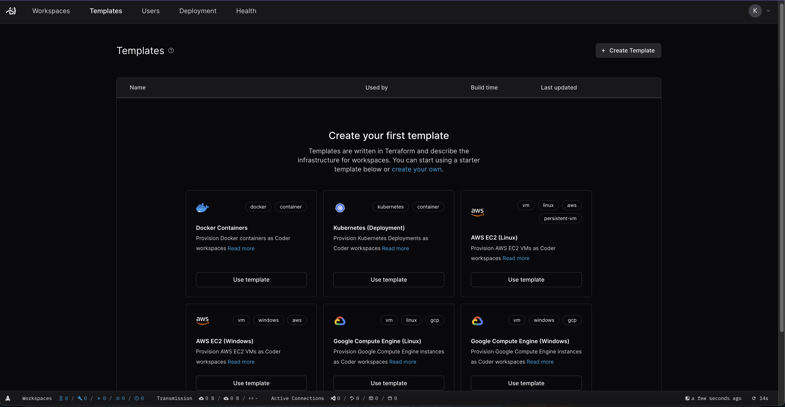
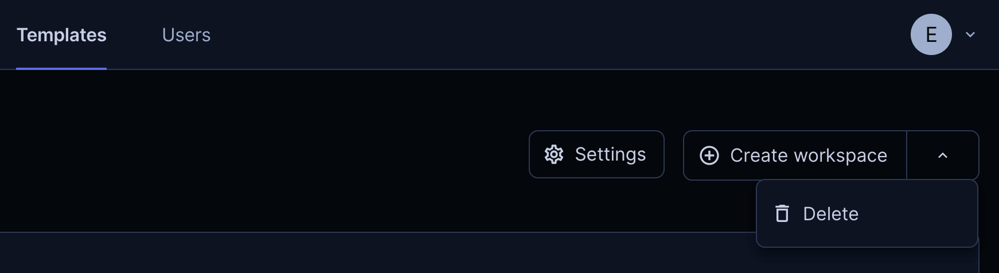

# Working with templates

You create and edit Coder templates as
[Terraform](../../../tutorials/quickstart.md) configuration files (`.tf`) and
any supporting files, like a README or configuration files for other services.

## Who creates templates?

The [Template Admin](../../../admin/users/groups-roles.md#roles) role (and
above) can create templates. End users, like developers, create workspaces from
them. Templates can also be [managed with git](./change-management.md), allowing
any developer to propose changes to a template.

You can give different users and groups access to templates with
[role-based access control](../template-permissions.md).

## Starter templates

We provide starter templates for common cloud providers, like AWS, and
orchestrators, like Kubernetes. From there, you can modify them to use your own
images, VPC, cloud credentials, and so on. Coder supports all Terraform
resources and properties, so fear not if your favorite cloud provider isn't
here!



If you prefer to use Coder on the
[command line](../../../reference/cli/index.md), `coder templates init`.

Coder starter templates are also available on our
[GitHub repo](https://github.com/coder/coder/tree/main/examples/templates).

## Community Templates

As well as Coder's starter templates, you can see a list of community templates
by our users
[here](https://github.com/coder/coder/blob/main/examples/templates/community-templates.md).

## Editing templates

Our starter templates are meant to be modified for your use cases. You can edit
any template's files directly in the Coder dashboard.


If you'd prefer to use the CLI, use `coder templates pull`, edit the template
files, then `coder templates push`.

> [!TIP]
> Even if you are a Terraform expert, we suggest reading our
> [guided tour of a template](../../../tutorials/template-from-scratch.md).

## Updating templates

Coder tracks a template's versions, keeping all developer workspaces up-to-date.
When you publish a new version, developers are notified to get the latest
infrastructure, software, or security patches. Learn more about
[change management](./change-management.md).


### Template update policies

> [!NOTE]
> Template update policies are an Enterprise and Premium feature.
> [Learn more](https://coder.com/pricing#compare-plans).

Licensed template admins may want workspaces to always remain on the latest
version of their parent template. To do so, enable **Template Update Policies**
in the template's general settings. All non-admin users of the template will be
forced to update their workspaces before starting them once the setting is
applied. Workspaces which leverage autostart or start-on-connect will be
automatically updated on the next startup.


## Delete templates

You can delete a template using both the coder CLI and UI. Only
[template admins and owners](../../users/groups-roles.md#roles) can delete a
template, and the template must not have any running workspaces associated to
it.

In the UI, navigate to the template you want to delete, and select the dropdown
in the right-hand corner of the page to delete the template.



Using the CLI, login to Coder and run the following command to delete a
template:

```shell
coder templates delete <template-name>
```

## Next steps

- [Image management](./image-management.md)
- [Devcontainer templates](./devcontainers/index.md)
- [Change management](./change-management.md)
