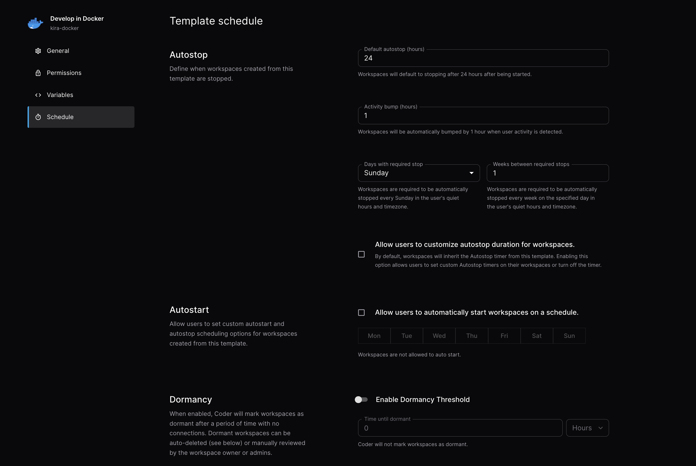

# Workspace Scheduling

You can configure a template to control how workspaces are started and stopped.
You can also manage the lifecycle of failed or inactive workspaces.

## Schedule

Template [admins](../../users/index.md) may define these default values:

- [**Default autostop**](../../../user-guides/workspace-scheduling.md#autostop):
  How long a workspace runs without user activity before Coder automatically
  stops it.
- [**Autostop requirement**](#autostop-requirement): Enforce mandatory workspace
  restarts to apply template updates regardless of user activity.
- **Activity bump**: The duration by which to extend a workspace's deadline when activity is detected (default: 1 hour). The workspace will be considered inactive when no sessions are detected (VSCode, JetBrains, Terminal, or SSH). For details on what counts as activity, see the [user guide on activity detection](../../../user-guides/workspace-scheduling.md#activity-detection).
- **Dormancy**: This allows automatic deletion of unused workspaces to reduce
  spend on idle resources.

## Allow users scheduling

For templates where a uniform autostop duration is not appropriate, admins may
allow users to define their own autostart and autostop schedules. Admins can
restrict the days of the week a workspace should automatically start to help
manage infrastructure costs.

## Failure cleanup

> [!NOTE]
> Failure cleanup is an Enterprise and Premium feature.
> [Learn more](https://coder.com/pricing#compare-plans).

Failure cleanup defines how long a workspace is permitted to remain in the
failed state prior to being automatically stopped. Failure cleanup is only
available for licensed customers.

## Dormancy threshold

> [!NOTE]
> Dormancy threshold is an Enterprise and Premium feature.
> [Learn more](https://coder.com/pricing#compare-plans).

Dormancy Threshold defines how long Coder allows a workspace to remain inactive
before being moved into a dormant state. A workspace's inactivity is determined
by the time elapsed since a user last accessed the workspace. A workspace in the
dormant state is not eligible for autostart and must be manually activated by
the user before being accessible. Coder stops workspaces during their transition
to the dormant state if they are detected to be running. Dormancy Threshold is
only available for licensed customers.

## Dormancy auto-deletion

> [!NOTE]
> Dormancy auto-deletion is an Enterprise and Premium feature.
> [Learn more](https://coder.com/pricing#compare-plans).

Dormancy Auto-Deletion allows a template admin to dictate how long a workspace
is permitted to remain dormant before it is automatically deleted. Dormancy
Auto-Deletion is only available for licensed customers.

## Autostop requirement

> [!NOTE]
> Autostop requirement is an Enterprise and Premium feature.
> [Learn more](https://coder.com/pricing#compare-plans).

Autostop requirement is a template setting that determines how often workspaces
using the template must automatically stop. Autostop requirement ignores any
active connections, and ensures that workspaces do not run in perpetuity when
connections are left open inadvertently.

Workspaces will apply the template autostop requirement on the given day in the
user's timezone and specified quiet hours (see below). This ensures that
workspaces will not be stopped during work hours.

The available options are "Days", which can be set to "Daily", "Saturday" or
"Sunday", and "Weeks", which can be set to any number from 1 to 16.

"Days" governs which days of the week workspaces must stop. If you select
"daily", workspaces must be automatically stopped every day at the start of the
user's defined quiet hours. When using "Saturday" or "Sunday", workspaces will
be automatically stopped on Saturday or Sunday in the user's timezone and quiet
hours.

"Weeks" determines how many weeks between required stops. It cannot be changed
from the default of 1 if you have selected "Daily" for "Days". When using a
value greater than 1, workspaces will be automatically stopped every N weeks on
the day specified by "Days" and the user's quiet hours. The autostop week is
synchronized for all workspaces on the same template.

Autostop requirement is disabled when the template is using the deprecated max
lifetime feature. Templates can choose to use a max lifetime or an autostop
requirement during the deprecation period, but only one can be used at a time.

## User quiet hours

> [!NOTE]
> User quiet hours are an Enterprise and Premium feature.
> [Learn more](https://coder.com/pricing#compare-plans).

User quiet hours can be configured in the user's schedule settings page.
Workspaces on templates with an autostop requirement will only be forcibly
stopped due to the policy at the start of the user's quiet hours.

Admins can define the default quiet hours for all users with the
[CODER_QUIET_HOURS_DEFAULT_SCHEDULE](../../../reference/cli/server.md#--default-quiet-hours-schedule)
environment variable. The value should be a cron expression such as
`CRON_TZ=America/Chicago 30 2 * * *` which would set the default quiet hours to
2:30 AM in the America/Chicago timezone. The cron schedule can only have a
minute and hour component. The default schedule is UTC 00:00. It is recommended
to set the default quiet hours to a time when most users are not expected to be
using Coder.

Admins can force users to use the default quiet hours with the
[CODER_ALLOW_CUSTOM_QUIET_HOURS](../../../reference/cli/server.md#--allow-custom-quiet-hours)
environment variable. Users will still be able to see the page, but will be
unable to set a custom time or timezone. If users have already set a custom
quiet hours schedule, it will be ignored and the default will be used instead.
