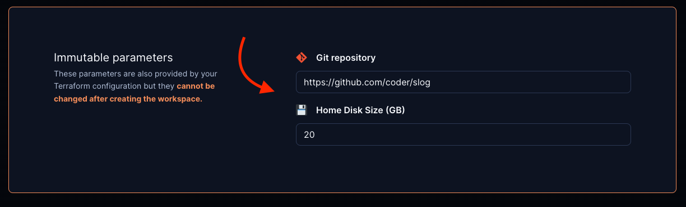

# Open in Coder

You can embed an "Open in Coder" button into your git repos or internal wikis to
let developers quickly launch a new workspace.

<video autoplay playsinline loop>
  <source src="https://github.com/coder/coder/blob/main/docs/images/templates/open-in-coder.mp4?raw=true" type="video/mp4">
Your browser does not support the video tag.
</video>

## How it works

To support any infrastructure and software stack, Coder provides a generic
approach for "Open in Coder" flows.

### 1. Set up git authentication

See [External Authentication](../external-auth.md) to set up git authentication
in your Coder deployment.

### 2. Modify your template to auto-clone repos

The id in the template's `coder_external_auth` data source must match the
`CODER_EXTERNAL_AUTH_X_ID` in the Coder deployment configuration.

If you want the template to clone a specific git repo:

```hcl
# Require external authentication to use this template
data "coder_external_auth" "github" {
    id = "primary-github"
}

resource "coder_agent" "dev" {
    # ...
    dir = "~/coder"
    startup_script =<<EOF

    # Clone repo from GitHub
    if [ ! -d "coder" ]
    then
        git clone https://github.com/coder/coder
    fi

    EOF
}
```

> [!NOTE]
> The `dir` attribute can be set in multiple ways, for example:
>
> - `~/coder`
> - `/home/coder/coder`
> - `coder` (relative to the home directory)

If you want the template to support any repository via
[parameters](./extending-templates/parameters.md)

```hcl
# Require external authentication to use this template
data "coder_external_auth" "github" {
    id = "primary-github"
}

# Prompt the user for the git repo URL
data "coder_parameter" "git_repo" {
    name          = "git_repo"
    display_name  = "Git repository"
    default       = "https://github.com/coder/coder"
}

locals {
    folder_name = try(element(split("/", data.coder_parameter.git_repo.value), length(split("/", data.coder_parameter.git_repo.value)) - 1), "")
}

resource "coder_agent" "dev" {
    # ...
    dir = "~/${local.folder_name}"
    startup_script =<<EOF

    # Clone repo from GitHub
    if [ ! -d "${local.folder_name}" ]
    then
        git clone ${data.coder_parameter.git_repo.value}
    fi

    EOF
}
```

### 3. Embed the "Open in Coder" button with Markdown

```md
[](https://YOUR_ACCESS_URL/templates/YOUR_TEMPLATE/workspace)
```

Be sure to replace `YOUR_ACCESS_URL` with your Coder access url (e.g.
<https://coder.example.com>) and `YOUR_TEMPLATE` with the name of your template.

### 4. Optional: pre-fill parameter values in the "Create Workspace" page

This can be used to pre-fill the git repo URL, disk size, image, etc.

```md
[](https://YOUR_ACCESS_URL/templates/YOUR_TEMPLATE/workspace?param.git_repo=https://github.com/coder/slog&param.home_disk_size%20%28GB%29=20)
```



### 5. Optional: disable specific parameter fields by including their names as

specified in your template in the `disable_params` search params list

```md
[](https://YOUR_ACCESS_URL/templates/YOUR_TEMPLATE/workspace?disable_params=first_parameter,second_parameter)
```

### Example: Kubernetes

For a full example of the Open in Coder flow in Kubernetes, check out
[this example template](https://github.com/bpmct/coder-templates/tree/main/kubernetes-open-in-coder).
