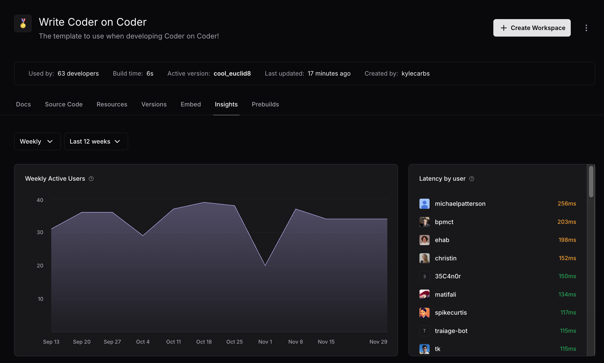
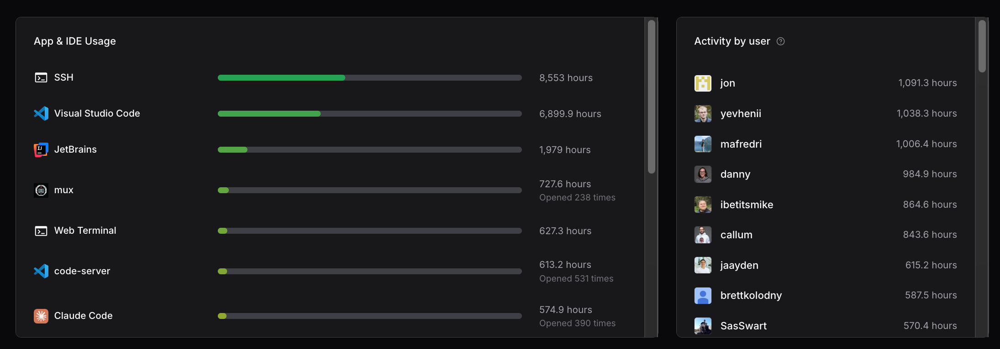
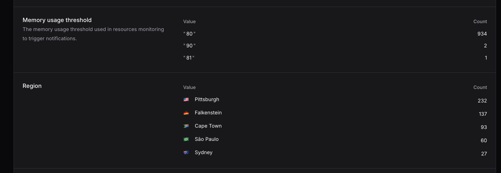

# Template Insights

Template Insights provides detailed analytics and usage metrics for your Coder templates. This feature helps administrators and template owners understand how templates are being used, identify popular applications, and monitor user engagement.



## Accessing Template Insights

To view Template Insights:

1. Navigate to the **Templates** page in your Coder dashboard
2. Select a template from the list
3. Click the **Insights** tab

> [!NOTE]
> Template Insights requires the `view_insights` permission on the template. Template administrators and organization owners have this permission.

## Overview

The Template Insights page displays usage analytics across several key areas:

<small>Template Insights showing weekly active users and connection latency metrics.</small>

### Active Users

The Weekly Active Users chart tracks the number of unique users who connected to workspaces from this template over time. This metric helps you:

- Monitor template adoption trends
- Identify usage patterns and peak periods
- Plan infrastructure capacity based on user growth

You can view data by daily intervals (default for templates less than 5 weeks old) or weekly intervals (default for templates 5 weeks or older). Use the date range picker to analyze specific time periods.

### User Latency

The connection latency table displays performance metrics for each user:

- **P50 (Median)**: The median connection latency experienced by users
- **P95**: The 95th percentile latency, indicating worst-case performance for most users

Latency is color-coded for quick assessment:

- **Green**: Good performance (< 150ms)
- **Yellow**: Moderate performance (150-300ms)
- **Red**: Poor performance (> 300ms)

High latency may indicate network issues between users and workspaces, resource constraints on workspace hosts, or geographic distance between users and infrastructure.

## Application Usage and User Activity

Template Insights provides detailed metrics on how users interact with workspace applications and which users are most active.



<small>Application usage statistics and user activity rankings.</small>

### App & IDE Usage

The App & IDE Usage section shows which applications users are connecting through, ranked by total usage time.

### Activity by User

The Activity by user table lists users who have used workspaces from this template, sorted by total usage time. This information helps you:

- Identify power users who may benefit from optimized resources
- Spot users who might need additional support or training
- Understand overall adoption of the template
- Plan resource allocation based on actual usage patterns

## Template Parameters

Understanding which parameter values users select when creating workspaces helps you optimize template defaults and identify unused options.



<small>Distribution of memory usage threshold and region parameter selections.</small>

The Template Parameters section shows the distribution of values selected for each parameter in your template. In the example above:

- **Memory usage threshold**: Shows that most workspaces (934) use the default 80% threshold, with only a few using higher thresholds
- **Region**: Displays geographic distribution of workspaces, with Pittsburgh being the most popular region (232 workspaces), followed by Falkenstein (137) and Cape Town (93)

This information helps you:

- Understand common configuration choices
- Identify unused parameter options that could be removed
- Optimize default values based on actual usage patterns
- Plan regional infrastructure capacity

## Use Cases

Template Insights helps you make data-driven decisions about your Coder deployment:

- **Template Optimization**: Remove unused applications or features, adjust default parameters based on actual usage patterns, and optimize resource allocations for common use cases
- **Capacity Planning**: Monitor active user trends to predict infrastructure capacity needs, plan for scaling during peak usage periods, and identify underutilized templates that could be consolidated
- **User Support**: Identify users with high latency connections who may need network troubleshooting, low usage who might need onboarding help, or specific application preferences for targeted support
- **ROI and Reporting**: Generate reports on developer productivity through usage metrics, template adoption rates, and infrastructure utilization efficiency

## Permissions

Template Insights respects Coder's RBAC (Role-Based Access Control) system:

- **Template Administrators**: Can view insights for templates they manage
- **Organization Owners**: Can view insights for all templates in their organization
- **Regular Users**: Cannot access Template Insights by default

To grant a user access to Template Insights for a specific template, assign them the `view_insights` permission through [template permissions](./template-permissions.md).

Access to insights data is controlled entirely through permissions. To prevent users from viewing insights for a template, do not grant them the `view_insights` permission.

### Disabling Template Insights

To completely disable Template Insights collection and display across your deployment, use the `--disable-template-insights` server flag:

```sh
coder server --disable-template-insights
```

Or set the environment variable:

```sh
CODER_DISABLE_TEMPLATE_INSIGHTS=true
```

When disabled, insights data will not be collected or stored, and the Insights tab will not be available in the UI.

See the [server CLI reference](../../reference/cli/server.md#--disable-template-insights) for more details.

## Data Privacy

Template Insights aggregates usage data while respecting user privacy:

- Individual workspace sessions are aggregated
- User activity shows total usage time, not detailed session logs
- No personally identifiable information beyond usernames is exposed
- Connection latency is measured from agent statistics, not network monitoring

## API Access

Template Insights data is also available via the Coder API. See the [API documentation](../../reference/api/insights.md) for details on:

- `/api/v2/insights/templates` - Template usage metrics
- `/api/v2/insights/user-activity` - User activity data
- `/api/v2/insights/user-latency` - Connection latency metrics

## Related Documentation

- [Template Permissions](./template-permissions.md) - Learn about template access control
- [Creating Templates](./creating-templates.md) - Build templates with usage tracking in mind
- [Managing Templates](./managing-templates/change-management.md) - Use insights to inform template updates
