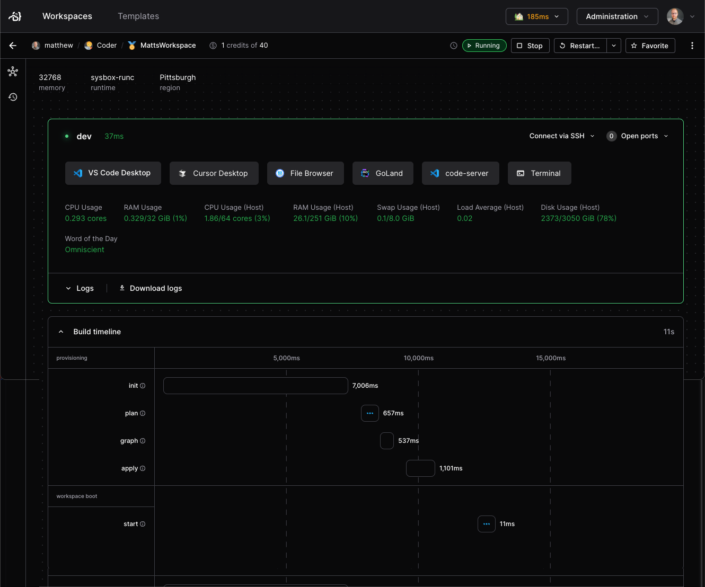

# Troubleshooting templates

Occasionally, you may run into scenarios where a workspace is created, but the
agent is either not connected or the
[startup script](https://registry.terraform.io/providers/coder/coder/latest/docs/resources/agent#startup_script-1)
has failed or timed out.

## Agent connection issues

If the agent is not connected, it means the agent or
[init script](https://github.com/coder/coder/tree/main/provisionersdk/scripts)
has failed on the resource.

```console
$ coder ssh myworkspace
⢄⡱ Waiting for connection from [agent]...
```

While troubleshooting steps vary by resource, here are some general best
practices:

- Ensure the resource has `curl` installed (alternatively, `wget` or `busybox`)
- Ensure the resource can `curl` your Coder
  [access URL](../../admin/setup/index.md#access-url)
- Manually connect to the resource and check the agent logs (e.g.,
  `kubectl exec`, `docker exec` or AWS console)
  - The Coder agent logs are typically stored in `/tmp/coder-agent.log`
  - The Coder agent startup script logs are typically stored in
    `/tmp/coder-startup-script.log`
  - The Coder agent shutdown script logs are typically stored in
    `/tmp/coder-shutdown-script.log`
- This can also happen if the websockets are not being forwarded correctly when
  running Coder behind a reverse proxy.
  [Read our reverse-proxy docs](../../admin/setup/index.md#tls--reverse-proxy)

## Startup script issues

Depending on the contents of the
[startup script](https://registry.terraform.io/providers/coder/coder/latest/docs/resources/agent#startup_script-1),
and whether or not the
[startup script behavior](https://registry.terraform.io/providers/coder/coder/latest/docs/resources/agent#startup_script_behavior-1)
is set to blocking or non-blocking, you may notice issues related to the startup
script. In this section we will cover common scenarios and how to resolve them.

### Unable to access workspace, startup script is still running

If you're trying to access your workspace and are unable to because the
[startup script](https://registry.terraform.io/providers/coder/coder/latest/docs/resources/agent#startup_script-1)
is still running, it means the
[startup script behavior](https://registry.terraform.io/providers/coder/coder/latest/docs/resources/agent#startup_script_behavior-1)
option is set to blocking or you have enabled the `--wait=yes` option (for e.g.
`coder ssh` or `coder config-ssh`). In such an event, you can always access the
workspace by using the web terminal, or via SSH using the `--wait=no` option. If
the startup script is running longer than it should, or never completing, you
can try to [debug the startup script](#debugging-the-startup-script) to resolve
the issue. Alternatively, you can try to force the startup script to exit by
terminating processes started by it or terminating the startup script itself (on
Linux, `ps` and `kill` are useful tools).

For tips on how to write a startup script that doesn't run forever, see the
[`startup_script`](https://registry.terraform.io/providers/coder/coder/latest/docs/resources/agent#startup_script-1)
section. For more ways to override the startup script behavior, see the
[`startup_script_behavior`](https://registry.terraform.io/providers/coder/coder/latest/docs/resources/agent#startup_script_behavior-1)
section.

Template authors can also set the
[startup script behavior](https://registry.terraform.io/providers/coder/coder/latest/docs/resources/agent#startup_script_behavior-1)
option to non-blocking, which will allow users to access the workspace while the
startup script is still running. Note that the workspace must be updated after
changing this option.

### Your workspace may be incomplete

If you see a warning that your workspace may be incomplete, it means you should
be aware that programs, files, or settings may be missing from your workspace.
This can happen if the
[startup script](https://registry.terraform.io/providers/coder/coder/latest/docs/resources/agent#startup_script-1)
is still running or has exited with a non-zero status (see
[startup script error](#startup-script-exited-with-an-error)). No action is
necessary, but you may want to
[start a new shell session](#session-was-started-before-the-startup-script-finished)
after it has completed or check the
[startup script logs](#debugging-the-startup-script) to see if there are any
issues.

### Session was started before the startup script finished

The web terminal may show this message if it was started before the
[startup script](https://registry.terraform.io/providers/coder/coder/latest/docs/resources/agent#startup_script-1)
finished, but the startup script has since finished. This message can safely be
dismissed, however, be aware that your preferred shell or dotfiles may not yet
be activated for this shell session. You can either start a new session or
source your dotfiles manually. Note that starting a new session means that
commands running in the terminal will be terminated and you may lose unsaved
work.

Examples for activating your preferred shell or sourcing your dotfiles:

- `exec zsh -l`
- `source ~/.bashrc`

### Startup script exited with an error

When the
[startup script](https://registry.terraform.io/providers/coder/coder/latest/docs/resources/agent#startup_script-1)
exits with an error, it means the last command run by the script failed. When
`set -e` is used, this means that any failing command will immediately exit the
script and the remaining commands will not be executed. This also means that
[your workspace may be incomplete](#your-workspace-may-be-incomplete). If you
see this error, you can check the
[startup script logs](#debugging-the-startup-script) to figure out what the
issue is.

Common causes for startup script errors:

- A missing command or file
- A command that fails due to missing permissions
- Network issues (e.g., unable to reach a server)

### Debugging the startup script

The simplest way to debug the
[startup script](https://registry.terraform.io/providers/coder/coder/latest/docs/resources/agent#startup_script-1)
is to open the workspace in the Coder dashboard and click "Show startup log" (if
not already visible). This will show all the output from the script. Another
option is to view the log file inside the workspace (usually
`/tmp/coder-startup-script.log`). If the logs don't indicate what's going on or
going wrong, you can increase verbosity by adding `set -x` to the top of the
startup script (note that this will show all commands run and may output
sensitive information). Alternatively, you can add `echo` statements to show
what's going on.

Here's a short example of an informative startup script:

```shell
echo "Running startup script..."
echo "Run: long-running-command"
/path/to/long-running-command
status=$?
echo "Done: long-running-command, exit status: ${status}"
if [ $status -ne 0 ]; then
  echo "Startup script failed, exiting..."
  exit $status
fi
```

> [!NOTE]
> We don't use `set -x` here because we're manually echoing the
> commands. This protects against sensitive information being shown in the log.

This script tells us what command is being run and what the exit status is. If
the exit status is non-zero, it means the command failed and we exit the script.
Since we are manually checking the exit status here, we don't need `set -e` at
the top of the script to exit on error.

> [!NOTE]
> If you aren't seeing any logs, check that the `dir` directive points
> to a valid directory in the file system.

## Slow workspace startup times

If your workspaces are taking longer to start than expected, or longer than
desired, you can diagnose which steps have the highest impact in the workspace
build timings UI (available in v2.17 and beyond). Admins can can
programmatically pull startup times for individual workspace builds using our
[build timings API endpoint](../../reference/api/builds.md#get-workspace-build-timings-by-id).

See our
[guide on optimizing workspace build times](../../tutorials/best-practices/speed-up-templates.md)
to optimize your templates based on this data.



## Coder on Raspberry Pi OS

### Unable to query ContainerMemory

When you query `ContainerMemory` and encounter the error:

```shell
open /sys/fs/cgroup/memory.max: no such file or directory
```

This error mostly affects Raspberry Pi OS, but might also affect older Debian-based systems as well.

<details><summary>Add cgroup_memory and cgroup_enable to cmdline.txt:</summary>

1. Confirm the list of existing cgroup controllers doesn't include `memory`:

   ```console
   $ cat /sys/fs/cgroup/cgroup.controllers
   cpuset cpu io pids

   $ cat /sys/fs/cgroup/cgroup.subtree_control
   cpuset cpu io pids
   ```

1. Add cgroup entries to `cmdline.txt` in `/boot/firmware` (or `/boot/` on older Pi OS releases):

   ```text
   cgroup_memory=1 cgroup_enable=memory
   ```

   You can use `sed` to add it to the file for you:

   ```bash
   sudo sed -i '$s/$/ cgroup_memory=1 cgroup_enable=memory/' /boot/firmware/cmdline.txt
   ```

1. Reboot:

   ```bash
   sudo reboot
   ```

1. Confirm that the list of cgroup controllers now includes `memory`:

   ```console
   $ cat /sys/fs/cgroup/cgroup.controllers
   cpuset cpu io memory pids

   $ cat /sys/fs/cgroup/cgroup.subtree_control
   cpuset cpu io memory pids
   ```

Read more about cgroup controllers in [The Linux Kernel](https://docs.kernel.org/admin-guide/cgroup-v2.html#controlling-controllers) documentation.

</details>
