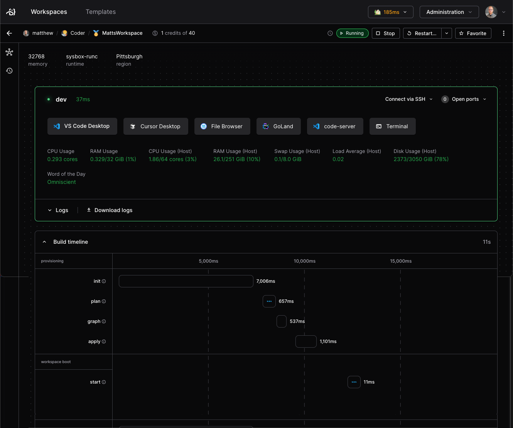

Occasionally, you may run into scenarios where a workspace is created, but the
agent is either not connected or the
[startup script](https://registry.terraform.io/providers/coder/coder/latest/docs/resources/agent#startup_script-1)
has failed or timed out.

## Agent connection issues

If the agent is not connected, it means the agent or
[init script](../../../provisionersdk/scripts)
has failed on the resource.

```console
$ coder ssh myworkspace
⢄⡱ Waiting for connection from [agent]...
```

While troubleshooting steps vary by resource, here are some general best
practices:

- Ensure the resource has `curl` installed (alternatively, `wget` or `busybox`)
- Ensure the resource can `curl` your Coder
  [access URL](../../admin/setup/index.md#access-url)
- Manually connect to the resource and check the agent logs (e.g.,
  `kubectl exec`, `docker exec` or AWS console)
  - The Coder agent logs are typically stored in `/tmp/coder-agent.log`
  - The Coder agent startup script logs are typically stored in
    `/tmp/coder-startup-script.log`
  - The Coder agent shutdown script logs are typically stored in
    `/tmp/coder-shutdown-script.log`
- This can also happen if the websockets are not being forwarded correctly when
  running Coder behind a reverse proxy.
  [Read our reverse-proxy docs](../../admin/setup/index.md#tls--reverse-proxy)

## Startup script issues

Depending on the contents of the
[startup script](https://registry.terraform.io/providers/coder/coder/latest/docs/resources/agent#startup_script-1),
and whether or not the
[startup script behavior](https://registry.terraform.io/providers/coder/coder/latest/docs/resources/agent#startup_script_behavior-1)
is set to blocking or non-blocking, you may notice issues related to the startup
script. In this section we will cover common scenarios and how to resolve them.

### Unable to access workspace, startup script is still running

If you're trying to access your workspace and are unable to because the
[startup script](https://registry.terraform.io/providers/coder/coder/latest/docs/resources/agent#startup_script-1)
is still running, it means the
[startup script behavior](https://registry.terraform.io/providers/coder/coder/latest/docs/resources/agent#startup_script_behavior-1)
option is set to blocking or you have enabled the `--wait=yes` option (for e.g.
`coder ssh` or `coder config-ssh`). In such an event, you can always access the
workspace by using the web terminal, or via SSH using the `--wait=no` option. If
the startup script is running longer than it should, or never completing, you
can try to [debug the startup script](#debugging-the-startup-script) to resolve
the issue. Alternatively, you can try to force the startup script to exit by
terminating processes started by it or terminating the startup script itself (on
Linux, `ps` and `kill` are useful tools).

For tips on how to write a startup script that doesn't run forever, see the
[`startup_script`](https://registry.terraform.io/providers/coder/coder/latest/docs/resources/agent#startup_script-1)
section. For more ways to override the startup script behavior, see the
[`startup_script_behavior`](https://registry.terraform.io/providers/coder/coder/latest/docs/resources/agent#startup_script_behavior-1)
section.

Template authors can also set the
[startup script behavior](https://registry.terraform.io/providers/coder/coder/latest/docs/resources/agent#startup_script_behavior-1)
option to non-blocking, which will allow users to access the workspace while the
startup script is still running. Note that the workspace must be updated after
changing this option.

### Your workspace may be incomplete

If you see a warning that your workspace may be incomplete, it means you should
be aware that programs, files, or settings may be missing from your workspace.
This can happen if the
[startup script](https://registry.terraform.io/providers/coder/coder/latest/docs/resources/agent#startup_script-1)
is still running or has exited with a non-zero status (see
[startup script error](#startup-script-exited-with-an-error)). No action is
necessary, but you may want to
[start a new shell session](#session-was-started-before-the-startup-script-finished)
after it has completed or check the
[startup script logs](#debugging-the-startup-script) to see if there are any
issues.

### Session was started before the startup script finished

The web terminal may show this message if it was started before the
[startup script](https://registry.terraform.io/providers/coder/coder/latest/docs/resources/agent#startup_script-1)
finished, but the startup script has since finished. This message can safely be
dismissed, however, be aware that your preferred shell or dotfiles may not yet
be activated for this shell session. You can either start a new session or
source your dotfiles manually. Note that starting a new session means that
commands running in the terminal will be terminated and you may lose unsaved
work.

Examples for activating your preferred shell or sourcing your dotfiles:

- `exec zsh -l`
- `source ~/.bashrc`

### Startup script exited with an error

When the
[startup script](https://registry.terraform.io/providers/coder/coder/latest/docs/resources/agent#startup_script-1)
exits with an error, it means the last command run by the script failed. When
`set -e` is used, this means that any failing command will immediately exit the
script and the remaining commands will not be executed. This also means that
[your workspace may be incomplete](#your-workspace-may-be-incomplete). If you
see this error, you can check the
[startup script logs](#debugging-the-startup-script) to figure out what the
issue is.

Common causes for startup script errors:

- A missing command or file
- A command that fails due to missing permissions
- Network issues (e.g., unable to reach a server)

### Debugging the startup script

The simplest way to debug the [startup script](https://registry.terraform.io/providers/coder/coder/latest/docs/resources/agent#startup_script-1) is to open the workspace in the Coder dashboard and select "Show startup log" (if not already visible).
This will show all the output from the script. Another
option is to view the log file inside the workspace (usually
`/tmp/coder-startup-script.log`). If the logs don't indicate what's going on or
going wrong, you can increase verbosity by adding `set -x` to the top of the
startup script (note that this will show all commands run and may output
sensitive information). Alternatively, you can add `echo` statements to show
what's going on.

Here's a short example of an informative startup script:

```sh
echo "Running startup script..."
echo "Run: long-running-command"
/path/to/long-running-command
status=$?
echo "Done: long-running-command, exit status: ${status}"
if [ $status -ne 0 ]; then
  echo "Startup script failed, exiting..."
  exit $status
fi
```

> [!NOTE]
> We don't use `set -x` here because we're manually echoing the
> commands. This protects against sensitive information being shown in the log.

This script tells us what command is being run and what the exit status is. If
the exit status is non-zero, it means the command failed and we exit the script.
Since we are manually checking the exit status here, we don't need `set -e` at
the top of the script to exit on error.

> [!NOTE]
> If you aren't seeing any logs, check that the `dir` directive points
> to a valid directory in the file system.

## Slow workspace startup times

If your workspaces are taking longer to start than expected, or longer than
desired, you can diagnose which steps have the highest impact in the workspace
build timings UI (available in v2.17 and beyond). Admins can can
programmatically pull startup times for individual workspace builds using our
[build timings API endpoint](../../reference/api/builds.md#get-workspace-build-timings-by-id).

See our
[guide on optimizing workspace build times](../../tutorials/best-practices/speed-up-templates.md)
to optimize your templates based on this data.



## Cannot connect to the Docker daemon

If a Docker-based template fails to provision with an error like `Cannot connect to the Docker daemon at unix:///var/run/docker.sock`, the Coder host cannot reach the Docker socket.
Confirm that Docker is installed and running on the host.
If you run Docker through rootless Docker, [Colima](https://colima.run), Podman, or a similar tool, the daemon may expose its socket at a non-default path, so set `DOCKER_HOST` to point at it.
Refer to [Cannot connect to the Docker daemon](../../install/docker.md#cannot-connect-to-the-docker-daemon) for the full steps.

## Template provisioning failures

The sections above cover issues with a workspace *after* it has been created. The
following issues instead occur while a template is being pushed or a workspace is
being built, i.e. while `terraform apply` is running. This Terraform run happens
on the Coder host (`coderd`) or on an [external provisioner](../provisioners/index.md),
not inside the workspace itself, so the fixes below apply to the machine or pod
running the provisioner rather than to the workspace.

### Docker socket permission denied during provisioning

If a template's `terraform apply` fails with an error such as:

```txt
Got permission denied while trying to connect to the Docker daemon socket at
unix:///var/run/docker.sock
```

or:

```txt
Error: Cannot connect to the Docker daemon at unix:///var/run/docker.sock.
Is the docker daemon running?
```

the provisioner process cannot reach the Docker socket used by the template's
`docker` provider (for example `docker_container` or `docker_volume`
resources). This is a separate host-level issue from
[Cannot connect to the Docker daemon](#cannot-connect-to-the-docker-daemon)
above, which covers the daemon not running at all. Fix it based on how you run
`coderd`:

- **Docker Compose / `docker run`**: mount the host socket into the container
  and add the container to the `docker` group so it can read/write the socket:

  ```yaml
  services:
    coder:
      image: ghcr.io/coder/coder:latest
      volumes:
        - /var/run/docker.sock:/var/run/docker.sock
      group_add:
        - "999" # gid of the `docker` group, see below
  ```

  Get the correct `gid` with `getent group docker | cut -d: -f3` and use that
  value for `group_add` (or `--group-add` for `docker run`). See
  [Install Coder via Docker](../../install/docker.md#i-cannot-add-docker-templates)
  for more details.

- **Kubernetes**: the `coderd` pod does not (and should not) mount the
  node's Docker socket, so Docker-based templates cannot run directly from a
  pod deployed via the [Helm chart](../../install/kubernetes.md). Run an
  [external provisioner](../provisioners/index.md) on a host or VM that has access
  to a Docker socket instead, and use the same `group_add`/socket mount
  guidance as the Docker Compose case above for that host. If you don't
  specifically need `docker_container` resources, use a
  [Kubernetes-native template](https://github.com/coder/coder/tree/main/examples/templates/kubernetes)
  (`kubernetes_pod` or `kubernetes_deployment`) instead, which only needs the
  Kubernetes API and not a Docker socket.

- **System service (systemd)**: add the user that runs the `coder` service to
  the `docker` group, then restart the service so the new group membership
  takes effect (group membership is only applied on login/process start):

  ```console
  sudo usermod -aG docker coder
  sudo systemctl restart coder
  ```

  Alternatively, set `SupplementaryGroups=docker` under `[Service]` in the
  unit file (e.g. `/etc/systemd/system/coder.service`) to grant the group
  without modifying the user's primary group list, then run
  `sudo systemctl daemon-reload && sudo systemctl restart coder`.

### Cloud or Kubernetes provider authentication failures

If `terraform apply` fails while creating cloud resources with errors such as:

```txt
error configuring Terraform AWS Provider: no valid credential sources for Terraform AWS Provider found
```

```txt
google: could not find default credentials. See https://cloud.google.com/docs/authentication/external/set-up-adc for more information
```

```txt
Error: building AzureRM Client: obtain subscription() from Azure CLI: parse access token: ...
```

```txt
Error: Get "https://<cluster>/api/v1/namespaces/...": Unauthorized
```

the credentials used by the template's cloud or Kubernetes provider block
(e.g. `provider "aws" {}`, `provider "google" {}`, `provider "azurerm" {}`, or
`provider "kubernetes" {}`) are missing or invalid **in the environment where
the provisioner runs**, not in the workspace. Coder's
[example templates](https://github.com/coder/coder/tree/main/examples/templates)
intentionally leave these provider blocks empty so they pick up ambient
credentials, so those credentials must be supplied out-of-band:

- **Docker Compose / system service (systemd)**: export the provider's
  standard credential environment variables (or mount a credentials file)
  for the process running `coderd`/the provisioner:

  ```yaml
  # docker-compose.yaml
  services:
    coder:
      environment:
        - AWS_ACCESS_KEY_ID=...
        - AWS_SECRET_ACCESS_KEY=...
        - GOOGLE_APPLICATION_CREDENTIALS=/creds/gcp-key.json
        - ARM_CLIENT_ID=...
        - ARM_CLIENT_SECRET=...
        - ARM_TENANT_ID=...
        - ARM_SUBSCRIPTION_ID=...
      volumes:
        - ./gcp-key.json:/creds/gcp-key.json:ro
  ```

  For a systemd install, put the same variables in an `EnvironmentFile`
  referenced by the unit (e.g. `EnvironmentFile=/etc/coder.d/coder.env`), then
  run `sudo systemctl daemon-reload && sudo systemctl restart coder`. If
  `coderd` runs on the cloud provider's own compute (e.g. an EC2 instance with
  an instance profile, or a GCE VM with a service account attached), no
  explicit credentials are usually needed since the provider SDK reads them
  from the instance metadata service.

- **Kubernetes**: for cloud providers (AWS/GCP/Azure), prefer workload
  identity over static keys, for example
  [IAM roles for service accounts (IRSA)](https://docs.aws.amazon.com/eks/latest/userguide/iam-roles-for-service-accounts.html)
  on EKS or
  [Workload Identity](https://cloud.google.com/kubernetes-engine/docs/how-to/workload-identity)
  on GKE, or supply credentials via a mounted `Secret` using `coder.env` in
  your Helm `values.yaml`:

  ```yaml
  coder:
    env:
      - name: AWS_ACCESS_KEY_ID
        valueFrom:
          secretKeyRef:
            name: cloud-credentials
            key: aws_access_key_id
      - name: AWS_SECRET_ACCESS_KEY
        valueFrom:
          secretKeyRef:
            name: cloud-credentials
            key: aws_secret_access_key
  ```

  For the `kubernetes` provider itself (used by
  [Kubernetes-based templates](https://github.com/coder/coder/tree/main/examples/templates/kubernetes)),
  `Unauthorized` or `forbidden` errors usually mean the `coder` service
  account lacks RBAC permissions in the workspaces namespace. The
  [Helm chart](../../install/kubernetes.md) grants a default set of
  permissions via `coder.serviceAccount.workspacePerms` and
  `coder.serviceAccount.enableDeployments`; add additional rules with
  `coder.serviceAccount.extraRules`, or grant access to additional namespaces
  with `coder.serviceAccount.workspaceNamespaces` in your `values.yaml`:

  ```yaml
  coder:
    serviceAccount:
      workspacePerms: true
      enableDeployments: true
      extraRules:
        - apiGroups: [""]
          resources: ["services"]
          verbs: ["create", "delete", "get", "list", "patch", "update", "watch"]
  ```

### Provisioner cannot write files (permission denied)

If `terraform apply` or `terraform init` fails with `permission denied` or
`operation not permitted` while writing to the provisioner's working
directory (state, plugin cache, or module downloads), the OS user running the
provisioner does not own that directory:

- **Docker Compose / `docker run`**: verify that any bind-mounted volume used
  for `CODER_CACHE_DIRECTORY` is writable by the container's user (`coder` by
  default), for example `sudo chown -R 1000:1000 <host-path>` for the default
  non-root `coder` user in the published image.
- **Kubernetes**: ensure any `PersistentVolumeClaim` mounted for the cache
  directory is writable by the pod's `securityContext.runAsUser`/`fsGroup`.
  If you change the pod's security context in `values.yaml`, update the
  volume's ownership to match.
- **System service (systemd)**: confirm the unit's `User=`/`Group=` (if set)
  own the configured `CODER_CACHE_DIRECTORY` and any directories referenced by
  `CODER_CONFIG_DIR`, e.g. `sudo chown -R coder:coder /var/lib/coder`.

## Docker Workspaces on Raspberry Pi OS

### Unable to query ContainerMemory

When you query `ContainerMemory` and encounter the error:

```sh
open /sys/fs/cgroup/memory.max: no such file or directory
```

This error mostly affects Raspberry Pi OS, but might also affect older Debian-based systems as well.

<details><summary>Add cgroup_memory and cgroup_enable to cmdline.txt:</summary>

1. Confirm the list of existing cgroup controllers doesn't include `memory`:

   ```console
   $ cat /sys/fs/cgroup/cgroup.controllers
   cpuset cpu io pids

   $ cat /sys/fs/cgroup/cgroup.subtree_control
   cpuset cpu io pids
   ```

1. Add cgroup entries to `cmdline.txt` in `/boot/firmware` (or `/boot/` on older Pi OS releases):

   ```txt
   cgroup_memory=1 cgroup_enable=memory
   ```

   You can use `sed` to add it to the file for you:

   ```sh
   sudo sed -i '$s/$/ cgroup_memory=1 cgroup_enable=memory/' /boot/firmware/cmdline.txt
   ```

1. Reboot:

   ```sh
   sudo reboot
   ```

1. Confirm that the list of cgroup controllers now includes `memory`:

   ```console
   $ cat /sys/fs/cgroup/cgroup.controllers
   cpuset cpu io memory pids

   $ cat /sys/fs/cgroup/cgroup.subtree_control
   cpuset cpu io memory pids
   ```

Read more about cgroup controllers in [The Linux Kernel](https://docs.kernel.org/admin-guide/cgroup-v2.html#controlling-controllers) documentation.

</details>
