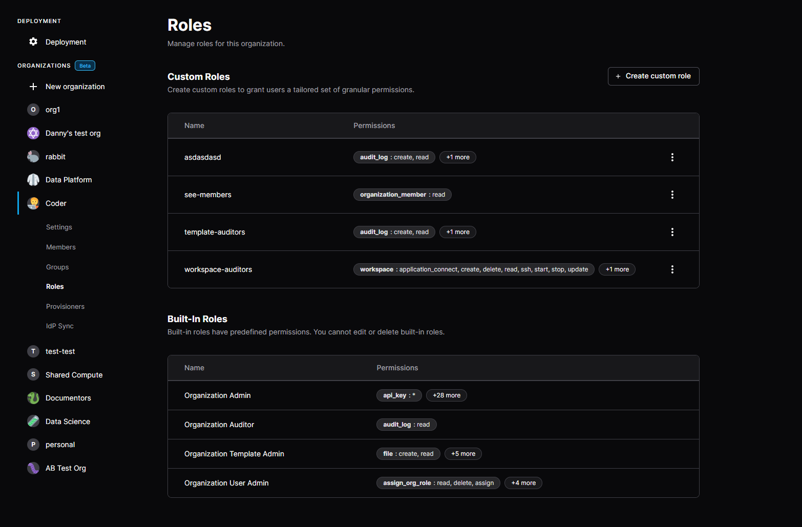
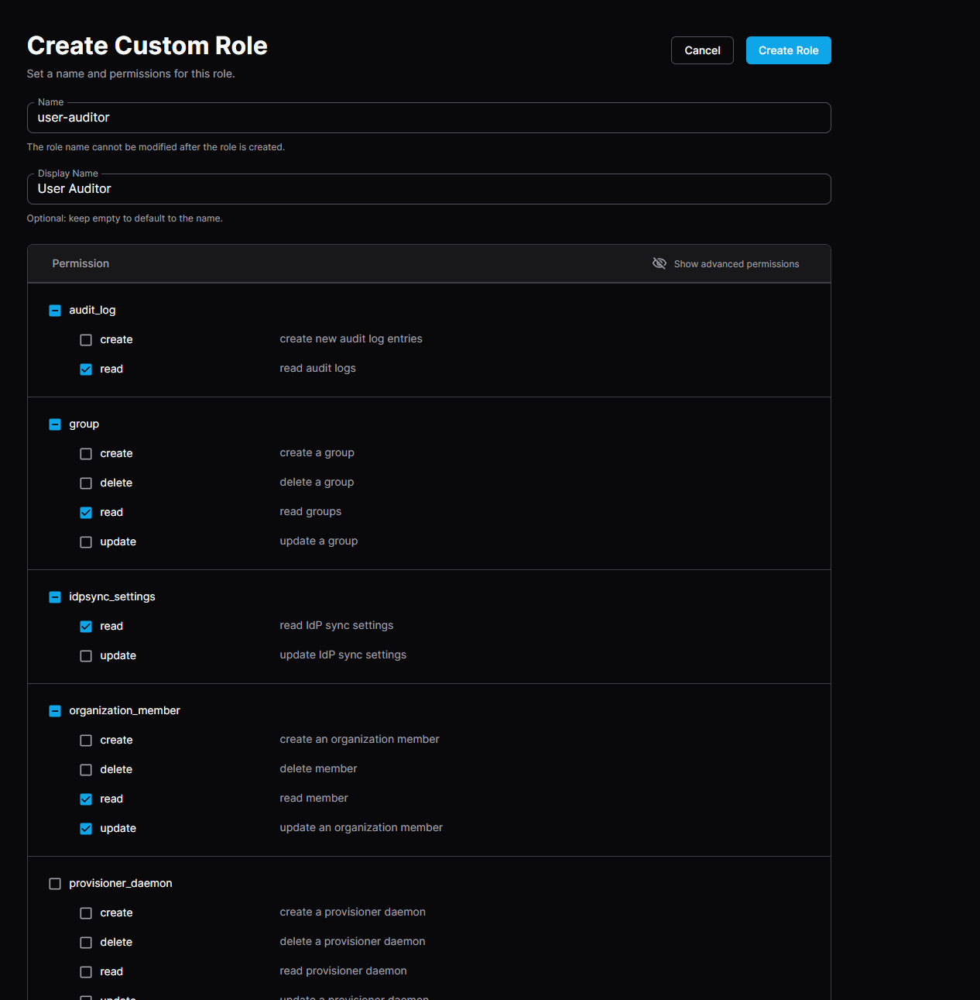
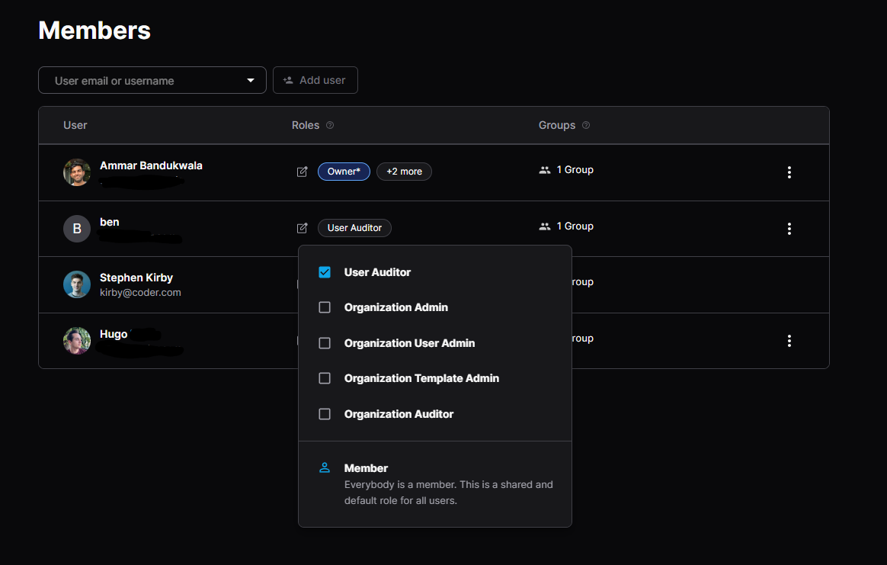

Groups and roles can be manually assigned in Coder. For production deployments,
these can also be [managed and synced by the identity provider](./idp-sync.md).

## Groups

> [!NOTE]
> Groups require a
> [Premium license](https://coder.com/pricing#compare-plans).
> For more details, [contact your account team](https://coder.com/contact).

Groups are logical segmentations of users in Coder and can be used to control
which templates developers can use. For example:

- Users within the `devops` group can access the `AWS-VM` template
- Users within the `data-science` group can access the `Jupyter-Kubernetes`
  template

## Roles

Roles determine which actions users can take within the platform.
The roles in the following table apply across the whole deployment.
Organizations have their own roles.
Refer to [Organization roles](#organization-roles) for more information.

|                                                                 | Auditor | User Admin | Template Admin | Owner |
|-----------------------------------------------------------------|---------|------------|----------------|-------|
| Add and remove Users                                            |         | ✅          |                | ✅     |
| Manage groups (premium)                                         |         | ✅          |                | ✅     |
| Change User roles                                               |         |            |                | ✅     |
| Manage **ALL** Templates                                        |         |            | ✅              | ✅     |
| View **ALL** Workspaces                                         |         |            | ✅              | ✅     |
| Update and delete **ALL** Workspaces                            |         |            |                | ✅     |
| Run [external provisioners](../provisioners/index.md)           |         |            | ✅              | ✅     |
| Execute and use **ALL** Workspaces                              |         |            |                | ✅     |
| View all user operation [Audit Logs](../security/audit-logs.md) | ✅       |            |                | ✅     |

A user may have one or more roles.
Every user also holds an implicit Member role that covers their own account, such as reading their profile and managing their tokens.

The Member role doesn't grant workspace access on its own.
The ability to create and use workspaces comes from the organization's default member roles, which include Organization Workspace Access by default.
Refer to [Default member roles](./organizations.md#default-member-roles) for how to remove workspace operations from the default member set.

The preceding table describes a default deployment.
A deployment that sets `CODER_DISABLE_OWNER_WORKSPACE_ACCESS` removes the Owner role's SSH, application, and terminal access to other users' workspaces.
Owners keep that access to workspaces they own.
Refer to [`--disable-owner-workspace-access`](../../reference/cli/server.md#--disable-owner-workspace-access) for the flag, environment variable, and YAML forms.

## Organization roles

Organization roles apply inside a single [organization](./organizations.md) rather than across the deployment.
A user who belongs to more than one organization can hold different organization roles in each one.
Assign organization roles from **Admin settings** > **Organizations** > **Members**, or sync them from your identity provider with [IdP sync](./idp-sync.md).

Coder ships the following organization roles:

- **Organization Admin**: manages the organization's templates, provisioners, groups, members, and organization role assignments.
- **Organization User Admin**: manages the organization's members, groups, and role assignments, including its IdP sync settings.
- **Organization Template Admin**: manages the organization's templates and provisioners, and reads its workspaces.
- **Organization Auditor**: reads the organization's audit logs and connection logs, along with the resources those logs reference.
- **Organization Workspace Access**: creates and operates the user's own workspaces in the organization.
- **Organization Workspace Creation Ban**: blocks creating and deleting workspaces in the organization, and overrides any role that would otherwise allow it.

Organization Admin doesn't include SSH, application, or terminal access to workspaces other members own.
A user with that role can read, build, stop, and delete those workspaces.
Connecting to one requires access granted through [workspace sharing](../../user-guides/shared-workspaces.md).

Every member of an organization also holds an implicit organization membership role that the dashboard doesn't display.
That role carries the smallest permission set a member needs, such as reading the organization and their own membership record.
Service accounts hold an equivalent implicit role.

## Custom roles

> [!NOTE]
> Custom roles are a Premium feature.
> [Learn more](https://coder.com/pricing#compare-plans).

Starting in v2.16.0, Premium Coder deployments can configure custom roles on the
[Organization](./organizations.md) level. You can create and assign custom roles
in the dashboard under **Organizations** -> **My Organization** -> **Roles**.

### Example roles

- The `Banking Compliance Auditor` custom role cannot create workspaces, but can
  read template source code and view audit logs
- The `Organization Lead` role can access user workspaces for troubleshooting
  purposes, but cannot edit templates
- The `Platform Member` role cannot edit or create workspaces as they are
  created via a third-party system

Custom roles can also be applied to
[headless user accounts](./headless-auth.md):

- A `Health Check` role can view deployment status but cannot create workspaces,
  manage templates, or view users
- A `CI` role can update manage templates but cannot create workspaces or view
  users

### Creating custom roles

Selecting "Create custom role" opens a UI to select the desired permissions for a given persona.

From there, you can assign the custom role to any user in the organization under
the **Users** settings in the dashboard.

Note that these permissions only apply to the scope of an
[organization](./organizations.md), not across the deployment.

### Security notes

A malicious Template Admin could write a template that executes commands on the
host (or `coder server` container), which potentially escalates their privileges
or shuts down the control plane. To avoid this, run
[external provisioners](../provisioners/index.md).

In low-trust environments, we do not recommend giving users direct access to
edit templates. Instead, use
[CI/CD pipelines to update templates](../templates/managing-templates/change-management.md)
with proper security scans and code reviews in place.
