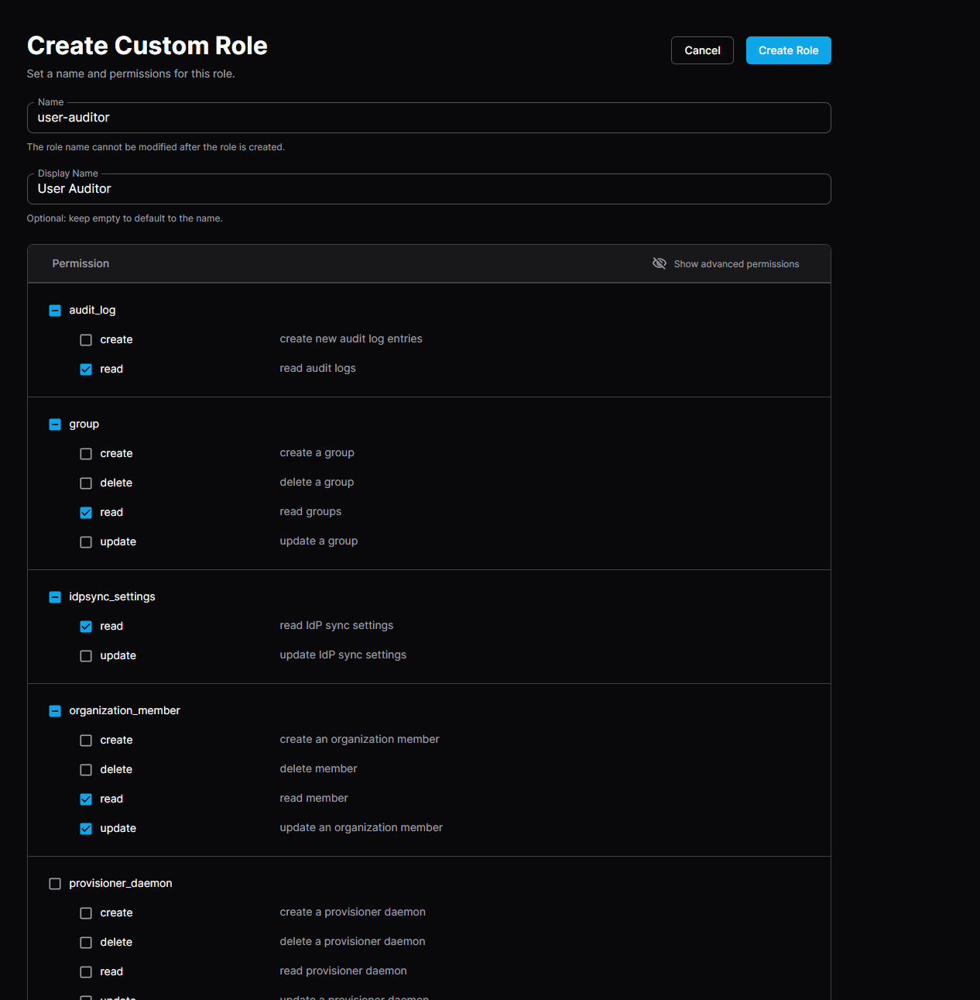

# Groups and Roles

Groups and roles can be manually assigned in Coder. For production deployments,
these can also be [managed and synced by the identity provider](./idp-sync.md).

## Groups

Groups are logical segmentations of users in Coder and can be used to control
which templates developers can use. For example:

- Users within the `devops` group can access the `AWS-VM` template
- Users within the `data-science` group can access the `Jupyter-Kubernetes`
  template

## Roles

Roles determine which actions users can take within the platform.

|                                                                 | Auditor | User Admin | Template Admin | Owner |
|-----------------------------------------------------------------|---------|------------|----------------|-------|
| Add and remove Users                                            |         | ✅          |                | ✅     |
| Manage groups (enterprise) (premium)                            |         | ✅          |                | ✅     |
| Change User roles                                               |         |            |                | ✅     |
| Manage **ALL** Templates                                        |         |            | ✅              | ✅     |
| View **ALL** Workspaces                                         |         |            | ✅              | ✅     |
| Update and delete **ALL** Workspaces                            |         |            |                | ✅     |
| Run [external provisioners](../provisioners.md)                 |         |            | ✅              | ✅     |
| Execute and use **ALL** Workspaces                              |         |            |                | ✅     |
| View all user operation [Audit Logs](../security/audit-logs.md) | ✅       |            |                | ✅     |

A user may have one or more roles. All users have an implicit Member role that
may use personal workspaces.

## Custom Roles

> [!NOTE]
> Custom roles are a Premium feature.
> [Learn more](https://coder.com/pricing#compare-plans).

Starting in v2.16.0, Premium Coder deployments can configure custom roles on the
[Organization](./organizations.md) level. You can create and assign custom roles
in the dashboard under **Organizations** -> **My Organization** -> **Roles**.

### Example roles

- The `Banking Compliance Auditor` custom role cannot create workspaces, but can
  read template source code and view audit logs
- The `Organization Lead` role can access user workspaces for troubleshooting
  purposes, but cannot edit templates
- The `Platform Member` role cannot edit or create workspaces as they are
  created via a third-party system

Custom roles can also be applied to
[headless user accounts](./headless-auth.md):

- A `Health Check` role can view deployment status but cannot create workspaces,
  manage templates, or view users
- A `CI` role can update manage templates but cannot create workspaces or view
  users

### Creating custom roles

Clicking "Create custom role" opens a UI to select the desired permissions for a
given persona.

From there, you can assign the custom role to any user in the organization under
the **Users** settings in the dashboard.

Note that these permissions only apply to the scope of an
[organization](./organizations.md), not across the deployment.

### Security notes

A malicious Template Admin could write a template that executes commands on the
host (or `coder server` container), which potentially escalates their privileges
or shuts down the Coder server. To avoid this, run
[external provisioners](../provisioners.md).

In low-trust environments, we do not recommend giving users direct access to
edit templates. Instead, use
[CI/CD pipelines to update templates](../templates/managing-templates/change-management.md)
with proper security scans and code reviews in place.
