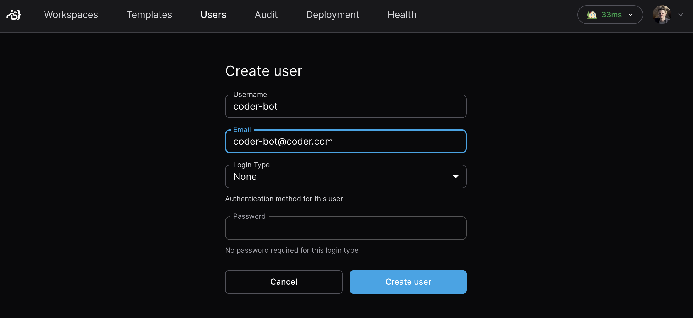

# Headless Authentication

Headless user accounts that cannot use the web UI to log in to Coder. This is
useful for creating accounts for automated systems, such as CI/CD pipelines or
for users who only consume Coder via another client/API.

You must have the User Admin role or above to create headless users.

## Create a headless user

<div class="tabs">

## CLI

```sh
coder users create \
  --email="coder-bot@coder.com" \
  --username="coder-bot" \
  --login-type="none \
```

## UI

Navigate to the `Users` > `Create user` in the topbar



</div>

To make API or CLI requests on behalf of the headless user, learn how to
[generate API tokens on behalf of a user](./sessions-tokens.md#generate-a-long-lived-api-token-on-behalf-of-another-user).
