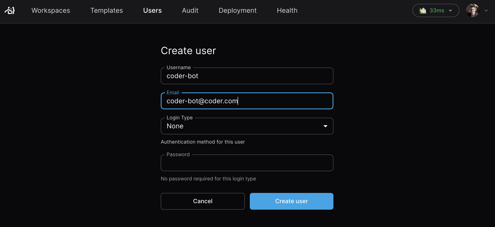

# Headless Authentication

> [!NOTE]
> Creating service accounts with the `--service-account` flag or the **None** login
type in the UI requires a [Premium license](https://coder.com/pricing).

Service accounts are headless user accounts that cannot use the web UI to log in
to Coder. This is useful for creating accounts for automated systems, such as
CI/CD pipelines or for users who only consume Coder via another client/API.

You must have the User Admin role or above to create service accounts.

## Create a service account

<div class="tabs">

## CLI

Use the `--service-account` flag to create a dedicated service account.
This flag is a Premium feature and automatically sets the login type to `none`,
prevents setting an email or password, and applies additional server-side
validations:

```sh
coder users create \
  --username="coder-bot" \
  --service-account
```

## UI

Navigate to **Users** > **Create user** in the top bar, then select
**Service account** as the login type. This option is only available with
a Premium license.



</div>

## Authenticate as a service account

To make API or CLI requests on behalf of the headless user, learn how to
[generate API tokens on behalf of a user](./sessions-tokens.md#generate-a-long-lived-api-token-on-behalf-of-another-user).
