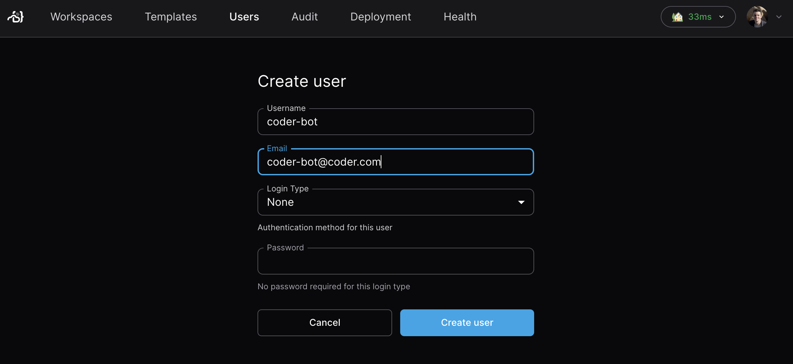

# Headless Authentication

> [!NOTE]
> Creating service accounts requires a [Premium license](https://coder.com/pricing).

Service accounts are headless user accounts that cannot use the web UI to log in
to Coder. This is useful for creating accounts for automated systems, such as
CI/CD pipelines or for users who only consume Coder via another client/API. Service accounts do not have passwords or associated email addresses.

You must have the User Admin role or above to create service accounts.

## Create a service account

<div class="tabs">

## CLI

Use the `--service-account` flag to create a dedicated service account:

```sh
coder users create \
  --username="coder-bot" \
  --service-account
```

## UI

Navigate to **Deployment** > **Users** > **Create user**, then select
**Service account** as the login type.



</div>

## Authenticate as a service account

To make API or CLI requests on behalf of the headless user, learn how to
[generate API tokens on behalf of a user](./sessions-tokens.md#generate-a-long-lived-api-token-on-behalf-of-another-user).

## Deprecation of `login_type=none`

Older Coder versions created passwordless machine users with
`coder users create --login-type none` or the `--disable-login` flag. Creating
these accounts is no longer supported. Use service accounts for
machine-to-machine access instead.

Coder rejects these requests at creation:

- `coder users create --login-type none` fails unless you also pass
  `--service-account`:

  ```text
  Login type 'none' requires --service-account.
  ```

- `--disable-login` is rejected:

  ```text
  --disable-login is deprecated. Use --service-account for machine-to-machine access.
  ```

- `POST /users` returns `400 Bad Request` for `login_type: "none"` without a
  service account:

  ```text
  Login type 'none' requires a service account.
  ```

Service accounts require a [Premium license](https://coder.com/pricing). On
OSS deployments, create a regular user with password, GitHub, or OIDC
authentication for automation instead. See
[Test templates through CI/CD](../../tutorials/testing-templates.md) for an
example.

### Upgrade behavior

> [!WARNING]
> This conversion is irreversible and clears email addresses. Export any email
> addresses you need to keep before you upgrade.

When you upgrade, Coder converts existing non-system `login_type=none` users
into service accounts. Service accounts cannot have an email address, so each
converted user's email is cleared. Existing API tokens for these accounts
remain valid. System users are not affected.
