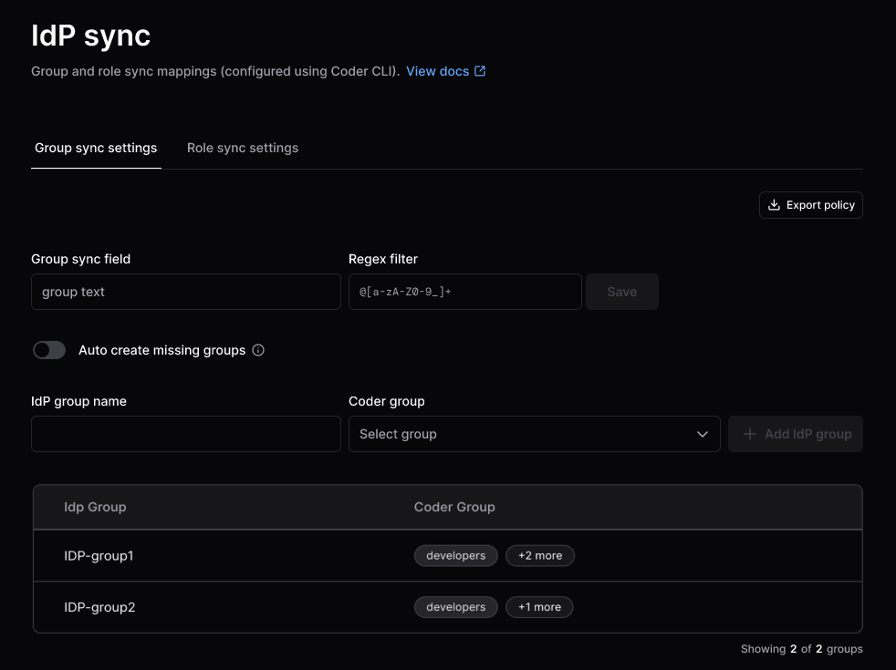
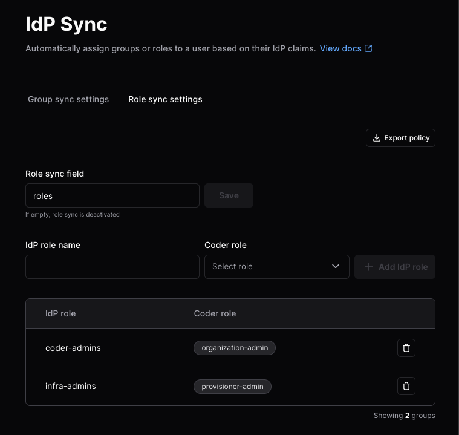

<!-- markdownlint-disable MD024 -->
# IdP Sync

<blockquote class="info">

IdP sync is an Enterprise and Premium feature.
[Learn more](https://coder.com/pricing#compare-plans).

</blockquote>

IdP (Identity provider) sync allows you to use OpenID Connect (OIDC) to
synchronize Coder groups, roles, and organizations based on claims from your IdP.

## Prerequisites

### Confirm that OIDC provider sends claims

To confirm that your OIDC provider is sending claims, log in with OIDC and visit
the following URL with an `Owner` account:

```text
https://[coder.example.com]/api/v2/debug/[your-username]/debug-link
```

You should see a field in either `id_token_claims`, `user_info_claims` or
both followed by a list of the user's OIDC groups in the response.

This is the [claim](https://openid.net/specs/openid-connect-core-1_0.html#Claims)
sent by the OIDC provider.

Depending on the OIDC provider, this claim might be called something else.
Common names include `groups`, `memberOf`, and `roles`.

See the [troubleshooting section](#troubleshooting-grouproleorganization-sync)
for help troubleshooting common issues.

## Group Sync

If your OpenID Connect provider supports group claims, you can configure Coder
to synchronize groups in your auth provider to groups within Coder. To enable
group sync, ensure that the `groups` claim is being sent by your OpenID
provider. You might need to request an additional
[scope](../../reference/cli/server.md#--oidc-scopes) or additional configuration
on the OpenID provider side.

If group sync is enabled, the user's groups will be controlled by the OIDC
provider. This means manual group additions/removals will be overwritten on the
next user login.

For deployments with multiple [organizations](./organizations.md), configure
group sync for each organization.

<div class="tabs">

### Dashboard

1. Fetch the corresponding group IDs using the following endpoint:

   ```text
   https://[coder.example.com]/api/v2/groups
   ```

1. As an Owner or Organization Admin, go to **Admin settings**, select
   **Organizations**, then **IdP Sync**:

   

1. Enter the **Group sync field** and an optional **Regex filter**, then select
   **Save**.

1. Select **Auto create missing groups** to automatically create groups
   returned by the OIDC provider if they do not exist in Coder.

1. Enter the **IdP group name** and **Coder group**, then **Add IdP group**.

### CLI

1. Confirm you have the [Coder CLI](../../install/index.md) installed and are
   logged in with a user who is an Owner or has an Organization Admin role.

1. To fetch the current group sync settings for an organization, run the
   following:

   ```sh
   coder organizations settings show group-sync \
     --org <org-name> \
     > group-sync.json
   ```

   The default for an organization looks like this:

   ```json
   {
       "field": "",
       "mapping": null,
       "regex_filter": null,
       "auto_create_missing_groups": false
   }
   ```

Below is an example that uses the `groups` claim and maps all groups prefixed by
`coder-` into Coder:

```json
{
    "field": "groups",
    "mapping": null,
    "regex_filter": "^coder-.*$",
    "auto_create_missing_groups": true
}
```

<blockquote class="admonition note">

You must specify Coder group IDs instead of group names. The fastest way to find
the ID for a corresponding group is by visiting
`https://coder.example.com/api/v2/groups`.

</blockquote>

Here is another example which maps `coder-admins` from the identity provider to
two groups in Coder and `coder-users` from the identity provider to another
group:

```json
{
    "field": "groups",
    "mapping": {
        "coder-admins": [
            "2ba2a4ff-ddfb-4493-b7cd-1aec2fa4c830",
            "93371154-150f-4b12-b5f0-261bb1326bb4"
        ],
        "coder-users": ["2f4bde93-0179-4815-ba50-b757fb3d43dd"]
    },
    "regex_filter": null,
    "auto_create_missing_groups": false
}
```

To set these group sync settings, use the following command:

```sh
coder organizations settings set group-sync \
  --org <org-name> \
  < group-sync.json
```

Visit the Coder UI to confirm these changes:



### Server Flags

<blockquote class="admonition note">

Use server flags only with Coder deployments with a single organization.

You can use the dashboard to configure group sync instead.

</blockquote>

1. Configure the Coder server to read groups from the claim name with the
   [OIDC group field](../../reference/cli/server.md#--oidc-group-field) server
   flag:

   - Environment variable:

     ```sh
     CODER_OIDC_GROUP_FIELD=groups
     ```

   - As a flag:

     ```sh
     --oidc-group-field groups
     ```

1. On login, users will automatically be assigned to groups that have matching
   names in Coder and removed from groups that the user no longer belongs to.

1. For cases when an OIDC provider only returns group IDs or you want to have
   different group names in Coder than in your OIDC provider, you can configure
   mapping between the two with the
   [OIDC group mapping](../../reference/cli/server.md#--oidc-group-mapping) server
   flag:

   - Environment variable:

     ```sh
     CODER_OIDC_GROUP_MAPPING='{"myOIDCGroupID": "myCoderGroupName"}'
     ```

   - As a flag:

     ```sh
     --oidc-group-mapping '{"myOIDCGroupID": "myCoderGroupName"}'
     ```

   Below is an example mapping in the Coder Helm chart:

   ```yaml
   coder:
     env:
       - name: CODER_OIDC_GROUP_MAPPING
         value: >
           {"myOIDCGroupID": "myCoderGroupName"}
   ```

   From this example, users that belong to the `myOIDCGroupID` group in your
   OIDC provider will be added to the `myCoderGroupName` group in Coder.

</div>

### Group allowlist

You can limit which groups from your identity provider can log in to Coder with
[CODER_OIDC_ALLOWED_GROUPS](https://coder.com/docs/cli/server#--oidc-allowed-groups).
Users who are not in a matching group will see the following error:

<Image height="412px" src="../../images/admin/group-allowlist.png" alt="Unauthorized group error" align="center" />

## Role Sync

If your OpenID Connect provider supports roles claims, you can configure Coder
to synchronize roles in your auth provider to roles within Coder.

For deployments with multiple [organizations](./organizations.md), configure
role sync at the organization level.

<div class="tabs">

### Dashboard

1. As an Owner or Organization Admin, go to **Admin settings**, select
   **Organizations**, then **IdP Sync**.

1. Select the **Role sync settings** tab:

   

1. Enter the **Role sync field**, then select **Save**.

1. Enter the **IdP role name** and **Coder role**, then **Add IdP role**.

   To add a new custom role, select **Roles** from the sidebar, then
   **Create custom role**.

   Visit the [groups and roles documentation](./groups-roles.md) for more information.

### CLI

1. Confirm you have the [Coder CLI](../../install/index.md) installed and are
   logged in with a user who is an Owner or has an Organization Admin role.

1. To fetch the current group sync settings for an organization, run the
   following:

   ```sh
   coder organizations settings show role-sync \
     --org <org-name> \
     > role-sync.json
   ```

   The default for an organization looks like this:

   ```json
   {
       "field": "",
       "mapping": null
   }
   ```

Below is an example that uses the `roles` claim and maps `coder-admins` from the
IdP as an `Organization Admin` and also maps to a custom `provisioner-admin`
role:

```json
{
    "field": "roles",
    "mapping": {
        "coder-admins": ["organization-admin"],
        "infra-admins": ["provisioner-admin"]
    }
}
```

<blockquote class="admonition note">

Be sure to use the `name` field for each role, not the display name. Use
`coder organization roles show --org=<your-org>` to see roles for your
organization.

</blockquote>

To set these role sync settings, use the following command:

```sh
coder organizations settings set role-sync \
  --org <org-name> \
  < role-sync.json
```

Visit the Coder UI to confirm these changes:



### Server Flags

<blockquote class="admonition note">

Use server flags only with Coder deployments with a single organization.

You can use the dashboard to configure role sync instead.

</blockquote>

1. Configure the Coder server to read groups from the claim name with the
   [OIDC role field](../../reference/cli/server.md#--oidc-user-role-field)
   server flag:

1. Set the following in your Coder server [configuration](../setup/index.md).

   ```env
    # Depending on your identity provider configuration, you may need to explicitly request a "roles" scope
   CODER_OIDC_SCOPES=openid,profile,email,roles

   # The following fields are required for role sync:
   CODER_OIDC_USER_ROLE_FIELD=roles
   CODER_OIDC_USER_ROLE_MAPPING='{"TemplateAuthor":["template-admin","user-admin"]}'
   ```

One role from your identity provider can be mapped to many roles in Coder. The
example above maps to two roles in Coder.

</div>

## Organization Sync

If your OpenID Connect provider supports groups/role claims, you can configure
Coder to synchronize claims in your auth provider to organizations within Coder.

Viewing and editing the organization settings requires deployment admin
permissions (UserAdmin or Owner).

Organization sync works across all organizations. On user login, the sync will
add and remove the user from organizations based on their IdP claims. After the
sync, the user's state should match that of the IdP.

You can initiate an organization sync through the Coder dashboard or CLI:

<div class="tabs">

### Dashboard

1. Fetch the corresponding organization IDs using the following endpoint:

   ```text
   https://[coder.example.com]/api/v2/organizations
   ```

1. As a Coder organization user admin or site-wide user admin, go to
   **Admin settings** > **Deployment** and select **IdP organization sync**.

1. In the **Organization sync field** text box, enter the organization claim,
   then select **Save**.

   Users are automatically added to the default organization.

   Do not disable **Assign Default Organization**. If you disable the default
   organization, the system will remove users who are already assigned to it.

1. Enter an IdP organization name and Coder organization(s), then select **Add
   IdP organization**:

   

### CLI

Use the Coder CLI to show and adjust the settings.

These deployment-wide settings are stored in the database. After you change the
settings, a user's memberships will update when they log out and log back in.

1. Show the current settings:

   ```console
   coder organization settings show org-sync
   {
      "field": "organizations",
      "mapping": {
         "product": ["868e9b76-dc6e-46ab-be74-a891e9bd784b", "cbdcf774-9412-4118-8cd9-b3f502c84dfb"]
      },
      "organization_assign_default": true
   }
   ```

1. Update with the JSON payload. In this example, `settings.json` contains the
   payload:

   ```console
   coder organization settings set org-sync < settings.json
   {
      "field": "organizations",
      "mapping": {
         "product": [
            "868e5b23-dc6e-46ab-be74-a891e9bd784b",
            "cbdcf774-4123-4118-8cd9-b3f502c84dfb"
         ],
         "sales": [
            "d79144d9-b30a-555a-9af8-7dac83b2q4ec",
         ]
      },
      "organization_assign_default": true
   }
   ```

   Analyzing the JSON payload:

   | Field                       | Explanation                                                                                                                                                                                                                                                                             |
   |:----------------------------|:----------------------------------------------------------------------------------------------------------------------------------------------------------------------------------------------------------------------------------------------------------------------------------------|
   | field                       | If this field is the empty string `""`, then org-sync is disabled. </br> Org memberships must be manually configured through the UI or API.                                                                                                                                             |
   | mapping                     | Mapping takes a claim from the IdP, and associates it with 1 or more organizations by UUID. </br> No validation is done, so you can put UUID's of orgs that do not exist (a noop). The UI picker will allow selecting orgs from a drop down, and convert it to a UUID for you.          |
   | organization_assign_default | This setting exists for maintaining backwards compatibility with single org deployments, either through their upgrade, or in perpetuity. </br> If this is set to 'true', all users will always be assigned to the default organization regardless of the mappings and their IdP claims. |

</div>

## Troubleshooting group/role/organization sync

Some common issues when enabling group, role, or organization sync.

### General guidelines

If you are running into issues with a sync:

1. View your Coder server logs and enable
   [verbose mode](../../reference/cli/index.md#-v---verbose).

1. To reduce noise, you can filter for only logs related to group/role sync:

   ```sh
   CODER_VERBOSE=true
   CODER_LOG_FILTER=".*userauth.*|.*groups returned.*"
   ```

1. Restart the server after changing these configuration values.

1. Attempt to log in, preferably with a user who has the `Owner` role.

The logs for a successful sync look like this (human-readable):

```sh
[debu]  coderd.userauth: got oidc claims  request_id=49e86507-6842-4b0b-94d4-f245e62e49f3  source=id_token  claim_fields="[aio aud email exp groups iat idp iss name nbf oid preferred_username rh sub tid uti ver]"  blank=[]

[debu]  coderd.userauth: got oidc claims  request_id=49e86507-6842-4b0b-94d4-f245e62e49f3  source=userinfo  claim_fields="[email family_name given_name name picture sub]"  blank=[]

[debu]  coderd.userauth: got oidc claims  request_id=49e86507-6842-4b0b-94d4-f245e62e49f3  source=merged  claim_fields="[aio aud email exp family_name given_name groups iat idp iss name nbf oid picture preferred_username rh sub tid uti ver]"  blank=[]

[debu]  coderd: groups returned in oidc claims  request_id=49e86507-6842-4b0b-94d4-f245e62e49f3  email=ben@coder.com  username=ben  len=3  groups="[c8048e91-f5c3-47e5-9693-834de84034ad 66ad2cc3-a42f-4574-a281-40d1922e5b65 70b48175-107b-4ad8-b405-4d888a1c466f]"
```

To view the full claim, the Owner role can visit this endpoint on their Coder
deployment after logging in:

```sh
https://[coder.example.com]/api/v2/debug/[username]/debug-link
```

### User not being assigned / Group does not exist

If you want Coder to create groups that do not exist, you can set the following
environment variable.

If you enable this, your OIDC provider might be sending over many unnecessary
groups. Use filtering options on the OIDC provider to limit the groups sent over
to prevent creating excess groups.

```env
# as an environment variable
CODER_OIDC_GROUP_AUTO_CREATE=true
```

```shell
# as a flag
--oidc-group-auto-create=true
```

A basic regex filtering option on the Coder side is available. This is applied
**after** the group mapping (`CODER_OIDC_GROUP_MAPPING`), meaning if the group
is remapped, the remapped value is tested in the regex. This is useful if you
want to filter out groups that do not match a certain pattern. For example, if
you want to only allow groups that start with `my-group-` to be created, you can
set the following environment variable.

```env
# as an environment variable
CODER_OIDC_GROUP_REGEX_FILTER="^my-group-.*$"
```

```shell
# as a flag
--oidc-group-regex-filter="^my-group-.*$"
```

### Invalid Scope

If you see an error like the following, you may have an invalid scope.

```console
The application '<oidc_application>' asked for scope 'groups' that doesn't exist on the resource...
```

This can happen because the identity provider has a different name for the
scope. For example, Azure AD uses `GroupMember.Read.All` instead of `groups`.
You can find the correct scope name in the IdP's documentation. Some IdPs allow
configuring the name of this scope.

The solution is to update the value of `CODER_OIDC_SCOPES` to the correct value
for the identity provider.

### No `group` claim in the `got oidc claims` log

Steps to troubleshoot.

1. Ensure the user is a part of a group in the IdP. If the user has 0 groups, no
   `groups` claim will be sent.
2. Check if another claim appears to be the correct claim with a different name.
   A common name is `memberOf` instead of `groups`. If this is present, update
   `CODER_OIDC_GROUP_FIELD=memberOf`.
3. Make sure the number of groups being sent is under the limit of the IdP. Some
   IdPs will return an error, while others will just omit the `groups` claim. A
   common solution is to create a filter on the identity provider that returns
   less than the limit for your IdP.
   - [Azure AD limit is 200, and omits groups if exceeded.](https://learn.microsoft.com/en-us/azure/active-directory/hybrid/connect/how-to-connect-fed-group-claims#options-for-applications-to-consume-group-information)
   - [Okta limit is 100, and returns an error if exceeded.](https://developer.okta.com/docs/reference/api/oidc/#scope-dependent-claims-not-always-returned)

## Provider-Specific Guides

Below are some details specific to individual OIDC providers.

### Active Directory Federation Services (ADFS)

> **Note:** Tested on ADFS 4.0, Windows Server 2019

1. In your Federation Server, create a new application group for Coder.
   Follow the steps as described in the [Windows Server documentation]
   (https://learn.microsoft.com/en-us/windows-server/identity/ad-fs/development/msal/adfs-msal-web-app-web-api#app-registration-in-ad-fs).

   - **Server Application**: Note the Client ID.
   - **Configure Application Credentials**: Note the Client Secret.
   - **Configure Web API**: Set the Client ID as the relying party identifier.
   - **Application Permissions**: Allow access to the claims `openid`, `email`,
     `profile`, and `allatclaims`.

1. Visit your ADFS server's `/.well-known/openid-configuration` URL and note the
   value for `issuer`.

   This will look something like
   `https://adfs.corp/adfs/.well-known/openid-configuration`.

1. In Coder's configuration file (or Helm values as appropriate), set the
   following environment variables or their corresponding CLI arguments:

   - `CODER_OIDC_ISSUER_URL`: `issuer` value from the previous step.
   - `CODER_OIDC_CLIENT_ID`: Client ID from step 1.
   - `CODER_OIDC_CLIENT_SECRET`: Client Secret from step 1.
   - `CODER_OIDC_AUTH_URL_PARAMS`: set to

     ```json
     {"resource":"$CLIENT_ID"}
     ```

     Where `$CLIENT_ID` is the Client ID from step 1.
     Consult the Microsoft [AD FS OpenID Connect/OAuth flows and Application Scenarios documentation](https://learn.microsoft.com/en-us/windows-server/identity/ad-fs/overview/ad-fs-openid-connect-oauth-flows-scenarios#:~:text=scope%E2%80%AFopenid.-,resource,-optional) for more information.

     This is required for the upstream OIDC provider to return the requested
     claims.

   - `CODER_OIDC_IGNORE_USERINFO`: Set to `true`.

1. Configure
   [Issuance Transform Rules](https://learn.microsoft.com/en-us/windows-server/identity/ad-fs/operations/create-a-rule-to-send-ldap-attributes-as-claims)
   on your Federation Server to send the following claims:

   - `preferred_username`: You can use e.g. "Display Name" as required.
   - `email`: You can use e.g. the LDAP attribute "E-Mail-Addresses" as
     required.
   - `email_verified`: Create a custom claim rule:

     ```json
     => issue(Type = "email_verified", Value = "true")
     ```

   - (Optional) If using Group Sync, send the required groups in the configured
     groups claim field.
     Use [this answer from Stack Overflow](https://stackoverflow.com/a/55570286) for an example.

### Keycloak

The `access_type` parameter has two possible values: `online` and `offline`.
By default, the value is set to `offline`.

This means that when a user authenticates using OIDC, the application requests
offline access to the user's resources, including the ability to refresh access
tokens without requiring the user to reauthenticate.

To enable the `offline_access` scope which allows for the refresh token
functionality, you need to add it to the list of requested scopes during the
authentication flow.
Including the `offline_access` scope in the requested scopes ensures that the
user is granted the necessary permissions to obtain refresh tokens.

By combining the `{"access_type":"offline"}` parameter in the OIDC Auth URL with
the `offline_access` scope, you can achieve the desired behavior of obtaining
refresh tokens for offline access to the user's resources.
