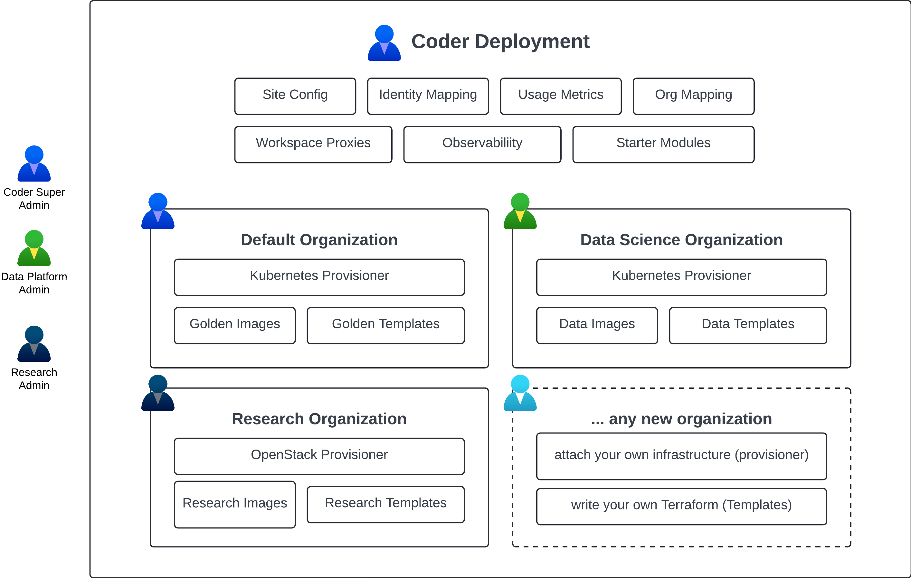
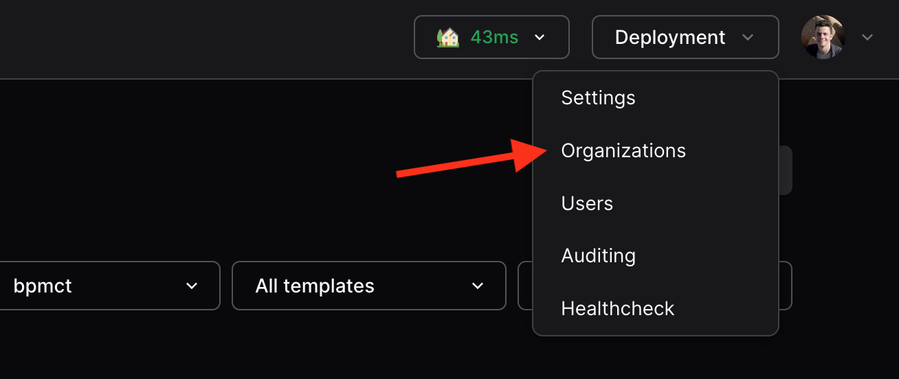
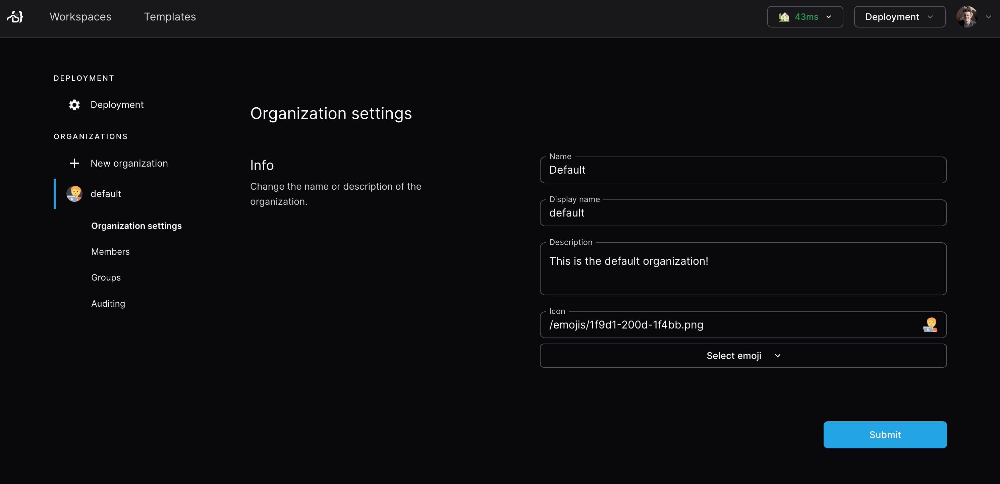
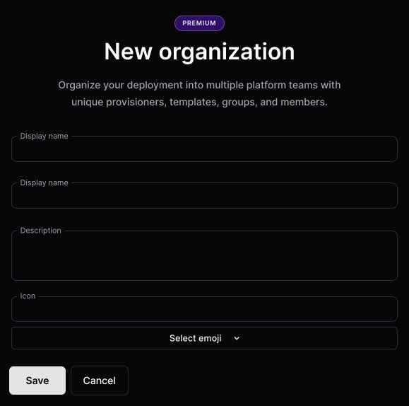
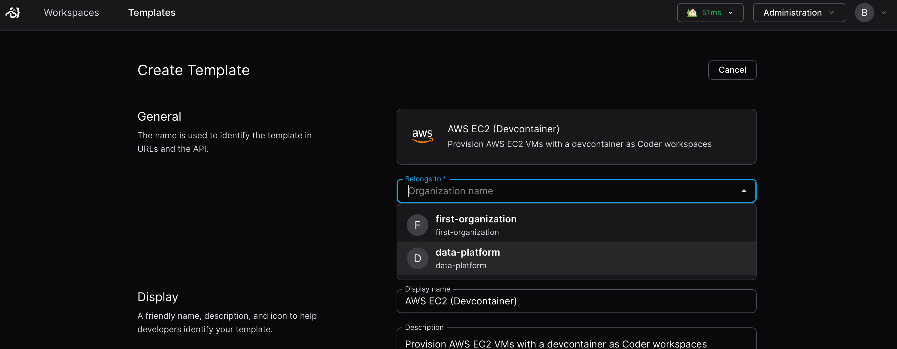
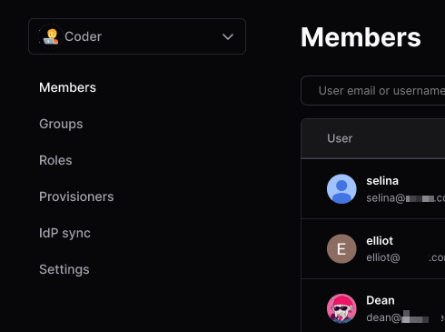

# Organizations (Premium)

> Note: Organizations requires a
> [Premium license](https://coder.com/pricing#compare-plans). For more details,
> [contact your account team](https://coder.com/contact).

Organizations can be used to segment and isolate resources inside a Coder
deployment for different user groups or projects.

## Example

Here is an example of how one could use organizations to run a Coder deployment
with multiple platform teams, all with unique resources:



## The default organization

All Coder deployments start with one organization called `Coder`.

To edit the organization details, navigate to `Deployment -> Organizations` in
the top bar:



From there, you can manage the name, icon, description, users, and groups:



## Additional organizations

Any additional organizations have unique admins, users, templates, provisioners,
groups, and workspaces. Each organization must have at least one
[provisioner](../provisioners.md) as the built-in provisioner only applies to
the default organization.

You can configure [organization/role/group sync](./idp-sync.md) from your
identity provider to avoid manually assigning users to organizations.

## Creating an organization

### Prerequisites

- Coder v2.16+ deployment with Premium license with Organizations enabled
  ([contact your account team](https://coder.com/contact)) for more details.
- User with `Owner` role

### 1. Create the organization

Within the sidebar, click `New organization` to create an organization. In this
example, we'll create the `data-platform` org.



From there, let's deploy a provisioner and template for this organization.

### 2. Deploy a provisioner

[Provisioners](../provisioners.md) are organization-scoped and are responsible
for executing Terraform/OpenTofu to provision the infrastructure for workspaces
and testing templates. Before creating templates, we must deploy at least one
provisioner as the built-in provisioners are scoped to the default organization.

Using Coder CLI, run the following command to create a key that will be used to
authenticate the provisioner:

```sh
coder provisioner keys create data-cluster-key --org data-platform
Successfully created provisioner key data-cluster! Save this authentication token, it will not be shown again.

< key omitted >
```

Next, start the provisioner with the key on your desired platform. In this
example, we'll start it using the Coder CLI on a host with Docker. For
instructions on using other platforms like Kubernetes, see our
[provisioner documentation](../provisioners.md).

```sh
export CODER_URL=https://<your-coder-url>
export CODER_PROVISIONER_DAEMON_KEY=<key>
coder provisionerd start --org <org-name>
```

### 3. Create a template

Once you've started a provisioner, you can create a template. You'll notice the
"Create Template" screen now has an organization dropdown:



### 5. Add members

Navigate to `Deployment->Organizations` to add members to your organization.
Once added, they will be able to see the organization-specific templates.



### 6. Create a workspace

Now, users in the data platform organization will see the templates related to
their organization. Users can be in multiple organizations.


## Beta

As of v2.16.0, Organizations is in beta. If you encounter any issues, please
[file an issue](https://github.com/coder/coder/issues/new) or contact your
account team.
