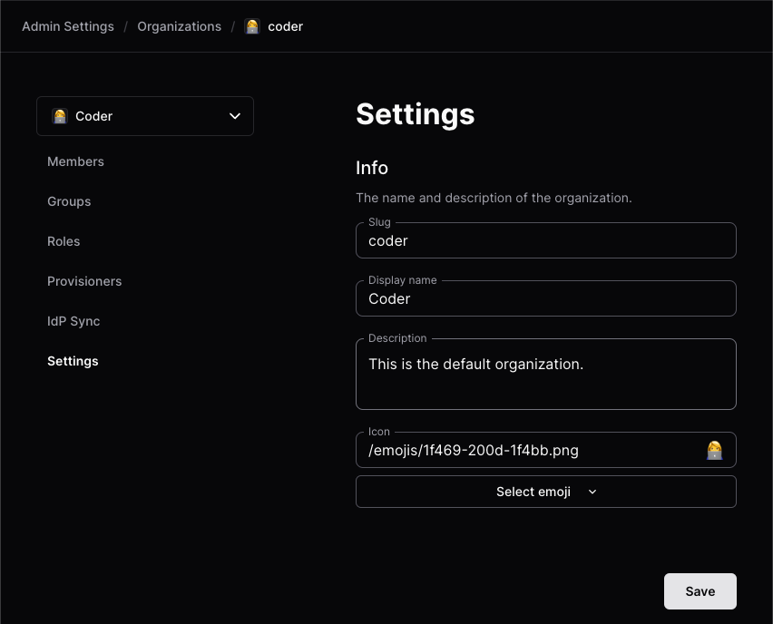
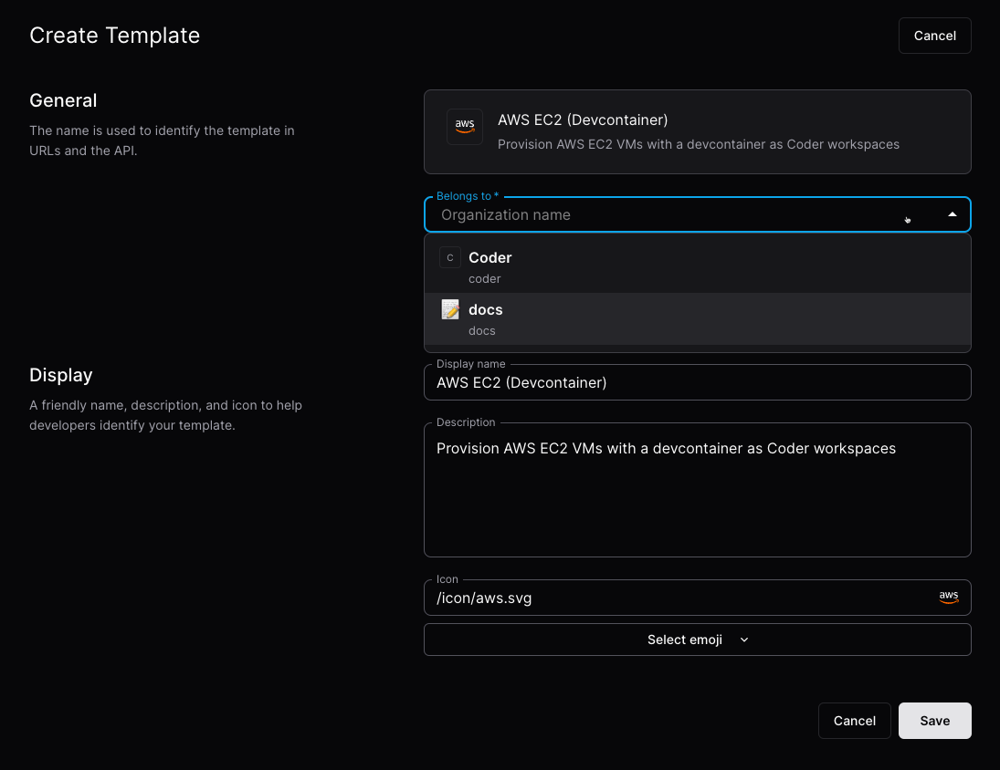
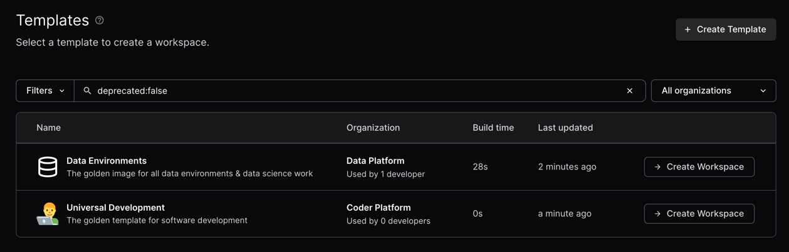

# Organizations (Premium)

> [!NOTE]
> Organizations requires a
> [Premium license](https://coder.com/pricing#compare-plans). For more details,
> [contact your account team](https://coder.com/contact).

Organizations can be used to segment and isolate resources inside a Coder
deployment for different user groups or projects.

## Example

Here is an example of how one could use organizations to run a Coder deployment
with multiple platform teams, all with unique resources:


For more information about how to use organizations, visit the
[organizations best practices](../../tutorials/best-practices/organizations.md)
guide.

## The default organization

All Coder deployments start with one organization called `coder`. All new users
are added to this organization by default.

To edit the organization details, select **Admin settings** from the top bar, then
**Organizations**:

<Image height="255px" src="../../images/admin/users/organizations/admin-settings-orgs.png" alt="Organizations Menu" align="center" />

From there, you can manage the name, icon, description, users, and groups:



## Additional organizations

Any additional organizations have unique admins, users, templates, provisioners,
groups, and workspaces. Each organization must have at least one dedicated
[provisioner](../provisioners.md) since the built-in provisioners only apply to
the default organization.

You can configure [organization/role/group sync](./idp-sync.md) from your
identity provider to avoid manually assigning users to organizations.

## How to create an organization

### Prerequisites

- Coder v2.16+ deployment with Premium license and Organizations enabled
  ([contact your account team](https://coder.com/contact)) for more details.
- User with `Owner` role

### 1. Create the organization

To create a new organization:

1. Select **Admin settings** from the top bar, then **Organizations**.

1. Select the current organization to expand the organizations dropdown, then select **Create Organization**:

   <Image height="212px" src="../../images/admin/users/organizations/org-dropdown-create.png" alt="Organizations dropdown and Create Organization" align="center" />

1. Enter the details and select **Save** to continue:

   <Image height="579px" src="../../images/admin/users/organizations/new-organization.png" alt="New Organization" align="center" />

In this example, we'll create the `data-platform` org.

Next deploy a provisioner and template for this organization.

### 2. Deploy a provisioner

[Provisioners](../provisioners.md) are organization-scoped and are responsible
for executing Terraform/OpenTofu to provision the infrastructure for workspaces
and testing templates. Before creating templates, we must deploy at least one
provisioner as the built-in provisioners are scoped to the default organization.

1. Using Coder CLI, run the following command to create a key that will be used
   to authenticate the provisioner:

   ```shell
   coder provisioner keys create data-cluster-key --org data-platform
   Successfully created provisioner key data-cluster! Save this authentication token, it will not be shown again.

   < key omitted >
   ```

1. Start the provisioner with the key on your desired platform.

   In this example, start the provisioner using the Coder CLI on a host with
   Docker. For instructions on using other platforms like Kubernetes, see our
   [provisioner documentation](../provisioners.md).

   ```sh
   export CODER_URL=https://<your-coder-url>
   export CODER_PROVISIONER_DAEMON_KEY=<key>
   coder provisionerd start --org <org-name>
   ```

### 3. Create a template

Once you've started a provisioner, you can create a template. You'll notice the
**Create Template** screen now has an organization dropdown:



### 4. Add members

From **Admin settings**, select **Organizations**, then **Members** to add members to
your organization. Once added, members will be able to see the
organization-specific templates.

<Image height="365px" src="../../images/admin/users/organizations/organization-members.png" alt="Add members" align="center" />

### 5. Create a workspace

Now, users in the data platform organization will see the templates related to
their organization. Users can be in multiple organizations.



## Next steps

- [Organizations - best practices](../../tutorials/best-practices/organizations.md)
