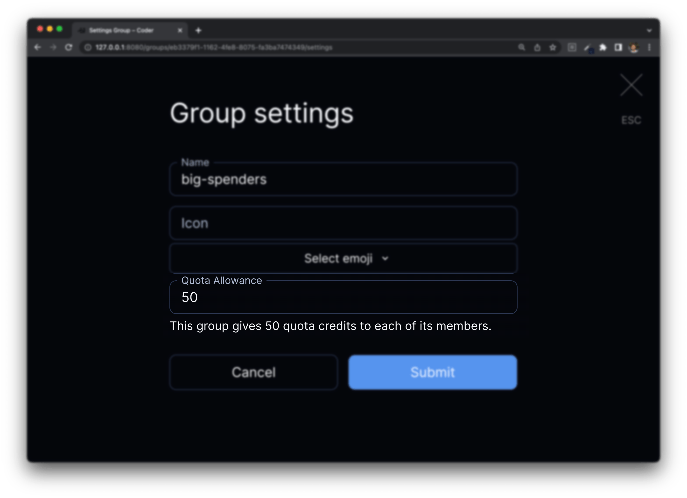
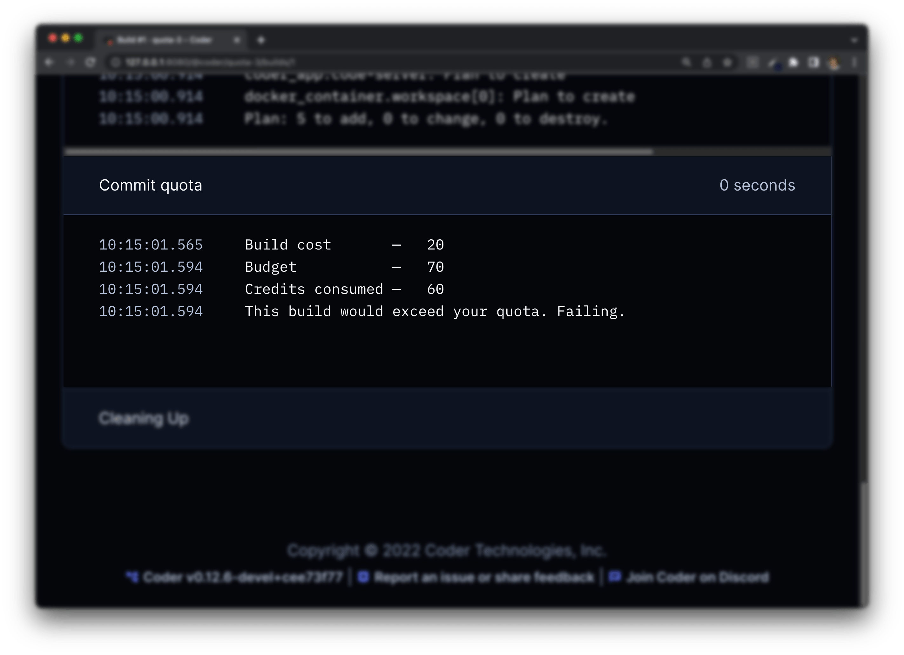

Quotas are a mechanism for controlling spend by associating costs with workspace
templates and assigning budgets to users. Users that exceed their budget will be
blocked from launching more workspaces until they either delete their other
workspaces or get their budget extended.

For example: A template is configured with a cost of 5 credits per day, and the
user is granted 15 credits, which can be consumed by both started and stopped
workspaces. This budget limits the user to 3 concurrent workspaces.

Quotas are scoped to [Groups](./groups-roles.md) in Enterprise and
[organizations](./organizations.md) in Premium.

## Definitions

- **Credits** is the fundamental unit representing cost in the quota system.
  This integer can be arbitrary, or it can map to your preferred currency.
- **Budget** is the per-user, enforced, upper limit to credit spend.
- **Allowance** is a grant of credits to the budget.

<a id="establishing-costs"></a>

## Establish costs

Templates describe their cost through the `daily_cost` attribute in
[`resource_metadata`](https://registry.terraform.io/providers/coder/coder/latest/docs/resources/metadata).
Since costs are associated with resources, an offline workspace may consume less
quota than an online workspace.

A common use case is separating costs for a persistent volume and ephemeral
compute:

```tf
resource "docker_volume" "home_volume" {
  name = "coder-${data.coder_workspace_owner.me.name}-${data.coder_workspace.me.name}-root"
}

resource "coder_metadata" "home_volume" {
    resource_id = docker_volume.home_volume.id
    daily_cost  = 10
}

resource "docker_container" "workspace" {
  count = data.coder_workspace.me.start_count
  image = "codercom/code-server:latest"
  ...
  volumes {
    container_path = "/home/coder/"
    volume_name    = docker_volume.home_volume.name
    read_only      = false
  }
}

resource "coder_metadata" "workspace" {
    count       = data.coder_workspace.me.start_count
    resource_id = docker_container.workspace.id
    daily_cost  = 20
}
```

When the workspace above is shut down, the `docker_container` and
`coder_metadata` both get deleted. This reduces the cost from 30 credits to 10
credits.

Resources without a `daily_cost` value are considered to cost 0. If the cost was
removed on the `docker_volume` above, the template would consume 0 credits when
it's offline. This technique is good for incentivizing users to shut down their
unused workspaces and freeing up compute in the cluster.

<a id="establishing-budgets"></a>

## Establish budgets

Each group has a configurable Quota Allowance. A user's budget is calculated as
the sum of their allowances.



For example:

| Group Name | Quota Allowance |
|------------|-----------------|
| Frontend   | 10              |
| Backend    | 20              |
| Data       | 30              |

<br/>

| Username | Groups            | Effective Budget |
|----------|-------------------|------------------|
| jill     | Frontend, Backend | 30               |
| jack     | Backend, Data     | 50               |
| sam      | Data              | 30               |
| alex     | Frontend          | 10               |

By default, groups are assumed to have a default allowance of 0.

## Quota Enforcement

Coder enforces Quota on workspace start and stop operations. The workspace build
process dynamically calculates costs, so quota violation fails builds as opposed
to failing the build-triggering operation. For example, the Workspace Create
Form will never get held up by quota enforcement.



Coder checks quota for one build at a time for each user in each organization.
Builds that start together, such as several autostarts, are each checked against the credits that the builds before them consumed.

## Upgrade a deployment that enforces quotas

Earlier releases of Coder check quota for concurrent builds in parallel, and current releases check one build at a time.
The two methods aren't safe to run side by side.
If an earlier and a current `coderd`, the process that runs the control plane, commit quota at the same time, users can get more workspaces than their budgets allow, and a build can pass a quota check that it should fail.

To upgrade an affected deployment from an earlier release to a current one, plan a short control plane outage with no overlap between earlier and current `coderd` processes.
Later upgrades between current releases follow the usual upgrade process.
If you aren't sure whether your current release checks quota one build at a time, follow this procedure.

### Check whether your deployment is affected

Your deployment is affected when both of these are true:

- The deployment has an Enterprise or Premium license.
- At least one template sets a nonzero `daily_cost` on a resource, as described in [Establish costs](#establish-costs).

Coder commits quota only for start and stop builds that have a nonzero cost.
Group quota allowances with no template that sets a `daily_cost` never commit quota.

To confirm that your deployment commits quota, run this query against the Coder database:

```sql
SELECT count(*) FROM workspace_builds WHERE daily_cost > 0;
```

A result greater than zero means the deployment commits quota.
A result of zero doesn't rule out a template that adds a cost later, so check your templates as well.

If your deployment isn't affected, [upgrade as usual](../../install/operate/upgrade.md).

> [!WARNING]
> Don't use a rolling upgrade for an affected deployment.
> The default Kubernetes `RollingUpdate` strategy starts a new pod before the old pod stops, even with one replica, so earlier and current `coderd` processes overlap and quota can be granted beyond a user's budget.
>
> Stopping every workspace doesn't make the upgrade safe.
> Stop builds also commit quota, queued and running builds can remain, and autostart, prebuilt workspaces, and API requests keep creating builds until every `coderd` stops.

### What users experience during the outage

- From the time you stop the first `coderd` until the new release starts, the dashboard, the API, and the CLI are unavailable, so users can't create, start, or stop workspaces.
- The upgrade doesn't start or stop workspaces, so running workspaces keep running.
- Autostarts and autostops that come due during the outage run shortly after the new release starts, so expect a burst of builds.
- Builds that are still queued stay queued and run after provisioners reconnect.
- The new release marks a queued build as failed once the build has gone 30&nbsp;minutes without an update.
- The new release marks an interrupted build as failed once the build has gone 5&nbsp;minutes without an update, and its owner must start or stop the workspace again.

### Prepare for the upgrade

1. Take a database snapshot, because Coder doesn't support rollbacks.
1. List every host, VM, container, and Kubernetes deployment that runs `coderd`.
1. List everything that can start or restart `coderd`, such as systemd units, container restart policies, autoscalers, and GitOps controllers.
1. List every external provisioner daemon and where it runs.
   `coder provisioner list --org <organization>` shows the daemons connected to each organization.
1. Tell users when the outage starts and how long it lasts.

### Stop the earlier release

1. Pause or turn off everything from your list that can start or restart `coderd`, for example with `sudo systemctl disable coder`.
1. Stop each external provisioner daemon with `SIGTERM`, for example with `kubectl scale deployment <provisioner-deployment> --replicas=0` or `sudo systemctl stop <provisioner-unit>`.

   On `SIGTERM`, a provisioner daemon finishes its active build and then exits.
   `SIGINT` cancels the active build instead.
   In the provisioner Helm chart, `provisionerDaemon.terminationGracePeriodSeconds` (default `600`) sets how long Kubernetes waits for the build before it stops the pod.

1. Wait until every external provisioner daemon process has exited.
1. If `coderd` runs embedded provisioners, wait until each organization has no running builds:

   ```console
   $ coder provisioner jobs list --status running,canceling --org <organization>
   No provisioner jobs found
   ```

   `CODER_PROVISIONER_DAEMONS` sets the number of embedded provisioners, and its default is `3`.
   Embedded provisioners keep taking new builds until `coderd` stops, so go to the next step as soon as the list is empty.

1. Stop every `coderd` replica with `SIGTERM`, and wait for each process to exit.

   - Kubernetes: run `kubectl scale deployment coder --replicas=0 -n <namespace>`, then wait until `kubectl get pods -n <namespace> -l app.kubernetes.io/name=coder` lists no pods, including pods that are `Terminating`.
   - systemd: run `sudo systemctl stop coder` on each host.

   On `SIGTERM`, `coderd` stops serving the API and then waits up to 30&nbsp;minutes for embedded provisioners to finish their active builds.
   The Coder Helm chart gives each pod 60&nbsp;seconds before Kubernetes stops it, and any build still running at that point is interrupted.

### Verify that the earlier release is gone

1. Confirm that no `coderd` process from the earlier release runs on any host from your list.
1. Check the database for sessions that `coderd` left open:

   ```sql
   SELECT pid, usename, client_addr, state, backend_start, xact_start
   FROM pg_stat_activity
   WHERE datname = '<coder-database>'
     AND usename = '<coderd-database-user>'
     AND pid <> pg_backend_pid();
   ```

   The expected result is no rows.
   `coderd` doesn't set an `application_name` unless your `CODER_PG_CONNECTION_URL` sets one, so identify its sessions by `usename` and `client_addr`.

1. If a session remains from a host that runs no `coderd`, end it with `SELECT pg_terminate_backend(<pid>);`.

   > [!CAUTION]
   > Ending a session rolls back its open transaction.
   > End only sessions from hosts where you confirmed that no `coderd` runs.

1. Confirm that no `coderd` replica still reports to the database:

   ```sql
   SELECT hostname, version, updated_at
   FROM replicas
   WHERE stopped_at IS NULL
     AND updated_at > now() - interval '1 minute';
   ```

   The expected result is no rows, because a running `coderd` updates its row every 5&nbsp;seconds.

1. Record the builds that the outage interrupted:

   ```sql
   SELECT pj.id AS job_id, wb.workspace_id, wb.transition, pj.job_status
   FROM provisioner_jobs pj
   JOIN workspace_builds wb ON wb.job_id = pj.id
   WHERE pj.job_status IN ('running', 'canceling');
   ```

   The new release marks these builds as failed, so plan to tell their owners to start or stop the workspace again.

### Start the new release

1. Turn off automatic rollback for this upgrade, such as the `--atomic` flag of `helm upgrade`.
   A rollback replaces new pods with pods of the earlier release while the new ones may still run.
1. Upgrade and start `coderd` on every host or deployment from your list.
   On Kubernetes, run `helm upgrade` with the new version, then confirm that the deployment runs the replica count you expect.
1. Confirm that every replica runs the new release by running the `replicas` query again.
   Each row shows the new version in the `version` column.
1. Start the external provisioner daemons.
1. Confirm that each daemon is connected with `coder provisioner list --org <organization>`.
1. Configure everything you paused or turned off to use the new release.
1. Resume everything you paused or turned off.
1. Tell users that the outage is over, and tell the owners of interrupted builds to start or stop their workspaces again.

> [!NOTE]
> On Kubernetes, setting `coder.strategy.type` to `Recreate` in your Helm values makes Kubernetes remove every old pod before it creates a new one.
> Remove any `coder.strategy.rollingUpdate` settings when you do, because Kubernetes rejects them with `Recreate`.
> `Recreate` doesn't drain provisioners or check the database, so it doesn't replace the steps above.

### Recover from an overlap

If you find a `coderd` from the earlier release running after the new release started, quota decisions made during the overlap might be wrong.

1. Stop the earlier `coderd`.
1. Repeat the checks in [Verify that the earlier release is gone](#verify-that-the-earlier-release-is-gone).
1. For each user who built workspaces during the overlap, compare `credits_consumed` with `budget` from [Get workspace quota by user](../../reference/api/enterprise.md#get-workspace-quota-by-user).
1. If a user is over budget, stop or delete workspaces until the user is within budget, or raise the user's allowance.
   A build that lowers a workspace's cost is allowed even when its owner is over budget.
1. Tell owners of builds that failed during the overlap to start or stop the workspace again.

### Roll back

Coder [doesn't support rollbacks](../../install/operate/upgrade.md), so returning to the earlier release means restoring the database snapshot you took before the upgrade.
Returning to the earlier release has the same overlap risk as the upgrade, so run the procedure in reverse:

1. Stop the new release as described in [Stop the earlier release](#stop-the-earlier-release).
1. Run the checks in [Verify that the earlier release is gone](#verify-that-the-earlier-release-is-gone) against the new release.
1. Restore the database snapshot that you took before the upgrade.
1. Start the earlier release.

Don't use `helm rollback` or a rolling update while pods of the new release are running.

## Up next

- [Group Sync](./idp-sync.md)
- [Control plane configuration](../setup/index.md)
