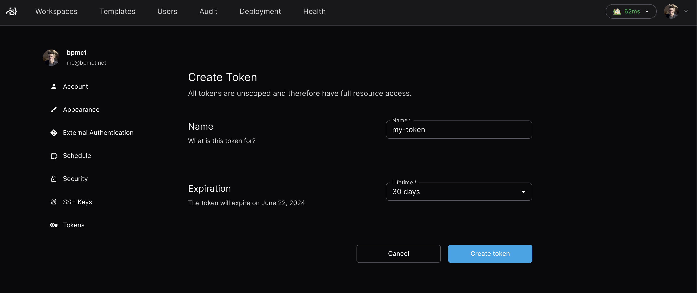

# API & Session Tokens

Users can generate tokens to make API requests on behalf of themselves.

## Short-Lived Tokens (Sessions)

The [Coder CLI](../../install/cli.md) and
[Backstage Plugin](https://github.com/coder/backstage-plugins) use short-lived
token to authenticate. To generate a short-lived session token on behalf of your
account, visit the following URL: `https://coder.example.com/cli-auth`

### Session Durations

By default, sessions last 24 hours and are automatically refreshed. You can
configure
[`CODER_SESSION_DURATION`](../../reference/cli/server.md#--session-duration) to
change the duration and
[`CODER_DISABLE_SESSION_EXPIRY_REFRESH`](../../reference/cli/server.md#--disable-session-expiry-refresh)
to configure this behavior.

## Long-Lived Tokens (API Tokens)

Users can create long lived tokens. We refer to these as "API tokens" in the
product.

### Generate a long-lived API token on behalf of yourself

<div class="tabs">

#### UI

Visit your account settings in the top right of the dashboard or by navigating
to `https://coder.example.com/settings/account`

Navigate to the tokens page in the sidebar and create a new token:



#### CLI

Use the following command:

```sh
coder tokens create --name=my-token --lifetime=720h
```

See the help docs for
[`coder tokens create`](../../reference/cli/tokens_create.md) for more info.

</div>

### Generate a long-lived API token on behalf of another user

You must have the `Owner` role to generate a token for another user.

As of Coder v2.17+, you can use the CLI or API to create long-lived tokens on
behalf of other users. Use the API for earlier versions of Coder.

<div class="tabs">

#### CLI

```sh
coder tokens create my-token --user <username>
```

See the full CLI reference for
[`coder tokens create`](../../reference/cli/tokens_create.md)

#### API

Use our API reference for more information on how to
[create token API key](../../reference/api/users.md#create-token-api-key)

</div>

### Set max token length

You can use the
[`CODER_MAX_TOKEN_LIFETIME`](https://coder.com/docs/reference/cli/server#--max-token-lifetime)
server flag to set the maximum duration for long-lived tokens in your
deployment.
