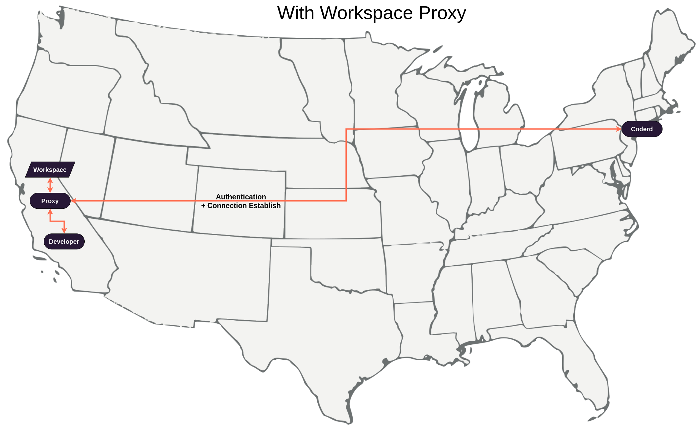

# Workspace Proxies

Workspace Proxies are a feature to provide low latency experiences for geo-distributed teams.

Coder's networking does a best effort to make direct connections to a workspace. In situtions where this is not possible, such as [dashboard connections](../networking/README.md#dashboard-connections), workspace proxies are able to reduce the amount of distance the network traffic needs to travel. 

A workspace proxy is a relay connection a developer can choose to use when connecting with their workspace over ssh, a workspace app, port forwarding, etc.

<!-- TODO: Might want to modify this diagram? -->


# Deploy a workspace proxy

Workspace deployment and management must be done by a user with the `owner` role. You must logged into the `coder` cli to create a proxy.

```bash
coder login <deployment_url>
```

# Step 1: Create the proxy

Create the workspace proxy and make sure to save the returned authentication token for said proxy.

```bash
$ coder proxy create --name=newyork --display-name="USA East" --icon="/emojis/2194.png"
Workspace Proxy "newyork" created successfully. Save this token, it will not be shown again.
Token: 2fb6500b-bb47-4783-a0db-dedde895b865:05271b4ef9432bac14c02b3c56b5a2d7f05453718a1f85ba7e772c0a096c7175
```

To verify it was created.

```bash
$ coder proxy ls
NAME         URL                    STATUS STATUS  
newyork                             unregistered
```

# Step 2: Deploy the proxy

Deploying the workspace proxy will also register the proxy and make the workspace proxy usable.

// TODO: Docs to deploy a workspace proxy. Helm chart? Manually? Config sync?
