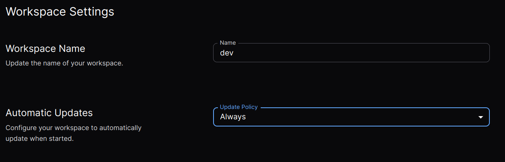
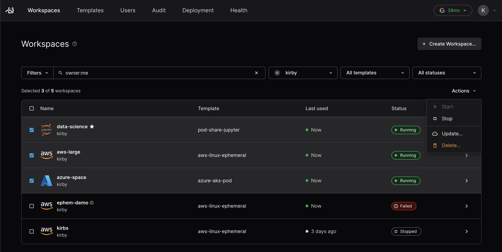

# Administering workspaces

<!-- 
Layout of admin/workspaces/

README.md
lifecycle.md
update-policies.md
multiple-agents.md
auditing.md
 -->

Coder manages Workspaces, which are user-facing virtualized development environments. Each workspace is defined by a [template](../templates/README.md), owned by a single user, and can be individually modified with parameters and scheduling.

Coder allows workspaces to be hosted on either VMs or containers and is not opinionated on which compute you choose to maximize flexibility.


> If you are an end-user of Coder looking to learn more about how to use and manage the workspaces you own, see our [user guides](../../user-guides/README.md).

## Viewing and Filtering workspaces

Admins have visibility for every workspace in a deployment under the **Workspaces** tab. The name, associated template, and status are shown for each workspace.


You can filter these workspaces using pre-defined filters or
Coder's filter query. For example, you can find the workspaces that you own or
that are currently running.

The following filters are supported:

- `owner` - Represents the `username` of the owner. You can also use `me` as a
  convenient alias for the logged-in user.
- `template` - Specifies the name of the template.
- `status` - Indicates the status of the workspace. For a list of supported
  statuses, see
  [WorkspaceStatus documentation](https://pkg.go.dev/github.com/coder/coder/codersdk#WorkspaceStatus).


## Updating workspaces

After updating the default version of the template that a workspace was created
from, you can update the workspace.

<!-- TODO: Update screenshot -->


If the workspace is running, Coder stops it, updates it, then starts the workspace again.

### Updating via the CLI

Update a workspace through the command line:

```shell
coder update <workspace-name>
```
### Automatic updates

It can be tedious to manually update a workspace every time an update is pushed
to a template. Users can choose to opt-in to automatic updates to update to the
active template version whenever the workspace is started.

Note: If a template is updated such that new parameter inputs are required from
the user, autostart will be disabled for the workspace until the user has
manually updated the workspace.



### Update policies

Template admins can require workspaces be on the latest version before starting. When this is enabled, you will be presented with an "Update and Start" button in the UI. Workspaces that start on connect will automatically update on the first out-of-date connection.


<!-- TODO: Link force update policies -->

## Bulk operations (enterprise)

Enterprise admins may apply bulk operations (update, delete, start, stop) in the **Workspaces** tab. Select the workspaces you'd like to modify with the checkboxes on the left, then use the top-right **Actions** dropdown to apply the operation.

The start and stop operations can only be applied to a set of workspaces which are all in the same state. For update and delete, the user will be prompted for confirmation before any action is taken.



<!-- TODO: Children or next steps -->
