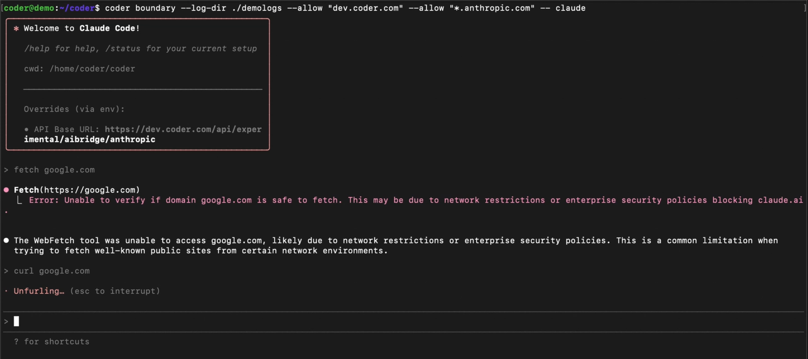

# Agent Boundary

Agent Boundaries are process-level firewalls that restrict and audit what autonomous programs, such as AI agents, can access and use.

Example of Agent Boundaries blocking a process.

The easiest way to use Agent Boundaries is through existing Coder modules, such as the [Claude Code module](https://registry.coder.com/modules/coder/claude-code). It can also be ran directly in the terminal by installing the [CLI](https://github.com/coder/boundary).

> [!NOTE]
> The Coder Boundary CLI is free and open source. Integrations with the core product, such as through modules, offers strong isolation and is available to Coder Premium customers.

## Supported Agents

Coder Boundary supports the securing of any terminal-based agent, including your own custom agents.

## Features

Boundaries extend Coder's trusted workspaces with a defense-in-depth model that detects and prevents destructive actions without reducing productivity by slowing down workflows or blocking automation. They offer the following features:

- _Policy-driven access controls_: limit what an agent can access (repos, registries, APIs, files, commands)
- _Network policy enforcement_: block domains, subnets, or HTTP verbs to prevent exfiltration
- _Audit-ready_: centralize logs, exportable for compliance, with full visibility into agent actions

## Architecture

Agent Boundary runs in two locations:

- Workspace: Boundary runs alongside your agent or tool, wrapping its process and enforcing outbound network policy at runtime
- Control place (Premium): Module-level config toggles enforcement and routes audit logs to centralized governance

[More detail to be added here]

## Getting Started with Boundary

There are two ways to use Agent Boundaries in your project.

Users of Coder Premium can enable Agent Boundaries simply by updating to the latest versions of their preferred coding agent modules, which integrate with Coder with just a few lines of Terraform. Once configured by platform admins, developers get agent-ready environments automatically - no extra setup required.

All other users can use Agent Boundaries through its [open source CLI](https://github.com/coder/boundary), which can be run to wrap any process or invoked through rules in a YAML file.

### Option 1) Apply Boundary through Coder modules

This option is available to Coder Premium users. It is the easiest way to use Agent Boundaries and offers centralized policy management with strong isolation.

This integration offers:

- A built-in `coder boundary` subcommand
    - Module authors do not need to ship or manage a separate binary
- A clean module interface
    - Template admins toggle policy per template by using variables
- Stronger isolation and centralized governance hooks
    - Protection beyond what is offered by the CLI path

To apply Agent Boundaries through Coder modules, follow the instructions below:

1. Ensure that you have installed or updated to the latest version of the [Claude Code module](https://registry.coder.com/modules/coder/claude-code)
1. In the template that calls the module, set `module.boundary_configuration.enabled = true`
1. Choose a policy expression
    - For simple rules, you can insert a variation of this example: `provide allow = ["domain=github.com path=/api/*", "method=GET,HEAD domain=github.com"]`
    - For complexrules, you can package a YAML file into the workspace image or mount a path and set `config_path`

[More detail to be added here]

### Option 2) Wrap the agent process with the Boundary CLI

Users can also run Boundary directly in your workspace and configure it per template or per script. While free tier users won't get centralized policy management or the deeper, "strong isolation," they can still enforce per workspace network rules and log decisions locally.

There are two ways to integrate the open source Boundary CLI into a workspace.

#### Wrap a command inline with flags

1. Install the [binary](https://github.com/coder/boundary) into the workspace image or at start-up. You can do so with the following command:

    ```hcl
    curl -fsSL https://raw.githubusercontent.com/coder/boundary/main/install.sh | bash
    ```

1. Use the included `Makefile` to build your project. Here are a few example commands:

    ```hcl
    make build          # Build for current platform
    make build-all      # Build for all platforms
    make test           # Run tests
    make test-coverage  # Run tests with coverage
    make clean          # Clean build artifacts
    make fmt            # Format code
    make lint           # Lint code
    ```
1. Wrap the tool you want to guard. Below are some examples of usage:

    ```hcl
    # Allow only requests to github.com
    boundary --allow "github.com" -- curl https://github.com

    # Allow full access to GitHub issues API, but only GET/HEAD elsewhere on GitHub
    boundary \
    --allow "github.com/api/issues/*" \
    --allow "GET,HEAD github.com" \
    -- npm install

    # Default deny-all: everything is blocked unless explicitly allowed
    boundary -- curl https://example.com
    ```

    Additional information, such as Allow Rules, can be found in the [repository README](https://github.com/coder/boundary).

#### Use a config file (YAML) to set rules

Another option is to define rules in a YAML file, which only needs to be invoked once as opposed to through flags with each command.

1. Similarly to the previous method, install the [binary](https://github.com/coder/boundary) into the workspace image or at start-up. You can do so with the following command:

    ```hcl
    curl -fsSL https://raw.githubusercontent.com/coder/boundary/main/install.sh | bash
    ```
1. Use the included `Makefile` to build your project. Here are a few example commands:

    ```hcl
    make build          # Build for current platform
    make build-all      # Build for all platforms
    make test           # Run tests
    make test-coverage  # Run tests with coverage
    make clean          # Clean build artifacts
    make fmt            # Format code
    make lint           # Lint code
    ```
1. Create a YAML file to store rules that will be applied to all `boundary` commands run in the Workspace. In this example, we call it `boundary.yaml`.

    A config example can be seen below:

    ```hcl
    allow:

    - domain: [github.com](http://github.com)
        
        path: /api/issues/*
        
    - domain: [github.com](http://github.com)
        
        methods: [GET, HEAD]
    ```
1. Run a `boundary` command. For example: 
    
    ```hcl
    boundary run --config ./boundary.yaml -- claude
    ```

    You will notice that the rules are automatically applied without any need for additional customization.

### Unprivileged vs. Privileged Mode

There are two approaches you can take to secure your agentic workflows with Agent Boundary.

#### Unprivileged Mode

In this case, a specific agent process or tool (for example, Claude Code or a CLI agent) runs inside of a constrained sandbox. This is the default mode in which Boundary will operate in and does not require root access.

Agents are prevented from reaching restricted domains or exfiltrating data, without blocking the rest of the dev's environment.

This is the fastest way to add real guardrails, but a determined user could still operate a tool outside of Boundary restrictions because the broader environment allows it. This mode relies on tools respecting certain settings, like HTTP proxies, and can lead to silent failures if a tool bypasses them. 

#### Privileged Mode

In this case, boundaries are enforced at the level of the environment that the agent lives in. These are workspace- or session-level controls, including how the developer connects to it. 

Currently, this must be turned on with a flag and ran with higher-level permissions such as root access or `CapNetAdmin`.

In addition to process-level egress rules, privileged mode locks down all pathways that could bypass policy, such as restricting or disabling SSH tunnels or parallel unbound IDEs. This delivers deterministic, policy-as-code enforcement and offers the highest assurance for regulated environments, but results in slightly more friction for mixed human-and-agent workflows.

### Opting out of Boundary

If you tried Boundary through a Coder module and decided you don't want to use it, you can turn it off by setting the flag to `boundary_enabled=false`.
