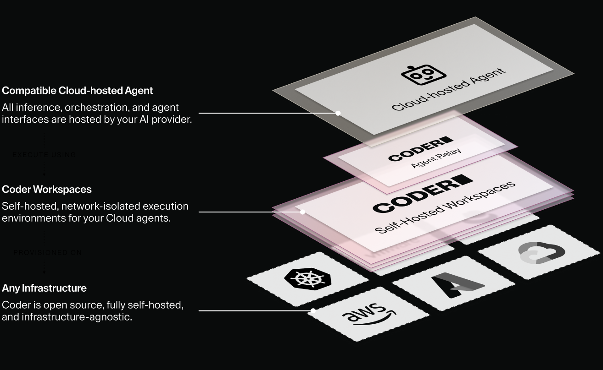

Agent Relay connects a cloud-hosted AI coding agent's hosted sessions to
self-hosted [Coder workspaces](../../user-guides/workspace-management.md).
Developers keep the cloud agent's client and workflow.
Coder provides the workspace where the agent's tool calls run.

## What Agent Relay does

Agent Relay watches for pending agent sessions from a supported provider.
When a session starts, Agent Relay provisions a Coder workspace from a
mapped template and connects the session to a worker process inside that
workspace.
The worker executes the agent's tool calls, such as reading files, running
commands, and using development tools, against the resources available in
that workspace.
Agent Relay manages the workspace for the life of the session and tears it
down when the session ends.

## What Agent Relay is and isn't

Agent Relay changes where a cloud agent's tool calls execute.
It doesn't change where the agent's orchestration or AI inference run.
Those stay with the cloud provider.

Agent Relay is not:

- A replacement for [Coder Agents](../agents/index.md), Coder's own AI
  workflow infrastructure that runs its native agent loop inside the Coder
  control plane and calls out to your configured LLM provider for inference.
- A proxy or observability layer for a provider's AI inference.
  Coder has no access to model selection or token usage for sessions that run through Agent Relay.
- A self-hosted deployment of a cloud provider's control plane.
  The provider's orchestration stays cloud-hosted.

## Business value

- Developers keep using the cloud agent client and workflow they already
  know.
- Platform and security teams control the infrastructure where agent
  sessions execute and which internal resources those sessions can reach.
- Agent sessions run in workspaces built from the same templates,
  networking, and governance controls as the rest of your Coder deployment.
- Each session gets its own workspace, provisioned on demand and deleted
  when the session ends.

## Current state

Agent Relay is in [early access](../../install/releases/feature-stages.md#early-access-features)
and is in closed preview with select customers.

## Get started

Talk to your [Coder account team](https://coder.com/contact) or email
[sales@coder.com](mailto:sales@coder.com) to get access to Agent Relay.

## Supported providers

[Cursor](./cursor.md) is the first provider Agent Relay supports.
Coder built Agent Relay to support additional cloud-hosted agent providers
as they add support for self-hosted execution.

## Learn more

- [Agent Relay for Cursor](./cursor.md)
- [Coder Agents](../agents/index.md)
- [Architecture](../../admin/infrastructure/architecture.md)
