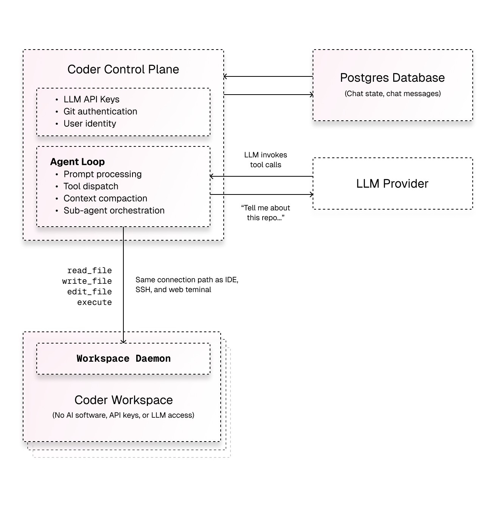

# Architecture

Coder's AI agent interacts with workspaces over the same
connection path as a developer's IDE, web terminal, and SSH session already
use. There is no sidecar process and no new network paths. If your developers
can already connect to their workspaces, the agent can too.

## Architecture at a glance

Three components are involved in every agent interaction:

1. **The control plane** runs the agent loop. It receives prompts, streams them
   to the LLM provider, interprets tool calls, and dispatches them to
   workspaces.
1. **The LLM provider** (Anthropic, OpenAI, Google, Azure, AWS Bedrock, or any
   OpenAI-compatible endpoint) performs model inference. It never communicates
   with the workspace directly.
1. **The workspace** is standard compute infrastructure. It runs shell commands,
   reads and writes files, and executes processes — exactly what occurs when a
   developer connects via their IDE.

## The same connection your IDE uses

This is the key architectural insight: the agent reaches into a workspace
over the same Tailnet tunnel that a developer's tools already use.

When a developer opens a web terminal in the Coder dashboard, connects via
VS Code Remote, or runs `coder ssh`, the traffic follows this path:

1. The client connects to the control plane.
1. The control plane routes the connection through its internal Tailnet node.
1. The connection reaches the workspace daemon over a DERP relay or
   direct peer-to-peer link.
1. The workspace daemon handles the request — spawning a shell,
   forwarding a port, or serving a file.

When the agent executes a tool call — reading a file, running a command,
writing code — it follows the same tunnel:

1. The agent loop in the control plane issues a tool call.
1. The control plane routes the call through its internal Tailnet node.
1. The call reaches the workspace daemon over the same DERP relay or
   peer-to-peer link.
1. The workspace daemon handles the request via its HTTP API — reading a file,
   starting a process, or writing content.

The underlying tunnel is identical. IDE connections use SSH, web terminals use
a WebSocket protocol, and the agent uses the workspace daemon's HTTP API — but
all three traverse the same Tailnet connection and rely on the same security
boundary. No additional ports or network paths are introduced.

### No inbound ports

The workspace daemon always dials _out_ to the control plane — never
the reverse. The control plane then uses that established tunnel to reach back
in. This means:

- The workspace needs no inbound ports or exposed services.
- You can block all inbound traffic to the workspace.
- The only required outbound connection from the workspace is to the control
  plane itself.

This is unchanged from how workspaces already operate in Coder. Enabling
Coder Agents does not change your workspace network requirements.

## The agent loop

When a user submits a prompt, the control plane processes it as a background
job:

1. The prompt is saved to the database and the chat is marked `pending`.
1. The control plane picks up the chat and marks it `running`.
1. The control plane streams the conversation to the configured LLM provider.
1. The model responds with text, reasoning, or tool calls.
1. If the response includes tool calls, the control plane executes them
   (connecting to the workspace as needed) and returns the results to the model.
1. Steps 3–5 repeat until the model produces a final response with no further
   tool calls.
1. The chat is marked `waiting` for the next user message.

This loop runs inside the control plane process. There is no separate service
to deploy — it is part of the same binary that serves the dashboard and API.

### Context compaction

As conversations grow, the agent automatically summarizes older context to stay
within the model's context window. When token usage exceeds a threshold, the
agent generates a compressed summary and inserts it as a new message. Earlier
messages remain in the database and are still visible to users, but are excluded
from the model's context window. This happens transparently and keeps
long-running sessions productive.

### Message queuing

Users can send follow-up messages while the agent is actively working. Messages
are queued in the database and delivered when the agent completes its current
turn — the full sequence of steps until the model stops calling tools. There is
no need to wait for a response before providing additional context or
redirecting the agent.

## Tool execution

Tools are how the agent takes action. Each tool call from the LLM translates to
a concrete operation — either inside a workspace or within the control plane
itself.

The agent is restricted to the built-in tool set defined in this section,
plus any additional tools from workspace skills and MCP servers. Skills
provide structured instructions the agent loads on demand
(see [Extending Agents](./extending-agents.md)). MCP tools come from
admin-configured external servers
(see [MCP Servers](./platform-controls/mcp-servers.md)) and from workspace
`.mcp.json` files. The agent has no direct access to the Coder API beyond
what these tools expose and cannot execute arbitrary operations against the
control plane.

### Workspace connection lifecycle

The connection to a workspace is **lazy**. It is not established when a chat
starts — only when something needs to reach the workspace. This is typically
triggered by the first tool call that requires workspace access. Once
established, the connection is cached and reused for the duration of that chat
session.

Chats that don't need workspace access (answering questions, planning an
approach, discussing architecture) never provision or connect to a workspace.

### Workspace tools

These tools execute inside the workspace via the workspace daemon's HTTP API.
They traverse the same Tailnet tunnel used by web terminals and IDE connections.

| Tool             | What it does                                                       |
|------------------|--------------------------------------------------------------------|
| `read_file`      | Reads file contents with line-number pagination.                   |
| `write_file`     | Writes content to a file.                                          |
| `edit_files`     | Performs atomic search-and-replace edits across one or more files. |
| `execute`        | Runs a shell command, waiting for completion up to a timeout.      |
| `process_output` | Retrieves output from a tracked process.                           |
| `process_list`   | Lists all tracked processes in the workspace.                      |
| `process_signal` | Sends a signal (SIGTERM or SIGKILL) to a tracked process.          |

### Platform tools

These tools run entirely within the control plane. They do not require a
workspace connection. Platform and orchestration tools are only available to
root chats — sub-agents spawned by `spawn_agent` do not have access to them
and cannot create workspaces or spawn further sub-agents.

| Tool               | What it does                                                                            |
|--------------------|-----------------------------------------------------------------------------------------|
| `list_templates`   | Browses available workspace templates, sorted by popularity.                            |
| `read_template`    | Gets template details and configurable parameters.                                      |
| `create_workspace` | Creates a workspace from a template and waits for it to be ready.                       |
| `start_workspace`  | Starts the chat's workspace if it is currently stopped. Idempotent if already running.  |
| `propose_plan`     | Presents a Markdown plan file from the workspace for user review before implementation. |

### Orchestration tools

These tools manage sub-agents — child chats that work on independent tasks in
parallel.

| Tool                       | What it does                                                                                                                                                                      |
|----------------------------|-----------------------------------------------------------------------------------------------------------------------------------------------------------------------------------|
| `spawn_agent`              | Delegates a task to a sub-agent with its own context window.                                                                                                                      |
| `wait_agent`               | Waits for a sub-agent to finish and collects its result.                                                                                                                          |
| `message_agent`            | Sends a follow-up message to a running sub-agent.                                                                                                                                 |
| `close_agent`              | Stops a running sub-agent.                                                                                                                                                        |
| `spawn_computer_use_agent` | Spawns a sub-agent with desktop interaction capabilities (screenshot, mouse, keyboard). Requires an Anthropic provider and the desktop feature to be enabled by an administrator. |

### Provider tools

These tools are executed server-side by the LLM provider, not by the control
plane or workspace. They are conditionally available based on the model
configuration set by an administrator.

| Tool         | What it does                                                                                                                                     |
|--------------|--------------------------------------------------------------------------------------------------------------------------------------------------|
| `web_search` | Searches the internet for up-to-date information. Available when web search is enabled for the configured Anthropic, OpenAI, or Google provider. |

## What runs where

Understanding the split between the control plane and the workspace is central
to the security model.

| Responsibility      | Where it runs | Details                                                                   |
|---------------------|---------------|---------------------------------------------------------------------------|
| Agent loop          | Control plane | Prompt processing, tool dispatch, step iteration.                         |
| LLM inference       | LLM provider  | The control plane streams requests to the external provider.              |
| Chat state          | Control plane | All messages, token usage, and status stored in the database.             |
| Git authentication  | Control plane | Uses existing Coder external auth (GitHub, GitLab, Bitbucket).            |
| User identity       | Control plane | Every action is tied to the user who submitted the prompt.                |
| Model/prompt config | Control plane | Administrators configure providers, models, and system prompts centrally. |
| File read/write     | Workspace     | The workspace file system is the source of truth for code.                |
| Shell execution     | Workspace     | Commands run in the workspace's environment with its packages and tools.  |
| Git operations      | Workspace     | Commits, pushes, and branch management happen inside the workspace.       |
| Build and test      | Workspace     | Compilation, test suites, and dev servers run on workspace compute.       |

The workspace has **zero AI awareness**. There are no LLM API keys, no agent
processes, and no AI-specific software installed. If you inspect a workspace
created by the agent, it looks identical to one a developer created
manually.

## Chat state and persistence

All chat data is stored in the control plane database, not in the workspace.

- **Chat metadata** — status, owner, associated workspace, timestamps, and
  parent/child relationships for sub-agents.
- **Messages** — every message (user, assistant, tool calls, tool results) is
  stored as a separate record with role, content, and token usage.
- **Compressed context** — when the agent compacts the conversation, summaries
  are stored with a compression flag so the original context budget is
  preserved.
- **Queued messages** — follow-up messages sent while the agent is working are
  held in a queue and delivered in order.

Because state lives in the database:

- Chat history survives workspace stops, rebuilds, and deletions.
- An administrator can inspect any chat for audit or debugging.
- The agent can resume work by targeting a new workspace and continuing from the
  last git branch or checkpoint.

## Security implications

The control plane architecture provides several security advantages for AI
coding workflows.

### No API keys in workspaces

LLM provider credentials exist only in the control plane. The workspace never
sees them. There is nothing for a developer, a compromised dependency, or a
rogue process to exfiltrate.

### Workspaces can be fully network-isolated

Because the workspace does not need to reach any LLM provider, you can restrict
its network access to only:

- The control plane (required for the workspace daemon to function).
- Your git provider (for push/pull operations).

Everything else can be blocked. The AI functionality comes from the control
plane, not from the workspace's network.

> [!TIP]
> For sensitive environments, create dedicated templates for agent workloads
> with stricter egress rules than your standard developer templates. Because
> the AI comes from the control plane, these templates do not need any
> outbound access to LLM providers.

### Centralized enforcement

Administrators control which models are available, the system prompt, and tool
configuration from the control plane. Developers can select from the set of
admin-enabled models when starting or continuing a chat, but cannot add their
own providers or override system prompts or tool permissions. When an
administrator removes a model or modifies the system prompt, the change applies
to all agent sessions immediately.

### User identity on every action

Every action the agent takes — PRs opened, code committed, commands executed —
is tied to the user who submitted the prompt. There is no shared bot account or
anonymous identity. If a developer submits a prompt that results in a pull
request, that pull request is attributed to them via the git authentication
already configured in your Coder deployment.

### Permission boundaries

The agent operates with the exact same permissions as the user who submitted
the prompt. If a user cannot access a template, workspace, or API endpoint
through the Coder dashboard or CLI, the agent cannot access it either. There
is no privilege escalation.

This extends to workspace isolation: the agent can only interact with
workspaces owned by the user who started the chat. It cannot read files,
execute commands, or connect to workspaces belonging to other users.

Template visibility follows the same rule. When the agent lists available
templates, it sees only the templates the user is authorized to access.
The agent cannot provision a workspace from a template the user does not
have permission to use.

## Scaling and resource impact

The control plane overhead for Coder Agents is minimal. The heavy computation
happens elsewhere:

- **LLM inference** runs on the external provider's infrastructure.
- **File I/O, builds, and tests** run on workspace compute.
- **The control plane** primarily proxies streaming responses and dispatches
  tool calls over existing network connections.
