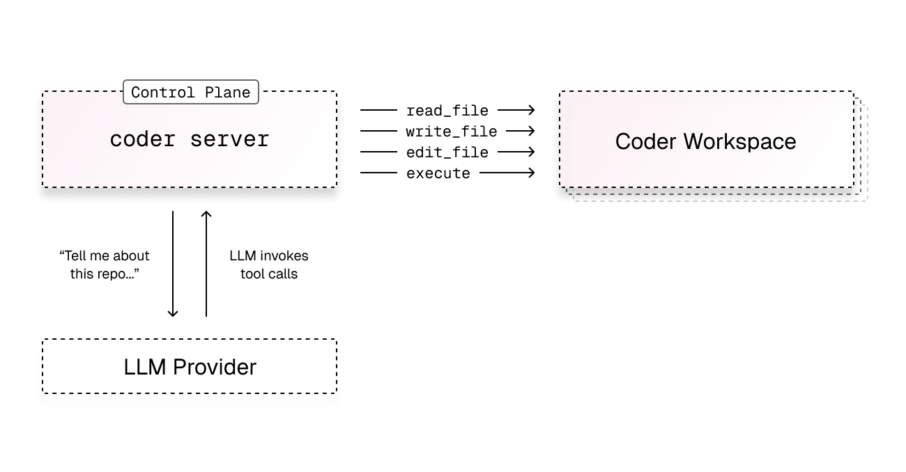
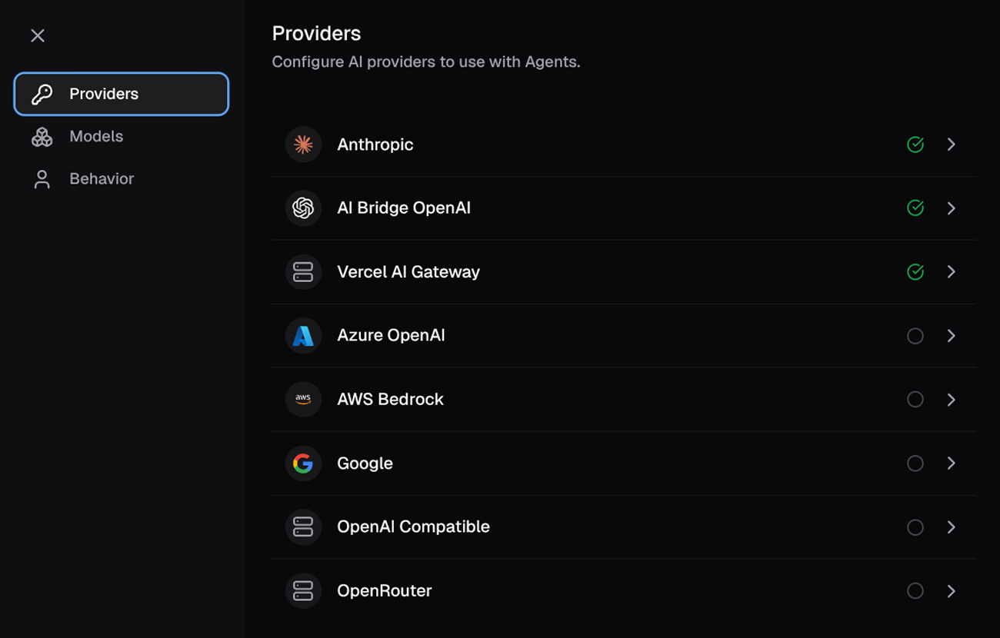

# Coder Agents

Coder Agents is a chat interface and API for delegating development work and research to coding agents in your Coder deployment. Developers describe the work they want done, and Coder Agents handles selecting a template, provisioning a workspace, and executing the task.

Coder Agents includes its own self-hosted AI coding
agent that runs the agent loop directly within the Coder control plane.

No specialized software, API keys, or network access is required inside your workspace. The only requirement is network access between the control plane and external LLM providers.

<video autoplay playsinline loop>
  <source src="https://raw.githubusercontent.com/coder/coder/refs/heads/main/docs/images/guides/ai-agents/coder-agents-ui.mp4" type="video/mp4">
Your browser does not support the video tag.
</video>

## What Coder Agents is and isn't

It is a standalone agent written in Go that implements standard
agentic patterns — sub-agent delegation, context compaction, file editing, and
shell execution — and works with any LLM provider you configure.

It is not a wrapper around third-party agent tools like Claude Code
or Codex.

Coder Agents is not a replacement for your text editor or IDE. It is the
primary interface where developers work with and orchestrate coding agents.
Developers still connect to workspaces via VS Code, Cursor, JetBrains, or any
other editor to review, refine, and complete work that the agent produces.

## Who Coder Agents is for

Coder Agents is designed for organizations that need to self-host their AI
coding workflows and maintain full control over how agents operate. It is a
strong fit for:

- **Regulated industries** such as financial services, healthcare, and
  government, where AI tools must run on controlled infrastructure with
  auditable access and strict network boundaries.
- **Platform engineering teams** that want to provide developers with a
  high-quality AI coding experience without managing per-workspace agent
  installations, API key distribution, or third-party agent licensing.
- **Organizations with existing Coder deployments** that want to add agentic
  capabilities using their current templates, workspaces, and identity
  providers rather than adopting a separate SaaS product.

Coder Agents runs entirely self-hosted. There is no SaaS or managed component — the agent
loop, chat history, and all tool execution happen within your Coder deployment.

## How it works

The agent loop runs inside [the control plane](./architecture.md). When a user
submits a prompt, the control plane:

1. Sends the prompt to the configured LLM provider (Anthropic, OpenAI, Google,
   Azure, AWS Bedrock, or any OpenAI-compatible endpoint).
1. Receives the model's response, which may include tool calls such as reading
   files, writing code, or running shell commands.
1. Executes tool calls by connecting to a Coder workspace over the existing
   workspace connection — the same path used for web terminals, port
   forwarding, and IDE access.
1. Returns tool results to the model and continues the loop until the task is
   complete.

The workspace itself has no knowledge of AI. It is standard compute
infrastructure — there are no LLM API keys, no agent harnesses, and no special
software installed. All intelligence lives in the control plane.

<small>The agent loop runs in the control plane. It makes outbound requests to LLM
providers and connects to workspaces only when tool execution is needed.</small>

### Automatic workspace provisioning

Not every chat requires a workspace. The agent runs in the control plane and can
answer questions, discuss architecture, or plan an approach without any
infrastructure. Workspaces are only provisioned when the agent needs to take
action — reading code, running commands, or editing files.

This means:

- **Faster responses** — conversations that don't require workspace access
  start immediately with no provisioning delay.
- **Lower infrastructure cost** — workspaces are only created when the agent
  needs to do real development work.

When a workspace _is_ needed, the agent reads the available templates —
including their descriptions and parameters — selects the appropriate one, and
creates a workspace automatically. Users can also manually choose which workspace is used when starting a new chat.

Platform teams control template routing by writing clear template descriptions.
For example, a description like "Use this template for Python backend services
in the payments repo" helps the agent select the correct infrastructure.

**Examples of what triggers workspace creation:**

| No workspace needed                                  | Workspace provisioned                                    |
|------------------------------------------------------|----------------------------------------------------------|
| "What are the tradeoffs between REST and gRPC?"      | "Find and fix the nil pointer crash in the auth service" |
| "Help me draft an RFC for adding a caching layer"    | "Run the test suite and fix any failures"                |
| "What's the best way to handle retry logic in Go?"   | "Refactor the handler to use the new SDK types"          |
| "Compare connection pooling strategies for Postgres" | "Read the config file and add the new feature flag"      |

### Sub-agents

Coder Agents supports sub-agent delegation. The root agent can spawn child
agents to work on independent tasks in parallel. Each sub-agent gets its own
context window, which keeps individual conversations focused and avoids the
quality degradation that occurs as context windows grow large.

For example, an agent tasked with "explore this repository and document its
structure" might spawn separate sub-agents to analyze the backend, frontend,
and infrastructure directories simultaneously.

### Chat persistence

All chat state is stored in the Coder database, not in the workspace. If a
workspace is stopped, deleted, or rebuilt, the full conversation history
survives. The agent can resume work by creating a new workspace with the same
template and continuing from the last known state, such as a git branch.

Users can also fork a chat at any point to explore a different direction while
preserving the original conversation.

### Message queuing

Users can send follow-up messages while the agent is actively working. Messages
are queued and delivered when the agent completes its current step, so there is
no need to wait for a response before providing additional context or changing
direction.

### Image attachments

Users can attach images to chat messages by pasting from the clipboard, dragging
files into the input area, or using the attachment button. Supported formats are
PNG, JPEG, GIF, and WebP up to 10 MB per file. Images are sent to the model as
multimodal content alongside the text prompt.

This is useful for sharing screenshots of errors, UI mockups, terminal output,
or other visual context that helps the agent understand the task. Messages can
contain images alone or combined with text. Image attachments require a model
that supports vision input.

## Security benefits of the control plane architecture

Running the agent loop in the control plane rather than inside the developer
workspace is an architectural decision that directly addresses the primary
concerns regulated organizations have with AI coding tools: how do you give
developers access to coding agents without introducing unnecessary risk?

Traditionally, agents run inside the same compute where code
lives. This means the agent needs LLM API keys in the workspace, outbound
network access to model providers, and often elevated permissions. In a
regulated environment, this creates a surface area that is difficult to lock
down.

Coder Agents eliminates this by moving the agent loop out of the workspace
entirely:

- **No API keys in workspaces.** LLM provider credentials never enter the
  workspace. The control plane makes all outbound requests to model providers
  directly, so there is nothing for a developer or a compromised process to
  exfiltrate.
- **No agent software to manage.** Workspaces don't need Claude Code, Codex,
  or any agent harness installed. This eliminates a class of supply chain risk
  and removes the need to keep agent software up to date across all workspaces.
- **Network boundaries are simpler.** Because the workspace doesn't need access
  to LLM APIs, you can apply strict egress rules. An agent-only template might
  permit access to only your git provider (e.g., `github.com`) and nothing
  else. The workspace never needs to reach the internet for AI functionality.
- **Centralized, enforced control.** Platform teams configure models, system
  prompts, and tool permissions from the control plane. These settings are
  enforced server-side — they are not user preferences that developers can
  override.
- **User identity is always attached.** Every action the agent takes — PRs
  opened, code pushed, commands run — is tied to the user who submitted the
  prompt. There is no shared bot identity or anonymous execution.

> [!TIP]
> For highly sensitive environments, create a dedicated set of templates for
> agent workloads with stricter network policies than your standard developer
> templates. Because the AI comes from the control plane, these templates don't
> need any outbound access to LLM providers.

## LLM provider support

Coder Agents works with any LLM provider. Administrators configure providers
and models from the Coder dashboard or API. Supported providers include:

| Provider          | Description                              |
|-------------------|------------------------------------------|
| Anthropic         | Claude models via Anthropic API          |
| OpenAI            | GPT and Codex models via OpenAI API      |
| Google            | Gemini models via Google AI API          |
| Azure OpenAI      | OpenAI models hosted on Azure            |
| AWS Bedrock       | Models available through AWS Bedrock     |
| OpenAI Compatible | Any endpoint implementing the OpenAI API |
| OpenRouter        | Multi-model routing via OpenRouter       |
| Vercel AI Gateway | Models via Vercel AI SDK                 |

Most providers support custom base URLs, which allows integration with
enterprise LLM proxies, self-hosted model endpoints, and internal gateways.

Administrators can configure multiple providers simultaneously and set a default
model. Developers select from enabled models when starting a chat.

<small>The model configuration panel in the Coder dashboard.</small>

## Built-in tools

The agent has access to a set of workspace tools that it uses to accomplish
tasks:

| Tool               | Description                                             |
|--------------------|---------------------------------------------------------|
| `list_templates`   | Browse available workspace templates                    |
| `read_template`    | Get template details and configurable parameters        |
| `create_workspace` | Create a workspace from a template                      |
| `read_file`        | Read file contents from the workspace                   |
| `write_file`       | Write a file to the workspace                           |
| `edit_files`       | Perform search-and-replace edits across files           |
| `execute`          | Run shell commands in the workspace                     |
| `spawn_agent`      | Delegate a task to a sub-agent running in parallel      |
| `wait_agent`       | Wait for a sub-agent to complete and collect its result |
| `message_agent`    | Send a follow-up message to a running sub-agent         |
| `close_agent`      | Stop a running sub-agent                                |

These tools connect to the workspace over the same secure connection used for
web terminals and IDE access. No additional ports or services are required in
the workspace.

## Comparison to Coder Tasks

Coder Agents is a new approach that differs from
[Coder Tasks](../tasks.md) in several ways:

| Aspect              | Coder Agents                         | Coder Tasks                                                    |
|---------------------|--------------------------------------|----------------------------------------------------------------|
| Agent execution     | Runs in the control plane            | Runs inside the workspace                                      |
| Agent harness       | Built-in, no installation needed     | Requires Claude Code, Codex, or similar installed in workspace |
| API keys            | Stored in control plane only         | Injected into workspace environment                            |
| Chat state          | Persisted in database                | Stored in workspace                                            |
| Workspace selection | Automatic, based on task description | Manual, user selects template                                  |
| Sub-agents          | Built-in parallel delegation         | Not supported                                                  |
| Modern chat UI      | Native chat with diffs, queuing      | Terminal-based interface                                       |

## Product status

Coder Agents is currently in internal preview. We are actively developing the
feature and demoing it with customers for feedback.

Our next step is to offer an early access program for interested customers. If
you would like to participate, [contact us](https://coder.com/contact).
