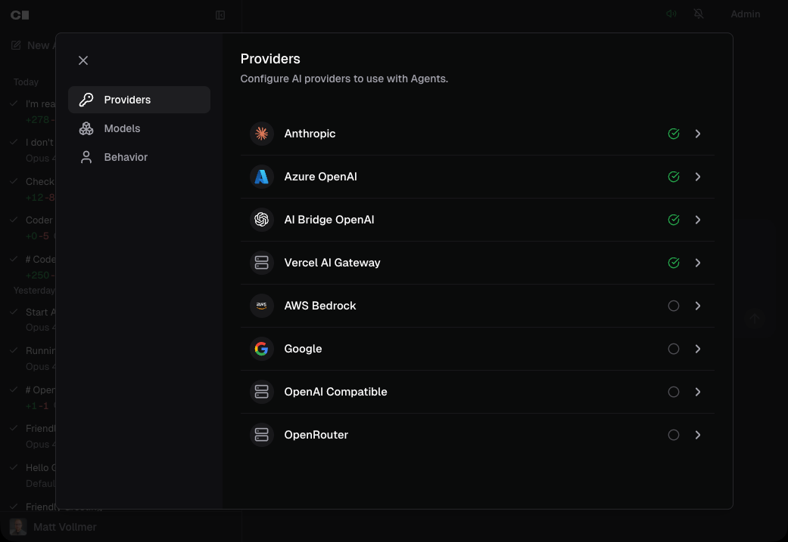
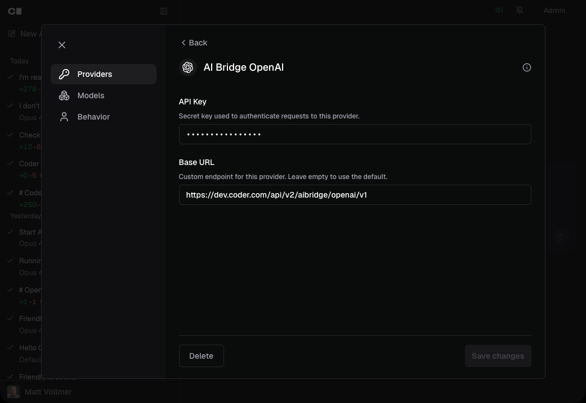
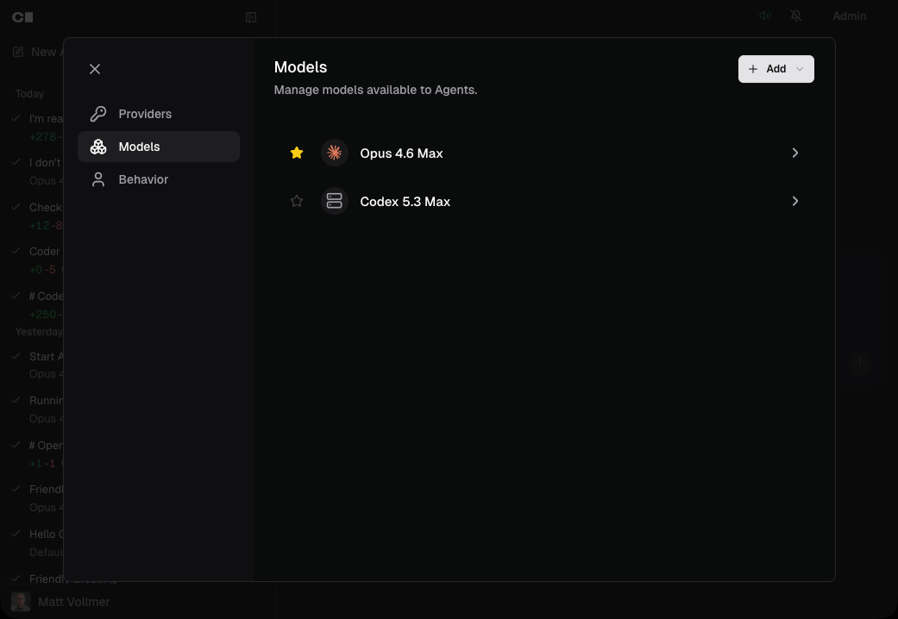
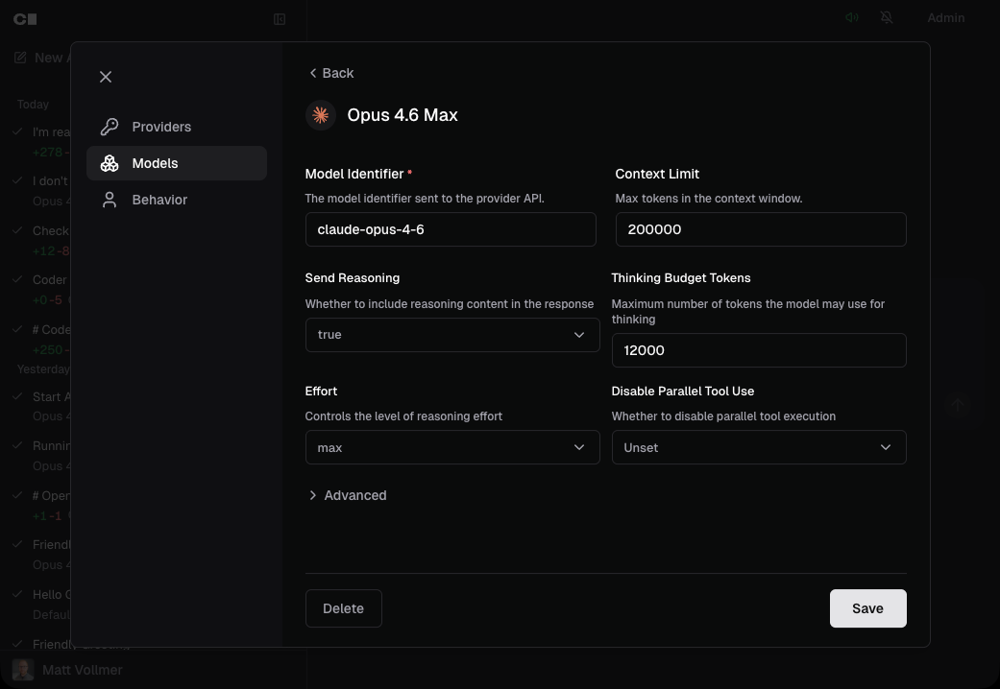

# Models

Administrators configure LLM providers and models from the Coder dashboard.
These are deployment-wide settings — developers do not manage API keys or
provider configuration. They select from the set of models that an administrator
has enabled.

## Providers

Each LLM provider has a type, an API key, and an optional base URL override.

Coder supports the following provider types:

| Provider          | Description                              |
|-------------------|------------------------------------------|
| Anthropic         | Claude models via Anthropic API          |
| OpenAI            | GPT and o-series models via OpenAI API   |
| Google            | Gemini models via Google AI API          |
| Azure OpenAI      | OpenAI models hosted on Azure            |
| AWS Bedrock       | Models available through AWS Bedrock     |
| OpenAI Compatible | Any endpoint implementing the OpenAI API |
| OpenRouter        | Multi-model routing via OpenRouter       |
| Vercel AI Gateway | Models via Vercel AI SDK                 |

The **OpenAI Compatible** type is a catch-all for any service that exposes an
OpenAI-compatible chat completions endpoint. Use it to connect to self-hosted
models, internal gateways, or third-party proxies like LiteLLM.

### Add a provider

1. Navigate to the **Agents** page in the Coder dashboard.
1. Click **Admin** in the top bar to open the configuration dialog.
1. Select the **Providers** tab.
1. Click the provider you want to configure.
1. Enter the **API key** for the provider.
1. Optionally set a **Base URL** to override the default endpoint. This is
   useful for enterprise proxies, regional endpoints, or self-hosted models.
1. Click **Save**.

<small>The providers list shows all supported providers and their configuration
status.</small>

<small>Adding a provider requires an API key. The base URL is optional.</small>

### Provider API keys and security

Provider API keys are stored encrypted in the Coder database. They are never
exposed to workspaces, developers, or the browser after initial entry. The
dashboard shows only whether a key is set, not the key itself.

Because the agent loop runs in the control plane, workspaces never need direct
access to LLM providers. See
[Architecture](./architecture.md#no-api-keys-in-workspaces) for details
on this security model.

## Models

Each model belongs to a provider and has its own configuration for context limits,
generation parameters, and provider-specific options.

### Add a model

1. Open the **Admin** dialog and select the **Models** tab.
1. Click **Add** and select the provider for the new model.
1. Enter the **Model Identifier** — the exact model string your provider
   expects (e.g., `claude-opus-4-6`, `gpt-5.3-codex`).
1. Set a **Display Name** so developers see a human-readable label in the model
   selector.
1. Set the **Context Limit** — the maximum number of tokens in the model's
   context window (e.g., `200000` for Claude Sonnet).
1. Configure any provider-specific options (see below).
1. Click **Save**.

<small>The models list shows all configured models grouped by provider.</small>

<small>Adding a model requires a model identifier, display name, and context
limit. Provider-specific options appear dynamically based on the selected
provider.</small>

### Set a default model

Click the **star icon** next to a model in the models list to make it the
default. The default model is pre-selected when developers start a new chat.
Only one model can be the default at a time.

## Model options

Every model has a set of general options and provider-specific options.
The admin UI generates these fields automatically from the provider's
configuration schema, so the available options always match the provider type.

### General options

These options apply to all providers:

| Option                | Description                                                                                      |
|-----------------------|--------------------------------------------------------------------------------------------------|
| Model Identifier      | The API model string sent to the provider (e.g., `claude-opus-4-6`).                             |
| Display Name          | The label shown to developers in the model selector.                                             |
| Context Limit         | Maximum tokens in the context window. Used to determine when context compaction triggers.        |
| Compression Threshold | Percentage (0–100) of context usage at which the agent compresses older messages into a summary. |
| Max Output Tokens     | Maximum tokens generated per model response.                                                     |
| Temperature           | Controls randomness. Lower values produce more deterministic output.                             |
| Top P                 | Nucleus sampling threshold.                                                                      |
| Top K                 | Limits token selection to the top K candidates.                                                  |
| Presence Penalty      | Penalizes tokens that have already appeared in the conversation.                                 |
| Frequency Penalty     | Penalizes tokens proportional to how often they have appeared.                                   |

### Provider-specific options

Each provider type exposes additional options relevant to its models. These
fields appear dynamically in the admin UI when you select a provider.

#### Anthropic

| Option                 | Description                                             |
|------------------------|---------------------------------------------------------|
| Thinking Budget Tokens | Maximum tokens allocated for extended thinking.         |
| Effort                 | Thinking effort level (`low`, `medium`, `high`, `max`). |

#### OpenAI

| Option                | Description                                                           |
|-----------------------|-----------------------------------------------------------------------|
| Reasoning Effort      | How much effort the model spends reasoning (`low`, `medium`, `high`). |
| Max Completion Tokens | Cap on completion tokens for reasoning models.                        |
| Parallel Tool Calls   | Whether the model can call multiple tools at once.                    |

#### Google

| Option           | Description                                         |
|------------------|-----------------------------------------------------|
| Thinking Budget  | Maximum tokens for the model's internal reasoning.  |
| Include Thoughts | Whether to include thinking traces in the response. |
| Safety Settings  | Content safety thresholds by category.              |

#### OpenRouter

| Option            | Description                                       |
|-------------------|---------------------------------------------------|
| Reasoning Enabled | Enable extended reasoning mode.                   |
| Reasoning Effort  | Reasoning effort level (`low`, `medium`, `high`). |
| Provider Order    | Preferred provider routing order.                 |
| Allow Fallbacks   | Whether to fall back to alternative providers.    |

#### Vercel AI Gateway

| Option            | Description                                   |
|-------------------|-----------------------------------------------|
| Reasoning Enabled | Enable extended reasoning mode.               |
| Reasoning Effort  | Reasoning effort level.                       |
| Provider Options  | Routing preferences for underlying providers. |

> [!NOTE]
> Azure OpenAI uses the same options as OpenAI. AWS Bedrock uses the same
> options as Anthropic.

## How developers select models

Developers see a model selector dropdown when starting or continuing a chat on
the Agents page. The selector shows only models from providers that have valid
API keys configured. Models are grouped by provider if multiple providers are
active.

The model selector uses the following precedence to pre-select a model:

1. **Last used model** — stored in the browser's local storage.
1. **Admin-designated default** — the model marked with the star icon.
1. **First available model** — if no default is set and no history exists.

Developers cannot add their own providers, models, or API keys. If no models
are configured, the chat interface displays a message directing developers to
contact an administrator.

## Using an LLM proxy

Organizations that route LLM traffic through a centralized proxy — such as
Coder's AI Bridge or third parties like LiteLLM — can point any provider's **Base URL** at their proxy endpoint.

For example, to route all OpenAI traffic through Coder's AI Bridge:

1. Add or edit the **OpenAI** provider.
1. Set the **Base URL** to your AI Bridge endpoint
   (e.g., `https://example.coder.com/api/v2/aibridge/openai/v1`).
1. Enter the API key your proxy expects.

Alternatively, use the **OpenAI Compatible** provider type if your proxy serves
multiple model families through a single OpenAI-compatible endpoint.

This lets you keep existing proxy-level features like per-user budgets, rate
limiting, and audit logging while using Coder Agents as the developer interface.
