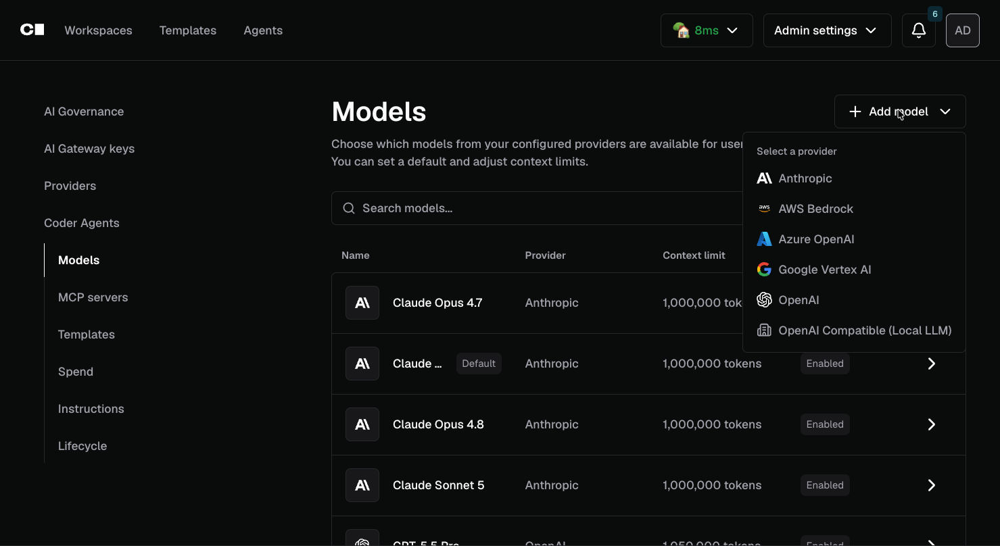
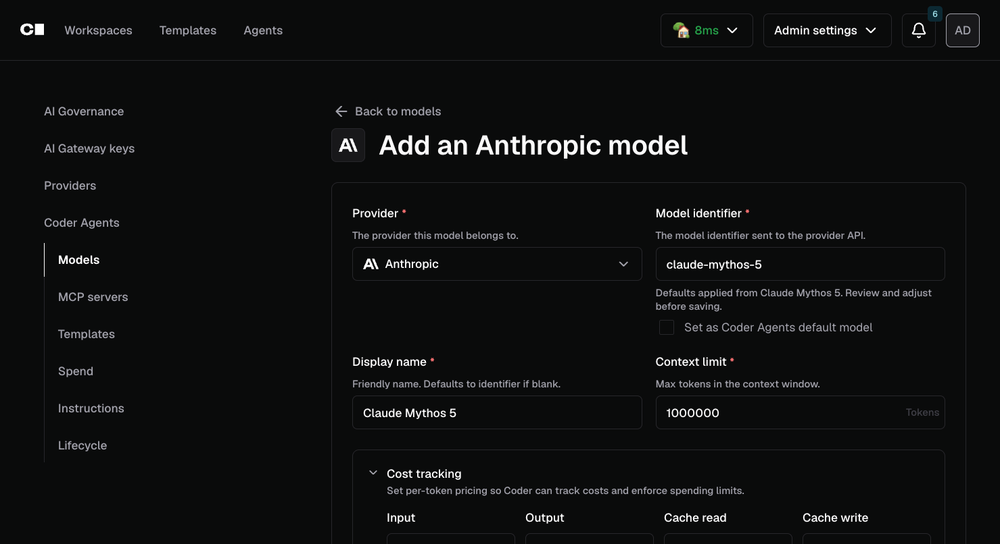

# Models

Administrators configure LLM providers from **Admin settings** > **AI** and Coder Agents models from **Admin settings** > **AI** > **Models**.
Providers and centrally managed credentials are deployment-wide settings managed by platform teams.
Each model belongs to an organization. Each organization has its own model list.
Developers select from the set of models that an administrator has enabled in their organization.
Refer to [Organization scope](./platform-controls/organizations.md) for the split between deployment-wide and organization-scoped settings.

Optionally, administrators can enable AI Gateway Bring Your Own Key (BYOK)
so developers can supply personal API keys for providers. See
[User API keys](#user-api-keys-byok) below.

## Providers

Each LLM provider has a type, credentials, and an endpoint/base URL for the
upstream provider or proxy.

Coder supports the following provider types:

| Provider          | Description                              |
|-------------------|------------------------------------------|
| Anthropic         | Claude models via Anthropic API          |
| OpenAI            | GPT and o-series models via OpenAI API   |
| Google            | Gemini models via Google AI API          |
| Azure OpenAI      | OpenAI models hosted on Azure            |
| AWS Bedrock       | Models via AWS Bedrock                   |
| OpenAI Compatible | Any endpoint implementing the OpenAI API |
| OpenRouter        | Multi-model routing via OpenRouter       |
| Vercel AI Gateway | Models via Vercel AI SDK                 |

The **OpenAI Compatible** type is a catch-all for any service that exposes an
OpenAI-compatible chat completions endpoint. Use it to connect to self-hosted
models, internal gateways, or third-party proxies like LiteLLM.

Coder Agents route model requests through AI Gateway automatically by using
the provider configuration stored in Coder's database.

Some provider types work as AI Gateway proxy targets but cannot back Coder
Agents. GitHub Copilot, for example, authenticates with a per-request token
that only an official Copilot client can mint, so the server-side Agents
harness cannot use it. Configuring such a provider does not unlock Agents;
add one of the supported provider types above instead.

### Add a provider

LLM providers are managed from the deployment AI settings, not from the Agents settings page.
A provider is deployment-wide, whilst the models that reference it are organization-scoped.

1. Navigate to **Admin settings** > **AI**.
1. Select **Providers**.
1. Click **Add provider**.
1. Select the provider type.
1. Enter a unique lowercase provider name, the credentials, and the upstream
   provider or proxy
   [endpoint/base URL](#endpointbase-url-for-openai-compatible-providers).
1. Click **Save**.

After saving a provider, add an Agents model for it from **Admin settings** > **AI** > **Models**.
Select the organization that should own the new model before you add it.
For provider-specific setup, including AWS Bedrock, refer to [AI Gateway provider configuration](../ai-gateway/providers.md#provider-types).

## Endpoint/base URL for OpenAI-compatible providers

Provider configuration stores an absolute HTTP(S) endpoint/base URL. Syntax
validation confirms that the value is a URL, but it does not prove the upstream
implements the APIs Coder sends.

For the default Agents path through AI Gateway, set the endpoint/base URL to
the upstream provider or proxy endpoint. Do not set it to Coder's public AI
Gateway route, such as `https://<coder-host>/api/v2/ai-gateway/openai/v1`.

OpenAI-shaped provider types require the upstream OpenAI-compatible prefix in
the endpoint/base URL because Coder appends request suffixes such as
`/chat/completions`, `/responses`, and `/models`. This applies to **OpenAI**,
**Azure OpenAI**, **Google**, **OpenAI Compatible**, **OpenRouter**, and
**Vercel AI Gateway** provider types.

Examples:

| Provider type                       | Example endpoint/base URL                                  |
|-------------------------------------|------------------------------------------------------------|
| OpenAI                              | `https://api.openai.com/v1/`                               |
| Azure OpenAI                        | `https://<resource-name>.openai.azure.com/openai/v1`       |
| Google Gemini OpenAI-compatible API | `https://generativelanguage.googleapis.com/v1beta/openai/` |
| OpenRouter                          | `https://openrouter.ai/api/v1`                             |
| Vercel AI Gateway                   | `https://ai-gateway.vercel.sh/v1`                          |
| Generic OpenAI-compatible proxy     | `https://provider.example.com/v1`                          |

Confirm the exact endpoint/base URL in your provider or proxy documentation.

## Provider credentials and security

Provider API keys entered in the dashboard are stored encrypted in the Coder
database. They are never exposed to workspaces, developers, or the browser
after initial entry. The dashboard shows only whether a key is set, not the
key itself.

Because the agent loop runs in the control plane, workspaces never need direct
access to LLM providers. See
[Architecture](./architecture.md#no-api-keys-in-workspaces) for details
on this security model.

## Credential selection

Coder Agents use the AI providers configured by administrators.
Provider API keys entered by administrators are centralized credentials for the deployment.

BYOK for Coder Agents is controlled by the
[global AI Gateway BYOK setting](../ai-gateway/auth.md#bring-your-own-key-byok),
not by per-provider key policy flags. When BYOK is enabled, users can save a
personal API key for any enabled AI provider. When BYOK is disabled, saved user
keys are ignored and users cannot add or update personal keys.

For each provider request, Coder selects credentials in this order:

1. If BYOK is enabled and the user has saved a personal key for the selected
   provider, Coder uses the user's key.
1. Otherwise, Coder uses centralized provider credentials when they are
   configured.
1. If neither a usable user key nor centralized credentials are available, the
   provider is unavailable for that user.

## Models

Each model belongs to a provider and has its own configuration for context limits,
generation parameters, and provider-specific options.

### Select an organization

Model settings use the stable path `/ai/settings/models` and the `org` query parameter to select an organization.
For example, `/ai/settings/models?org=engineering` opens the models that you can read in the `engineering` organization.

If the requested organization isn't accessible, Coder selects your accessible default organization or your first accessible organization.
Coder shows the organization picker when you can access more than 1 organization.

Members with model read access can open the model list and model details.
Coder shows model fields as read-only unless the member also has update permission.
Create, update, delete, and share permissions control their corresponding actions independently.

### Manage model permissions

Members with model share permission can let members and groups in the selected organization use the model.

Model access lists control who can use Coder Agents.
All organization members except service accounts hold chat permissions, but a member without read access to at least one model in the organization can't use the feature.
New models grant read access to the whole organization by default.

1. Navigate to **Admin settings** > **AI** > **Models**.
2. Select the organization that owns the model.
3. Select the model.
4. Open **Model actions** and select **Manage permissions**.
5. Add or remove organization members and groups.
6. Select **Save permissions**.

Coder applies the member and group changes when you save.
Removing all entries clears the model's access list, so members without another access grant cannot use the model on their next request.

### Model visibility and runtime availability

Management visibility and runtime availability are separate.
A member can see a model in settings through its access list even when the model isn't available for chat.

The Agents model selector includes the model only when its exact provider configuration has usable credentials for that member.
Coder evaluates providers by provider UUID, so 2 providers of the same type can have different availability.
An unavailable provider can remain visible while its models are omitted from the selector.

Model APIs identify each configured model with a UUID.
The provider's model identifier, such as `gpt-5.3-codex`, doesn't replace this model UUID.

### Migrate model API clients

Model collection APIs require an organization name or ID in the path.
Update clients that use the removed default-organization routes as follows:

| Removed route                                | Replacement                                              | Response change                                                                                                             |
|----------------------------------------------|----------------------------------------------------------|-----------------------------------------------------------------------------------------------------------------------------|
| `GET /api/experimental/chats/models`         | `GET /api/v2/organizations/{organization}/chats/models`  | The response remains an `OrganizationChatModelsResponse`.                                                                   |
| `GET /api/experimental/chats/model-configs`  | `GET /api/v2/organizations/{organization}/chats/models`  | The response changes from a `ChatModel` array to an `OrganizationChatModelsResponse`. Read configured models from `models`. |
| `POST /api/experimental/chats/model-configs` | `POST /api/v2/organizations/{organization}/chats/models` | The request and `ChatModel` response shapes remain the same.                                                                |

Replace `{organization}` with the organization name or ID that owns the models.
The collection response also includes provider descriptors and unsupported provider details.

### Add a model

1. Navigate to **Admin settings** > **AI** > **Models**.
1. Select **Add model** and select the provider for the new model.
1. Enter the **Model Identifier**, the exact model string your provider
   expects (e.g., `claude-opus-4-6`, `gpt-5.3-codex`).
1. Set a **Display Name** so developers see a human-readable label in the model
   selector.
1. Set the **Context Limit**, the maximum number of tokens in the model's
   context window (e.g., `200000` for Claude Sonnet).
1. Configure any provider-specific options (see below).
1. Select **Save**.

<small>The models list shows all configured models grouped by provider.</small>

<small>Adding a model requires a model identifier, display name, and context
limit. Provider-specific options appear dynamically based on the selected
provider.</small>

### Set a default model

Each organization has one default model.
The first model that you add to an organization becomes that organization's default model.
The models list marks the current default with a **Default** badge.
The default model is pre-selected when developers start a new chat in the organization.

To change the default model:

1. Navigate to **Admin settings** > **AI** > **Models**.
1. Select the organization that owns the model.
1. Open the model, or click **Add model** to create a new one.
1. Select **Set as Coder Agents default model**.
1. Click **Save**.

### Models with a missing or disabled provider

The Models list reflects whether each model can actually be used:

- When a model's connected provider has been deleted, the **Provider** column
  shows **Unset**.
- When a model's provider is missing or disabled, an **Unavailable** badge
  appears beside the model name. The badge's tooltip explains whether the
  provider was deleted or disabled. Such a model cannot serve chat requests.
- When a model is disabled, a **Disabled** badge appears beside the model name.

To reconnect a model to a working provider, open the model from the list,
pick a new provider from the **Provider** dropdown, and click **Save**. The
Save button is enabled as soon as the selected provider differs from the
model's current provider, even if no other field is edited.

## Model options

Every model has a set of general options and provider-specific options.
The admin UI generates these fields automatically from the provider's
configuration schema, so the available options always match the provider type.

### General options

These options apply to all providers:

| Option                | Description                                                                                      |
|-----------------------|--------------------------------------------------------------------------------------------------|
| Model Identifier      | The API model string sent to the provider (e.g., `claude-opus-4-6`).                             |
| Display Name          | The label shown to developers in the model selector.                                             |
| Context Limit         | Maximum tokens in the context window. Used to determine when context compaction triggers.        |
| Compression Threshold | Percentage (0-100) of context usage at which the agent compresses older messages into a summary. |
| Max Output Tokens     | Maximum tokens generated per model response.                                                     |
| Temperature           | Controls randomness. Lower values produce more deterministic output.                             |
| Top P                 | Nucleus sampling threshold.                                                                      |
| Top K                 | Limits token selection to the top K candidates.                                                  |
| Presence Penalty      | Penalizes tokens that have already appeared in the conversation.                                 |
| Frequency Penalty     | Penalizes tokens proportional to how often they have appeared.                                   |

### Provider-specific options

Each provider type exposes additional options relevant to its models. These
fields appear dynamically in the admin UI when you select a provider.

#### Anthropic

| Option                 | Description                                                                                                                                                                                                                      |
|------------------------|----------------------------------------------------------------------------------------------------------------------------------------------------------------------------------------------------------------------------------|
| Thinking Budget Tokens | Maximum tokens allocated for extended thinking.                                                                                                                                                                                  |
| Effort                 | Thinking effort level (`low`, `medium`, `high`, `xhigh`, `max`).                                                                                                                                                                 |
| 1M Context Window      | Sends the `anthropic-beta: context-1m-2025-08-07` header to unlock the 1M token context window on supported Claude models. Pair it with a raised Context Limit, which still controls compaction. Long-context pricing may apply. |

#### OpenAI

| Option                | Description                                                                               |
|-----------------------|-------------------------------------------------------------------------------------------|
| Reasoning Effort      | How much effort the model spends reasoning (`minimal`, `low`, `medium`, `high`, `xhigh`). |
| Max Completion Tokens | Cap on completion tokens for reasoning models.                                            |
| Parallel Tool Calls   | Whether the model can call multiple tools at once.                                        |

#### Google

| Option           | Description                                         |
|------------------|-----------------------------------------------------|
| Thinking Budget  | Maximum tokens for the model's internal reasoning.  |
| Include Thoughts | Whether to include thinking traces in the response. |

#### OpenRouter

| Option            | Description                                       |
|-------------------|---------------------------------------------------|
| Reasoning Enabled | Enable extended reasoning mode.                   |
| Reasoning Effort  | Reasoning effort level (`low`, `medium`, `high`). |

#### Vercel AI Gateway

| Option            | Description                     |
|-------------------|---------------------------------|
| Reasoning Enabled | Enable extended reasoning mode. |
| Reasoning Effort  | Reasoning effort level.         |

> [!NOTE]
> Azure OpenAI uses the same options as OpenAI. AWS Bedrock uses the same
> model configuration options as Anthropic (thinking budget, reasoning
> effort).

## How developers select models

Developers see a model selector dropdown when starting or continuing a chat on the Agents page.
The selector shows only models in the chat's organization that come from providers with valid credentials.
Models are grouped by provider if multiple providers are active.

The model selector uses the following precedence to pre-select a model:

1. **Last used model**, stored in the browser's local storage.
1. **Organization default**, the model marked with the **Default** badge.
1. **First available model**, if no default is set and no history exists.

Developers cannot add their own providers or models. If no models are
configured, the chat interface displays a message directing developers to
contact an administrator.

## Model overrides

Beyond the chat-level model picker, Coder Agents supports two override layers.
Both are stored per organization and resolve from the chat's organization:

- **Admin overrides** (per organization): Pin specific contexts to a particular model.
  Configure them in the **Organization settings** section of **Admin settings** > **AI** > **Coder Agents**.
  Coder shows an organization picker in that section when you can access more than 1 organization.
- **Personal overrides** (per user and organization, opt-in by admin): Let users override the model for their own root chats and delegated subagents.
  Admins enable the deployment-wide toggle in the **Deployment settings** section of the same page.
  Once the toggle is on, each user sees an **Agents** tab in their personal **Agents** > **Settings**.
  Users in more than one organization pick which organization to configure.

The **Coder Agents** page is visible to deployment admins and to organization members with model access.
To change an organization override, you need permission to edit that organization's models.
The **Deployment settings** section is visible only to deployment admins.

> [!IMPORTANT]
> When a deployment upgrades from the older deployment-wide override
> storage, existing admin and personal overrides are deleted rather than
> migrated. Admins and users must re-select their override models in
> settings after the upgrade.

The configurable contexts:

| Context              | Layer        | Applies to                                                                             |
|----------------------|--------------|----------------------------------------------------------------------------------------|
| **General**          | Admin + user | Write-capable subagents (`spawn_agent` with `type=general` or `computer_use`).         |
| **Explore**          | Admin + user | Read-only subagents (`spawn_agent` with `type=explore`).                               |
| **Title generation** | Admin only   | Automatic title generation for new chats.                                              |
| **Compaction**       | Admin only   | Conversation summarization near the context limit.                                     |
| **Advisor**          | Admin only   | The [advisor](./platform-controls/advisor.md). Requires the `chat-advisor` experiment. |
| **Root**             | User only    | The user's own root chats.                                                             |

Resolution order, evaluated per chat or subagent from the chat's
organization:

1. Explicit `model_config_id` on the `spawn_agent` tool call (general and
   explore subagents only).
1. Personal override (when the admin gate is on and a model is set).
1. Admin override.
1. The chat's selected model (or the organization default for new chats).

If a referenced model is later disabled or deleted, that layer is skipped
and resolution falls through to the next, with two exceptions: an unusable
explicit `spawn_agent` `model_config_id` fails the tool call, and an
unusable title generation override skips title generation instead of
falling back. Agents discover selectable models (and their reasoning
effort ranges) with the `list_subagent_models` tool, which only returns
enabled models usable with the chat owner's credentials. Computer-use
subagents always run on the administrator-configured computer-use model and
reject explicit model selection.

> [!NOTE]
> Both override layers may change between releases.
> Admin overrides are available through the API at
> `/api/v2/organizations/{organization}/chats/model-overrides`
> and personal overrides at
> `/api/v2/organizations/{organization}/members/{user}/chats/model-overrides`.

## User API keys (BYOK)

When [AI Gateway BYOK](../ai-gateway/auth.md#bring-your-own-key-byok) is
enabled, developers can supply personal API keys for any enabled AI provider
from the Agents settings page.

### Managing personal API keys

1. Navigate to the **Agents** page in the Coder dashboard.
1. Open **Settings** and select the **API Keys** tab.
1. Each enabled provider is listed with a status indicator:
   - **Key saved**, your personal key is active and will be used for requests to
     that provider.
   - **Shared key**, no personal key is set and Coder is using
     deployment-managed credentials for that provider.
   - **No key**, no personal key or deployment-managed credential is available.
     Add a personal key before you use models from this provider.
1. Enter your API key and click **Save**.

Personal API keys are encrypted at rest using the same database encryption
used for deployment-managed provider secrets. The dashboard never displays a
saved key, only whether one is set.

### Removing a personal key

Click **Remove** on the provider card in the API Keys settings tab. Subsequent
requests use deployment-managed credentials when they are configured for that
provider. If no deployment-managed credential is available, add a new personal
key before you use models from that provider.

## Using an LLM proxy

Organizations that route LLM traffic through a centralized proxy, such as
LiteLLM or an internal gateway, can point a provider's **Endpoint** or **Base
URL** at that upstream proxy endpoint. Enter the API key your proxy expects.

Use the **OpenAI Compatible** provider type if your proxy serves multiple model
families through a single OpenAI-compatible endpoint. Include the proxy
provider's documented OpenAI-compatible path prefix, such as `/v1`, when
required.

This lets you keep existing proxy-level features like per-user budgets, rate
limiting, and audit logging while using Coder Agents as the developer interface.
