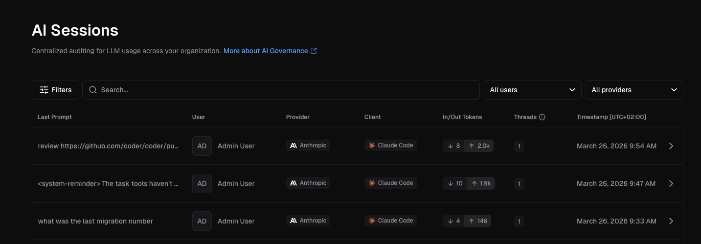
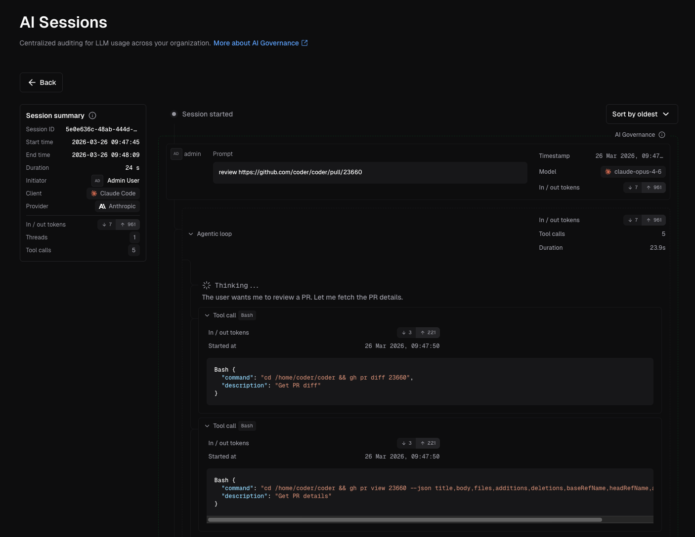

# Auditing AI Sessions

AI Bridge groups intercepted requests into **sessions** and **threads** to show
the causal relationships between human prompts and agent actions. This
structure gives auditors clear provenance over who initiated what, and why.

## Concepts

| Term             | Definition                                                                                                                                                                                                                                            |
|------------------|-------------------------------------------------------------------------------------------------------------------------------------------------------------------------------------------------------------------------------------------------------|
| **Interception** | A single intercepted request/response pair between client and provider.                                                                                                                                                |                                                                               |
| **Thread**       | A multi-part interaction starting with a human prompt that triggers one or more tool calls, forming an agentic loop.                                                                                                                                  |
| **Agentic loop** | A sequence of tool invocations the agent performs to satisfy a request. The model ends its turn with a tool call, the client invokes it, sends the result back, and the cycle repeats until the model has enough information to formulate a response. |
| **Session**      | A set of threads grouped by a client-provided session key. Claude Code and Codex provide session IDs automatically; other clients may not.                                                                                                            |

## Human vs. Agent attribution

AI Bridge distinguishes between human-initiated and agent-initiated requests
using the `role` property:

- A message with `role="user"` indicates a human-initiated action (i.e. prompt).
- A message with `role="assistant"` indicates a message generated by a model.
- A message with `role="system"` indicates the system prompt for the client.

The `user` role is currently overloaded by clients like Claude Code and Codex;
they inject system instructions
within `role="user"` blocks when using agents. AI Bridge applies a heuristic
of storing only the **last** prompt from a block of `role="user"` messages.

> [!NOTE]
> AI Bridge cannot declare with certainty whether a request was human- or
> agent-initiated.

## LLM reasoning capture

AI Bridge captures model reasoning and thinking content when available. Both
Anthropic (extended thinking) and OpenAI (reasoning summaries) support this
feature. Reasoning data gives auditors insight into **why** a tool was called,
not just what was called.

## Navigating the UI

### Sessions list

The sessions page (`http://<deployment-url>/aibridge/sessions`) lists all sessions in
reverse-chronological order. Each row shows the last prompt, initiator, provider,
client, token usage, thread count, and timestamp.

Select one to view its full details.

### Session detail

Click into a session to see a chronological causal chain of events.

Within a thread, each step shows token usage, tool call details (including
arguments and MCP server URLs), duration, and any errors or warnings.

## Conducting a forensic audit

When investigating an incident (policy violation, destructive action, etc.):

1. **Identify the session.** Filter by user, time range, or client to find the
   relevant session.
1. **Locate the thread.** Each thread in a session shows the (likely) human prompt
   that initiated the chain of actions.
1. **Trace the causal chain.** Expand the thread to see every step in the
   agentic loop — each tool call and its arguments.
1. **Review model reasoning.** If extended thinking was enabled, check the
   model's reasoning at each step to understand why specific tools were called.
1. **Assess attribution.** The session identifies the human who
   initiated the action. Subsequent interceptions represent agent-driven actions
   that stem from that original prompt.

## What we store

AI Bridge captures the following data from each request/response:

- Last user prompt
- Token usage
- Tool calls (requests only, not responses)
  - Responses may be very large, and generally have lower audit value than requests
  - In future, we will support storing these results
- Model thinking/reasoning

Model-produced inference text is discarded, as generated text alone
cannot affect external systems. The retention philosophy prioritizes:

- **Human prompts** — capture intent and detect policy violations or
  exfiltration attempts.
- **Tool calls** — record how agents interact with external systems,
  which is critical for understanding how incidents occurred. For
  example, an agent might delete and recreate a database because it
  lacks permissions to satisfy a human request to query a table.
- **Model reasoning** — preserve thinking content that explains why
  specific tools were invoked, distinguishing between human instruction
  and model misunderstanding as the root cause.

See [data retention](./setup.md#data-retention) to configure how long
session data is kept.

## Next steps

- [Monitoring](./monitoring.md) — Dashboards, data export, and tracing
- [Setup](./setup.md) — Configure AI Bridge and data retention
- [Reference](./reference.md) — API and technical reference
