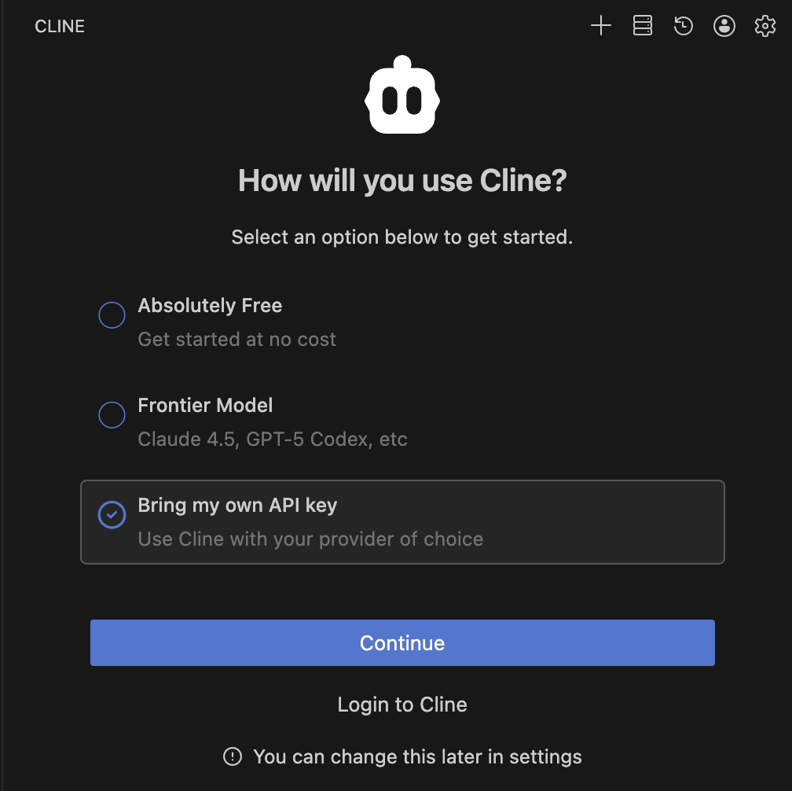
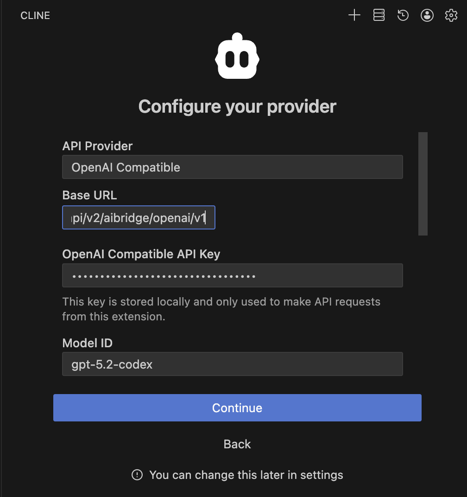
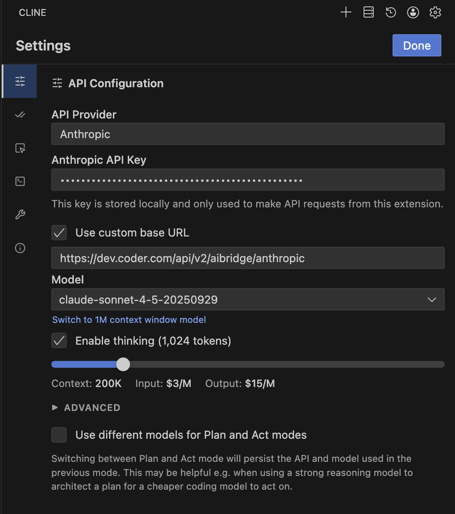

# Cline

[Cline](https://cline.bot) is an open source AI coding agent that brings frontier AI models directly to your IDE.

## Configuration

To configure Cline to use AI Bridge, follow these steps:

### OpenAI Compatible

1. Open Cline in VS Code.
1. Go to **Settings**.
1. **API Provider**: Select **OpenAI Compatible**.
1. **Base URL**: Enter `https://coder.example.com/api/v2/aibridge/openai/v1`.
1. **OpenAI Compatible API Key**: Enter your **[Coder Session Token](../../../admin/users/sessions-tokens.md#generate-a-long-lived-api-token-on-behalf-of-yourself)**.
1. **Model ID** (Optional): Enter the model you wish to use (e.g., `gpt-5.2-codex`).

### Anthropic

1. Open Cline in VS Code.
1. Go to **Settings**.
1. **API Provider**: Select **Anthropic**.
1. **Anthropic API Key**: Enter your **Coder Session Token**.
1. **Base URL**: Enter `https://coder.example.com/api/v2/aibridge/anthropic` after checking **_Use custom base URL_**.
1. **Model ID** (Optional): Select your desired Claude model.

**References:** [Cline Configuration](https://github.com/cline/cline)
