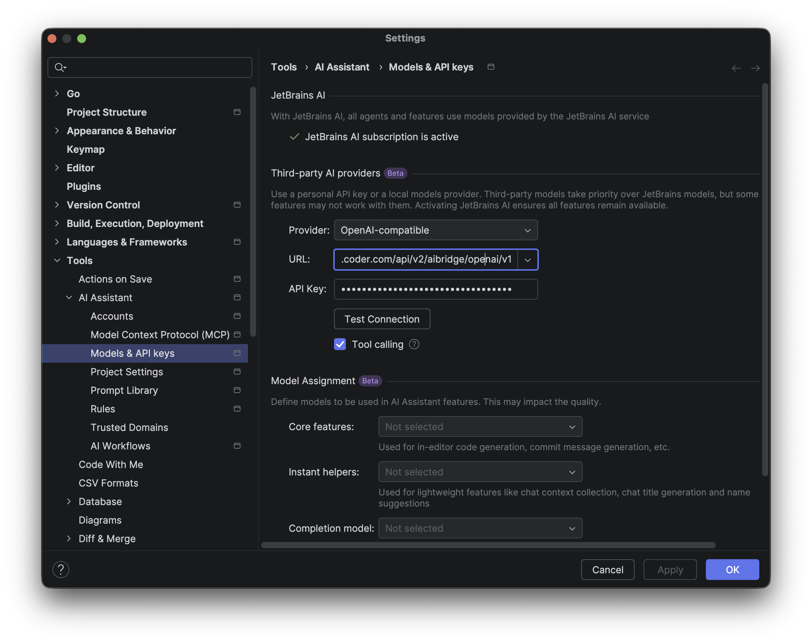
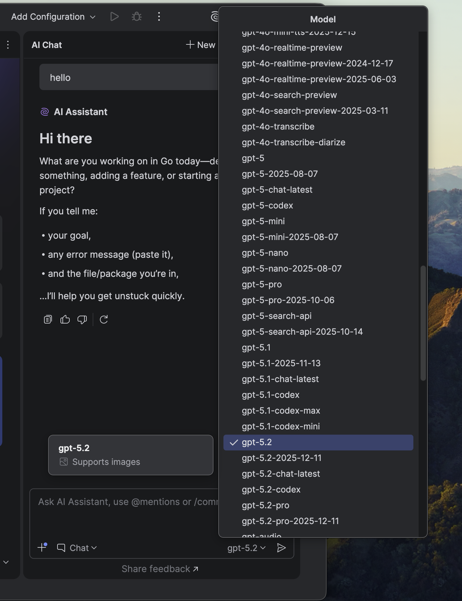

# JetBrains IDEs

JetBrains IDE (IntelliJ IDEA, PyCharm, WebStorm, etc.) support AI Bridge via the ["Bring Your Own Key" (BYOK)](https://www.jetbrains.com/help/ai-assistant/use-custom-models.html#provide-your-own-api-key) feature.

## Prerequisites

* [**JetBrains AI Assistant**](https://www.jetbrains.com/help/ai-assistant/installation-guide-ai-assistant.html): Installed and enabled.
* **Authentication**: Your **[Coder session token](../../../admin/users/sessions-tokens.md#generate-a-long-lived-api-token-on-behalf-of-yourself)**.

## Configuration

1. **Open Settings**: Go to **Settings** > **Tools** > **AI Assistant** > **Models & API Keys**.
1. **Configure Provider**: Go to **Third-party AI providers**.
1. **Choose Provider**: Choose **OpenAI-compatible**.
1. **URL**: `https://coder.example.com/api/v2/aibridge/openai/v1`
1. **API Key**: Paste your **[Coder session token](../../../admin/users/sessions-tokens.md#generate-a-long-lived-api-token-on-behalf-of-yourself)**.
1. **Apply**: Click **Apply** and **OK**.

## Using the AI Assistant

1. Go back to **AI Chat** on theleft side bar and choose **Chat**.
1. In the Model dropdown, select the desired model (e.g., `gpt-5.2`).

You can now use the AI Assistant chat with the configured provider.

> [!NOTE]
>
> * JetBrains AI Assistant currently only supports OpenAI-compatible endpoints. There is an open [issue](https://youtrack.jetbrains.com/issue/LLM-22740) tracking support for Anthropic.
> * JetBrains AI Assistant may not support all models that support OPenAI's `/chat/completions` endpoint in Chat mode.

**References:** [Use custom models with JetBrains AI Assistant](https://www.jetbrains.com/help/ai-assistant/use-custom-models.html#provide-your-own-api-key)
