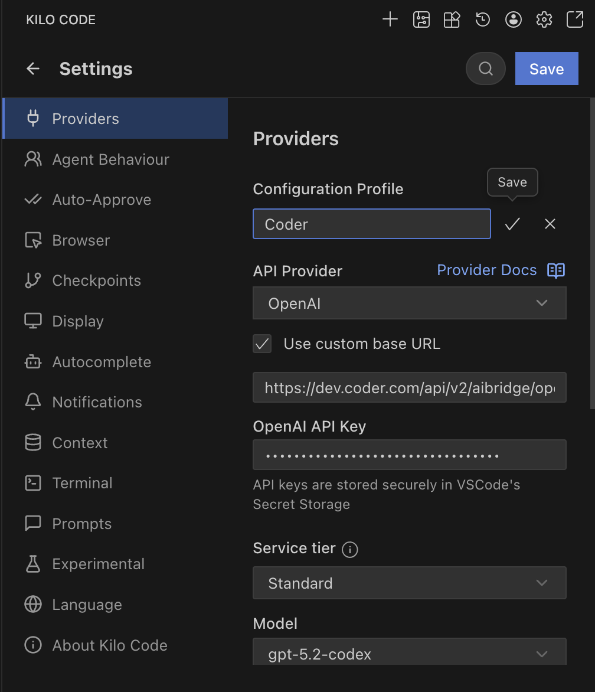
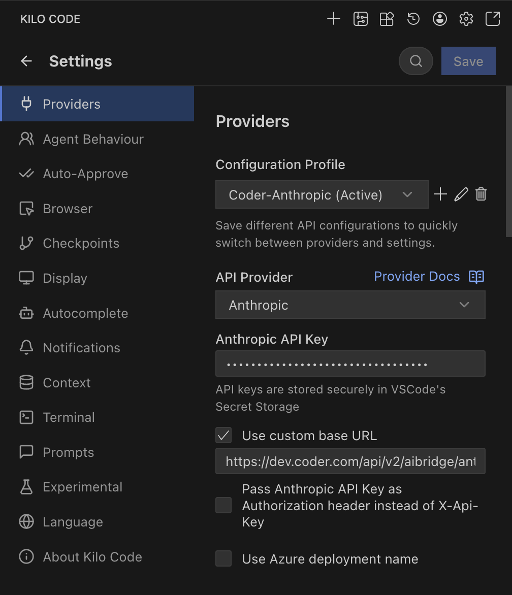

# Kilo Code

[Kilo Code](https://kilocode.ai) supports both OpenAI and Anthropic providers, allowing full integration with AI Bridge.

## Configuration

### OpenAI Compatible

1. Open Kilo Code in VS Code.
1. Go to **Settings**.
1. **Provider**: Select **OpenAI**.
1. **Base URL**: Enter `https://coder.example.com/api/v2/aibridge/openai/v1`.
1. **API Key**: Enter your **[Coder Session Token](../../../admin/users/sessions-tokens.md#generate-a-long-lived-api-token-on-behalf-of-yourself)**.
1. **Model ID**: Enter the model you wish to use (e.g., `gpt-5.2-codex`).

### Anthropic

1. **Provider**: Select **Anthropic**.
1. **Base URL**: Enter `https://coder.example.com/api/v2/aibridge/anthropic`.
1. **API Key**: Enter your **Coder Session Token**.
1. **Model ID**: Select your desired Claude model.

**References:** [Kilo Code Configuration](https://kilocode.ai/docs/ai-providers/openai-compatible)
