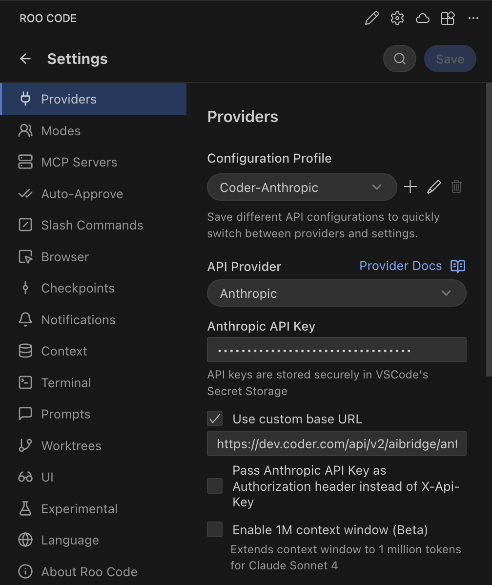

# Roo Code

[Roo Code](https://roocode.com) is an AI coding assistant that supports both OpenAI and Anthropic providers, making it fully compatible with AI Bridge.

## Configuration

Roo Code allows you to configure providers via the UI.

### OpenAI Compatible

1. Open Roo Code in VS Code.
1. Go to **Settings**.
1. **Provider**: Select **OpenAI**.
1. **Base URL**: Enter `https://coder.example.com/api/v2/aibridge/openai/v1`.
1. **API Key**: Enter your **[Coder Session Token](../../../admin/users/sessions-tokens.md#generate-a-long-lived-api-token-on-behalf-of-yourself)**.
1. **Model ID**: Enter the model you wish to use (e.g., `gpt-5.2-codex`).

### Anthropic

1. Open Roo Code in VS Code.
1. Go to **Settings**.
1. **Provider**: Select **Anthropic**.
1. **Base URL**: Enter `https://coder.example.com/api/v2/aibridge/anthropic`.
1. **API Key**: Enter your **Coder Session Token**.
1. **Model ID**: Select your desired Claude model.

### Notes

* If you encounter issues with the **OpenAI** provider type, use **OpenAI Compatible** to ensure correct endpoint routing.
* Ensure your Coder deployment URL is reachable from your VS Code environment.

**References:** [Roo Code Configuration Profiles](https://docs.roocode.com/features/api-configuration-profiles#creating-and-managing-profiles)
