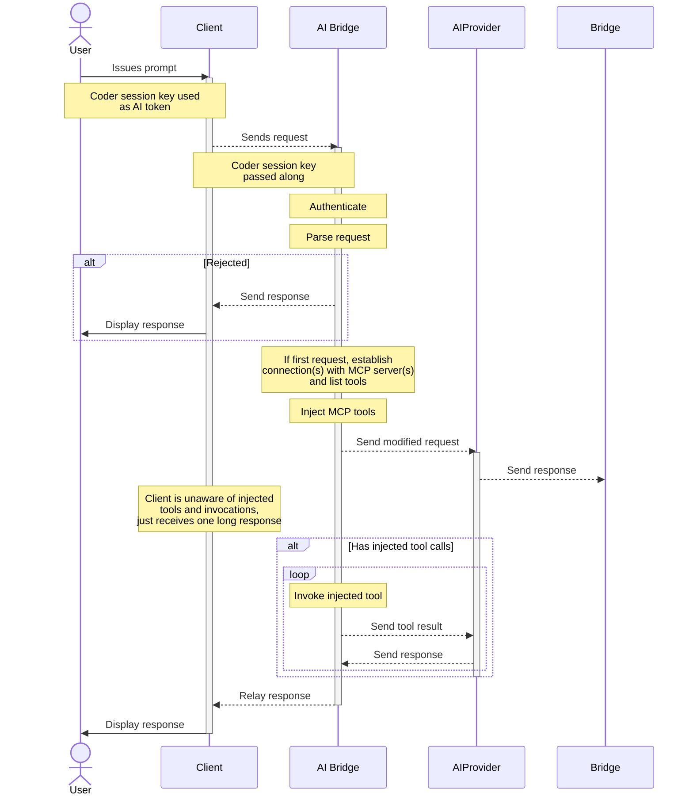

# AI Bridge


Bridge is a smart proxy for AI. It acts as a man-in-the-middle between your
users' coding agents / IDEs and providers like OpenAI and Anthropic. By
intercepting all the AI traffic between these clients and the upstream APIs,
Bridge can record user prompts, token usage, and tool invocations.

Bridge solves 3 key problems:

1. **Centralized authn/z management**: no more issuing & managing API tokens for
   OpenAI/Anthropic usage. Users use their Coder session or API tokens to
   authenticate with `coderd` (Coder control plane), and `coderd` securely
   communicates with the upstream APIs on their behalf. Use a single key for all
   users.
2. **Auditing and attribution**: all interactions with AI services, whether
   autonomous or human-initiated, will be audited and attributed back to a user.
3. **Centralized MCP administration**: define a set of approved MCP servers and
   tools which your users may use, and prevent users from using their own.

## When to use AI Bridge

As the library of LLMs and their associated tools grow, administrators are
pressured to provide auditing, measure adoption, provide tools through MCP, and
track token spend. Disparate SAAS platforms provide _some_ of these for _some_
tools, but there is no centralized, secure solution for these challenges.

If you are an administrator or devops leader looking to:

- Measure AI tooling adoption across teams or projects
- Provide an LLM audit trail to security administrators
- Manage token spend in a central dashboard
- Investigate opportunities for AI automation
- Uncover the high-leverage use cases from experienced engineers

We advise trying AI Bridge as self-hosted proxy to monitor LLM usage
agnostically across AI powered IDEs like Cursor and headless agents like Claude
Code.

## Setup

AI Bridge runs inside the Coder control plane, requiring no separate compute to deploy or scale. Once enabled, `coderd` hosts AI Bridge in-memory and brokers traffic to your configured AI providers on behalf of authenticated users.

### Requirements

1. A **premium** licensed Coder deployment
2. Server-side activation (see [Activation](#activation) below)
3. One or more [provider API keys](#providers) configured

### Activation

To enable this feature, activate the `aibridge` experiment using an environment
variable or a CLI flag. Additionally, you will need to enable AI Bridge explicitly:

```sh
CODER_EXPERIMENTS="aibridge" CODER_AIBRIDGE_ENABLED=true coder server
# or
coder server --experiments=aibridge --aibridge-enabled=true
```

_If you have other experiments enabled, separate them by commas._

### Providers

AI Bridge currently supports OpenAI and Anthropic APIs.

**API Key**:

The single key used to authenticate all requests from AI Bridge to
OpenAI/Anthropic APIs.

- `CODER_AIBRIDGE_OPENAI_KEY` or `--aibridge-openai-key`
- `CODER_AIBRIDGE_ANTHROPIC_KEY` or `--aibridge-anthropic-key`

**Base URL**:

The API to which AI Bridge will relay requests.

- `CODER_AIBRIDGE_OPENAI_BASE_URL` or `--aibridge-openai-base-url`, defaults to
  `https://api.openai.com/v1/`
- `CODER_AIBRIDGE_ANTHROPIC_BASE_URL` or `--aibridge-anthropic-base-url`,
  defaults to `https://api.anthropic.com/`

---

> [!NOTE] See [Supported APIs](#supported-apis) section below for a
> comprehensive list.

## Client Configuration

Once your platform team has enabled AI Bridge on the server, you'll need to configure your AI coding tools to use it. This section explains the general configuration concepts that apply to all clients.

For step-by-step instructions for your specific tool, see the [Supported Clients](#supported-clients) table below.

### Setting Base URLs

Configure your AI client to point to your Coder deployment's AI Bridge endpoints:

- **OpenAI-compatible clients**: Set `OPENAI_BASE_URL` to
  `https://coder.example.com/api/experimental/aibridge/openai/v1`
- **Anthropic-compatible clients**: Set `ANTHROPIC_BASE_URL` to
  `https://coder.example.com/api/experimental/aibridge/anthropic`

Replace `coder.example.com` with your actual Coder deployment URL.

### Authentication

Instead of using provider-specific API keys (OpenAI/Anthropic keys), clients
authenticate using your **Coder session token** or **API key**:

- **OpenAI clients**: Set `OPENAI_API_KEY` to your Coder session token or API
  key
- **Anthropic clients**: Set `ANTHROPIC_API_KEY` to your Coder session token or
  API key

You can generate a Coder API key using:

```sh
coder tokens create
```

### Supported Clients

The following AI coding assistants and IDEs have been tested with AI Bridge. Click the client name for detailed configuration instructions.

| Client                                    | OpenAI | Anthropic | Notes                                                                      |
|-------------------------------------------|--------|-----------|----------------------------------------------------------------------------|
| **[Roo Code](./roo-code.md)**             | ⚠️     | ✅         | Works with OpenAI Compatible provider. Use legacy API format.              |
| **[Claude Code](./claude-code.md)**       | N/A    | ✅         | CLI and VS Code extension. Can be pre-configured in templates.             |
| **[Cursor](./cursor.md)**                 | ⚠️     | ❌         | Only gpt-4.1 with custom endpoints. Requests proxy through Cursor servers. |
| **[GitHub Copilot](./github-copilot.md)** | ✅      | ❌         | VS Code only (Insiders required). CLI not supported.                       |
| **[Goose](./goose.md)**                   | ⚠️     | ✅         | Desktop app and CLI. Anthropic recommended.                                |
| **[Other Clients](./other-clients.md)**   | Varies | Varies    |                                                                            |

#### Legend

- ✅ **Fully Supported** - Works with AI Bridge
- ⚠️ **Partial Support** - Works with limitations
- ❌ **Not Supported** - Does not work or lacks configuration options
- N/A - Not applicable for this client

#### Clients Without Base URL Configuration

The following clients do not currently support custom base URLs and cannot be
used with AI Bridge:

- **[WindSurf](https://codeium.com/windsurf)** - No base URL override option
- **[Sourcegraph Amp](https://sourcegraph.com/amp)** - No base URL override
  option
- **[Kiro](https://kiro.ai/)** - No base URL override option
- **[Copilot CLI](https://github.com/github/copilot-cli)** - Uses GitHub token,
  no base URL override
  ([issue #104](https://github.com/github/copilot-cli/issues/104))

### Using AI Bridge with SDKs

Developers can use AI Bridge with OpenAI and Anthropic SDKs in custom applications.

#### OpenAI SDK

```python
import openai

client = openai.OpenAI(
    base_url="https://coder.example.com/api/experimental/aibridge/openai/v1",
    api_key="your-coder-session-token"
)
```

#### Anthropic SDK

```python
import anthropic

client = anthropic.Anthropic(
    base_url="https://coder.example.com/api/experimental/aibridge/anthropic",
    api_key="your-coder-session-token"
)
```

### Pre-configuring in Coder Templates

Template admins can pre-configure AI Bridge settings in Coder templates to provide a seamless experience for end users. When properly configured, users can start using AI tools immediately without manual setup.

#### Benefits of Template Pre-configuration

- **Zero user configuration** - Users get AI tools that work out of the box
- **Centralized management** - Admins control AI provider access through AI Bridge
- **Automatic authentication** - Session tokens are managed by Coder automatically
- **Consistent environment** - All workspaces use the same AI configuration
- **Audit trail** - All AI usage is automatically tracked through AI Bridge

#### Using Session Tokens in Templates

Coder provides the [`data.coder_workspace_owner.me.session_token`](https://registry.terraform.io/providers/coder/coder/latest/docs/data-sources/workspace_owner) data source, which gives template admins access to the workspace owner's session token. This token automatically authenticates requests through AI Bridge.

**Security Note**: The session token is scoped to the workspace owner and respects all Coder RBAC policies. It's automatically rotated and managed by Coder.

#### General Template Pattern

Here's a basic pattern for pre-configuring AI Bridge in any template:

```hcl
data "coder_workspace_owner" "me" {}

resource "coder_agent" "main" {
  os   = "linux"
  arch = "amd64"

  # Pre-configure AI Bridge for all supported tools
  env = {
    # OpenAI configuration
    OPENAI_BASE_URL = "${data.coder_workspace.me.access_url}/api/experimental/aibridge/openai/v1"
    OPENAI_API_KEY  = data.coder_workspace_owner.me.session_token

    # Anthropic configuration
    ANTHROPIC_BASE_URL = "${data.coder_workspace.me.access_url}/api/experimental/aibridge/anthropic"
    ANTHROPIC_API_KEY  = data.coder_workspace_owner.me.session_token
  }
}
```

This configuration works for:

- VS Code extensions (Roo Code, Claude Code, GitHub Copilot)
- CLI tools (Claude Code, Goose)
- Desktop applications (Cursor, Goose Desktop)
- Custom scripts using OpenAI or Anthropic SDKs

For tool-specific template examples, see the individual client pages:

- [Roo Code template config](./roo-code.md#template-configuration)
- [Claude Code template config](./claude-code.md#template-configuration)
- [Goose template config](./goose.md#template-configuration)

#### Configuring AI Agents in Tasks

For [Coder Tasks](./tasks.md) templates, you can pre-configure agents to use AI Bridge:

```tf
# For Claude Code

data "coder_workspace_owner" "me" {}

module "claude-code" {
  source    = "registry.coder.com/coder/claude-code/coder"
  version   = "3.1.0"
  agent_id  = coder_agent.main.id
  workdir   = "/home/coder/project"
  ai_prompt = data.coder_parameter.ai_prompt.value

  # Use AI Bridge instead of direct Anthropic API
  claude_api_key = data.coder_workspace_owner.me.session_token
}

resource "coder_env" "bridge_base_url" {
  agent_id = coder_agent.main.id
  name     = "ANTHROPIC_BASE_URL"
  value    = "${data.coder_workspace.me.access_url}/api/experimental/aibridge/anthropic"
}
```

## Collected Data

Bridge collects:

- The last `user` prompt of each request
- All token usage (associated with each prompt)
- Every tool invocation

All of these records are associated to an "interception" record, which maps 1:1
with requests received from clients but may involve several interactions with
upstream providers. Interceptions are associated with a Coder identity, allowing
you to map consumption and cost with teams or individuals in your organization:


These logs can be used to determine usage patterns, track costs, and evaluate
tooling adoption.

This data is currently accessible through the API and CLI (experimental), which
we advise administrators export to their observability platform of choice. We've
configured a Grafana dashboard to display Claude Code usage internally which can
be imported as a starting point for your tooling adoption metrics.


We provide an example Grafana dashboard that you can import as a starting point
for your tooling adoption metrics. See
[here](https://github.com/coder/coder/blob/main/examples/monitoring/dashboards/grafana/aibridge/README.md).

## Implementation Details

`coderd` runs an in-memory instance of `aibridged`, whose logic is mostly
contained in https://github.com/coder/aibridge. In future releases we will
support running external instances for higher throughput and complete memory
isolation from `coderd`.

<details>
<summary>See a diagram of how AI Bridge interception works</summary>



</details>

## MCP

[Model Context Protocol (MCP)](https://modelcontextprotocol.io/docs/getting-started/intro)
is a mechanism for connecting AI applications to external systems.

Bridge can connect to MCP servers and inject tools automatically, enabling you
to centrally manage the list of tools you wish to grant your users.

> [!NOTE] Only MCP servers which support OAuth2 Authorization are supported
> currently. In future releases we will support
> [optional authorization](https://modelcontextprotocol.io/specification/2025-06-18/basic/authorization#protocol-requirements).
>
> [_Streamable HTTP_](https://modelcontextprotocol.io/specification/2025-06-18/basic/transports#streamable-http)
> is the only supported transport currently. In future releases we will support
> the (now deprecated)
> [_Server-Sent Events_](https://modelcontextprotocol.io/specification/2025-06-18/basic/transports#backwards-compatibility)
> transport.

Bridge makes use of [External Auth](../admin/external-auth/index.md)
applications, as they define OAuth2 connections to upstream services. If your
External Auth application hosts a remote MCP server, you can configure AI Bridge to
connect to it, retrieve its tools and inject them into requests automatically -
all while using each individual user's access token.

For example, GitHub has a
[remote MCP server](https://github.com/github/github-mcp-server?tab=readme-ov-file#remote-github-mcp-server)
and we can use it as follows.

```bash
CODER_EXTERNAL_AUTH_0_TYPE=github
CODER_EXTERNAL_AUTH_0_CLIENT_ID=...
CODER_EXTERNAL_AUTH_0_CLIENT_SECRET=...
# Tell AI Bridge where it can find this service's remote MCP server.
CODER_EXTERNAL_AUTH_0_MCP_URL=https://api.githubcopilot.com/mcp/
```

See the diagram in [Implementation Details](#implementation-details) for more
information.

You can also control which tools are injected by using an allow and/or a deny
regular expression on the tool names:

```bash
CODER_EXTERNAL_AUTH_0_MCP_TOOL_ALLOW_REGEX=(.+_gist.*)
CODER_EXTERNAL_AUTH_0_MCP_TOOL_DENY_REGEX=(create_gist)
```

In the above example, all tools containing `_gist` in their name will be
allowed, but `create_gist` is denied.

The logic works as follows:

- If neither the allow/deny patterns are defined, all tools will be injected.
- The deny pattern takes precedence.
- If only a deny pattern is defined, all tools are injected except those
  explicitly denied.

In the above example, if you prompted your AI model with "list your available
github tools by name", it would reply something like:

> Certainly! Here are the GitHub-related tools that I have available:
>
> 1. `bmcp_github_update_gist`
> 2. `bmcp_github_list_gists`

Bridge marks automatically injected tools with a prefix `bmcp_` ("bridged MCP").
It also namespaces all tool names by the ID of their associated External Auth
application (in this case `github`).

## Tool Injection

If a model decides to invoke a tool and it has a `bmcp_` suffix and AI Bridge has a
connection with the related MCP server, it will invoke the tool. The tool result
will be passed back to the upstream AI provider, and this will loop until the
model has all of its required data. These inner loops are not relayed back to
the client; all it seems is the result of this loop. See
[Implementation Details](#implementation-details).

In contrast, tools which are defined by the client (i.e. the
[`Bash` tool](https://docs.claude.com/en/docs/claude-code/settings#tools-available-to-claude)
defined by _Claude Code_) cannot be invoked by AI Bridge, and the tool call from
the model will be relayed to the client, after which it will invoke the tool.

If you have the `oauth2` and `mcp-server-http` experiments enabled, Coder's own
[internal MCP tools](mcp-server.md) will be injected automatically.

### Troubleshooting

- **Too many tools**: should you receive an error like
  `Invalid 'tools': array too long. Expected an array with maximum length 128, but got an array with length 132 instead`,
  you can reduce the number by filtering out tools using the allow/deny patterns
  documented in the [MCP](#mcp) section.

- **Coder MCP tools not being injected**: in order for Coder MCP tools to be
  injected, the internal MCP server needs to be active. Follow the instructions
  in the [MCP Server](mcp-server.md) page to enable it.

- **External Auth tools not being injected**: this is generally due to the
  requesting user not being authenticated against the External Auth app; when
  this is the case, no attempt is made to connect to the MCP server.

## Known Issues / Limitations

- Codex CLI currently does not work with AI Bridge due to a JSON marshaling issue:
  https://github.com/coder/aibridge/issues/19
- Claude Code web searches do not report correctly:
  https://github.com/coder/aibridge/issues/11

## Supported APIs

API support is broken down into two categories:

- **Intercepted**: requests are intercepted, audited, and augmented - full
  AI Bridge functionality
- **Passthrough**: requests are proxied directly to the upstream, no auditing or
  augmentation takes place

Where relevant, both streaming and non-streaming requests are supported.

### OpenAI

**Intercepted**:

- [`/v1/chat/completions`](https://platform.openai.com/docs/api-reference/chat/create)

**Passthrough**:

- [`/v1/models(/*)`](https://platform.openai.com/docs/api-reference/models/list)
- [`/v1/responses`](https://platform.openai.com/docs/api-reference/responses/create)
  _(Interception support coming in **Beta**)_

### Anthropic

**Intercepted**:

- [`/v1/messages`](https://docs.claude.com/en/api/messages)

**Passthrough**:

- [`/v1/models(/*)`](https://docs.claude.com/en/api/models-list)

## Troubleshooting

To report a bug, file a feature request, or view a list of known issues, please
visit our [GitHub repository for AI Bridge](https://github.com/coder/aibridge). If
you encounter issues with AI Bridge during early access, please reach out to us via
[Discord](https://discord.gg/coder).
