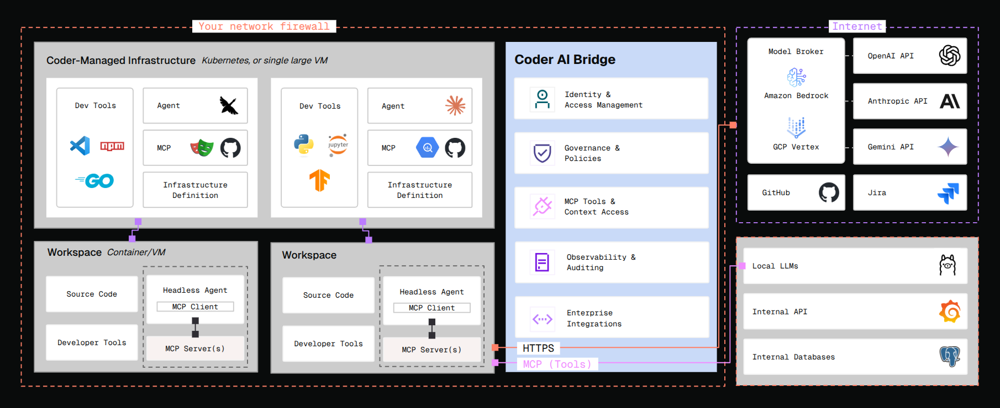

# AI Bridge

AI Bridge is a smart proxy for AI. It acts as a man-in-the-middle between your users' coding agents / IDEs
and providers like OpenAI and Anthropic. By intercepting all the AI traffic between these clients and
the upstream APIs, AI Bridge can record user prompts, token usage, and tool invocations.

AI Bridge solves 3 key problems:

1. **Centralized authn/z management**: no more issuing & managing API tokens for OpenAI/Anthropic usage.
   Users use their Coder session or API tokens to authenticate with `coderd` (Coder control plane), and
   `coderd` securely communicates with the upstream APIs on their behalf.
2. **Auditing and attribution**: all interactions with AI services, whether autonomous or human-initiated,
   will be audited and attributed back to a user.
3. **Centralized MCP administration**: define a set of approved MCP servers and tools which your users may
   use.

## When to use AI Bridge

As LLM adoption grows, administrators need centralized auditing, monitoring, and token management. AI Bridge enables organizations to manage AI tooling access for thousands of engineers from a single control plane.

If you are an administrator or devops leader looking to:

- Measure AI tooling adoption across teams or projects
- Establish an audit trail of prompts, issues, and tools invoked
- Manage token spend in a central dashboard
- Investigate opportunities for AI automation
- Uncover high-leverage use cases last

AI Bridge is best suited for organizations facing these centralized management and observability challenges.

## Next steps

- [Set up AI Bridge](./setup.md) on your Coder deployment
- [Configure AI clients](./client-config.md) to use AI Bridge
- [Configure MCP servers](./mcp.md) for tool access
- [Monitor usage and metrics](./monitoring.md)
- [Reference documentation](./reference.md)
