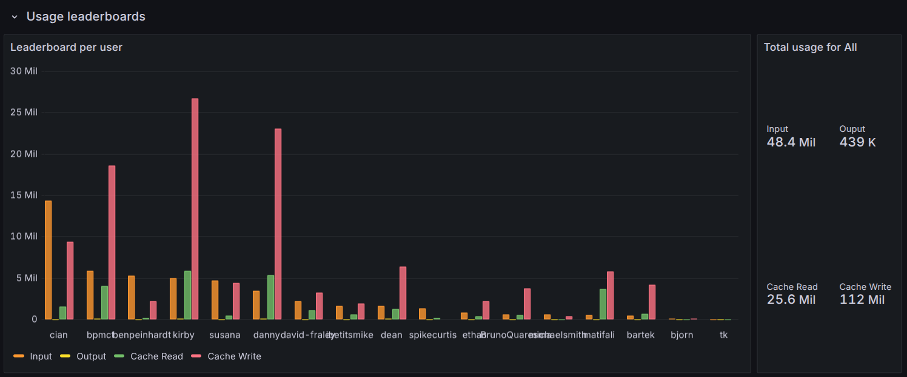

# Monitoring

Bridge records the last `user` prompt, token usage, and every tool invocation for each intercepted request. Each capture is tied to a single "interception" that maps back to the authenticated Coder identity, making it easy to attribute spend and behaviour.

We provide an example Grafana dashboard that you can import as a starting point for your metrics. See [the Grafana dashboard README](https://github.com/coder/coder/blob/main/examples/monitoring/dashboards/grafana/aibridge/README.md).

These logs and metrics can be used to determine usage patterns, track costs, and evaluate tooling adoption.
