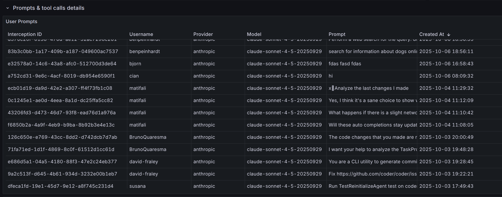

# Monitoring

AI Bridge records the last `user` prompt, token usage, and every tool invocation for each intercepted request. Each capture is tied to a single "interception" that maps back to the authenticated Coder identity, making it easy to attribute spend and behaviour.




We provide an example Grafana dashboard that you can import as a starting point for your metrics. See [the Grafana dashboard README](https://github.com/coder/coder/blob/main/examples/monitoring/dashboards/grafana/aibridge/README.md).

These logs and metrics can be used to determine usage patterns, track costs, and evaluate tooling adoption.

## Exporting Data

AI Bridge interception data can be exported for external analysis, compliance reporting, or integration with log aggregation systems.

### REST API

You can retrieve AI Bridge interceptions via the Coder API with filtering and pagination support.

```sh
curl -X GET "https://coder.example.com/api/v2/aibridge/interceptions?q=initiator:me" \
  -H "Coder-Session-Token: $CODER_SESSION_TOKEN"
```

Available query filters:

- `initiator` - Filter by user ID or username
- `provider` - Filter by AI provider (e.g., `openai`, `anthropic`)
- `model` - Filter by model name
- `started_after` - Filter interceptions after a timestamp
- `started_before` - Filter interceptions before a timestamp

See the [API documentation](../../reference/api/aibridge.md) for full details.

### CLI

Export interceptions as JSON using the CLI:

```sh
coder aibridge interceptions list --initiator me --limit 1000
```

You can filter by time range, provider, model, and user:

```sh
coder aibridge interceptions list \
  --started-after "2025-01-01T00:00:00Z" \
  --started-before "2025-02-01T00:00:00Z" \
  --provider anthropic
```

See `coder aibridge interceptions list --help` for all options.

## Data Retention

AI Bridge data is retained for **60 days by default**. Configure the retention
period to balance storage costs with your organization's compliance and analysis
needs.

For configuration options and details, see [Data Retention](./setup.md#data-retention)
in the AI Bridge setup guide.

## Tracing

AI Bridge supports tracing via [OpenTelemetry](https://opentelemetry.io/),
providing visibility into request processing, upstream API calls, and MCP server
interactions.

### Enabling Tracing

AI Bridge tracing is enabled when tracing is enabled for the Coder server.
To enable tracing set `CODER_TRACE_ENABLE` environment variable or
[--trace](https://coder.com/docs/reference/cli/server#--trace) CLI flag:

```sh
export CODER_TRACE_ENABLE=true
```

```sh
coder server --trace
```

### What is Traced

AI Bridge creates spans for the following operations:

| Span Name                                   | Description                                          |
|---------------------------------------------|------------------------------------------------------|
| `CachedBridgePool.Acquire`                  | Acquiring a request bridge instance from the pool    |
| `Intercept`                                 | Top-level span for processing an intercepted request |
| `Intercept.CreateInterceptor`               | Creating the request interceptor                     |
| `Intercept.ProcessRequest`                  | Processing the request through the bridge            |
| `Intercept.ProcessRequest.Upstream`         | Forwarding the request to the upstream AI provider   |
| `Intercept.ProcessRequest.ToolCall`         | Executing a tool call requested by the AI model      |
| `Intercept.RecordInterception`              | Recording creating interception record               |
| `Intercept.RecordPromptUsage`               | Recording prompt/message data                        |
| `Intercept.RecordTokenUsage`                | Recording token consumption                          |
| `Intercept.RecordToolUsage`                 | Recording tool/function calls                        |
| `Intercept.RecordInterceptionEnded`         | Recording the interception as completed              |
| `ServerProxyManager.Init`                   | Initializing MCP server proxy connections            |
| `StreamableHTTPServerProxy.Init`            | Setting up HTTP-based MCP server proxies             |
| `StreamableHTTPServerProxy.Init.fetchTools` | Fetching available tools from MCP servers            |

Example trace of an interception using Jaeger backend:


### Capturing Logs in Traces

> **Note:** Enabling log capture may generate a large volume of trace events.

To include log messages as trace events, enable trace log capture
by setting `CODER_TRACE_LOGS` environment variable or using
[--trace-logs](https://coder.com/docs/reference/cli/server#--trace-logs) flag:

```sh
export CODER_TRACE_ENABLE=true
export CODER_TRACE_LOGS=true
```

```sh
coder server --trace --trace-logs
```
