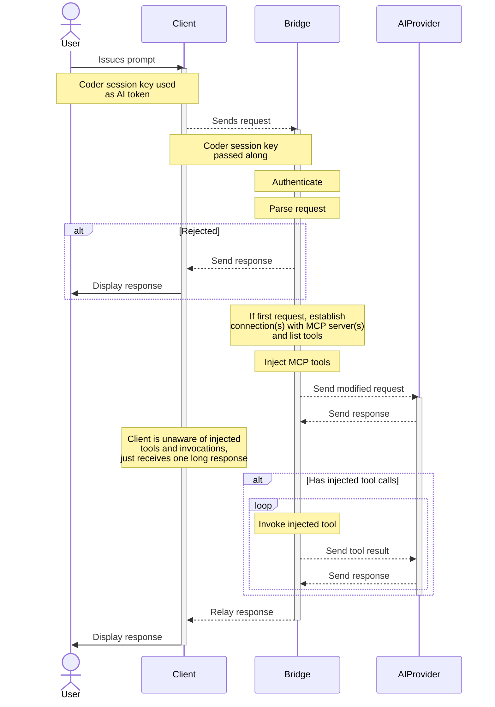
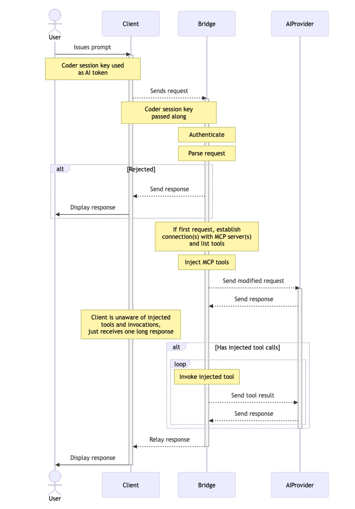

# Reference

## Implementation Details

`coderd` runs an in-memory instance of `aibridged`, whose logic is mostly contained in https://github.com/coder/aibridge. In future releases we will support running external instances for higher throughput and complete memory isolation from `coderd`.

See a diagram of how AI Bridge interception works

## Supported APIs

API support is broken down into two categories:

- **Intercepted**: requests are intercepted, audited, and augmented - full AI Bridge functionality
- **Passthrough**: requests are proxied directly to the upstream, no auditing or augmentation takes place

Where relevant, both streaming and non-streaming requests are supported.

### OpenAI

**Intercepted**:

- [`/v1/chat/completions`](https://platform.openai.com/docs/api-reference/chat/create)

**Passthrough**:

- [`/v1/models(/*)`](https://platform.openai.com/docs/api-reference/models/list)
- [`/v1/responses`](https://platform.openai.com/docs/api-reference/responses/create) _(Interception support coming in **Beta**)_

### Anthropic

**Intercepted**:

- [`/v1/messages`](https://docs.claude.com/en/api/messages)

**Passthrough**:

- [`/v1/models(/*)`](https://docs.claude.com/en/api/models-list)

## Troubleshooting

To report a bug, file a feature request, or view a list of known issues, please visit our [GitHub repository for AI Bridge](https://github.com/coder/aibridge). If you encounter issues with AI Bridge during early access, please reach out to us via [Discord](https://discord.gg/coder).
