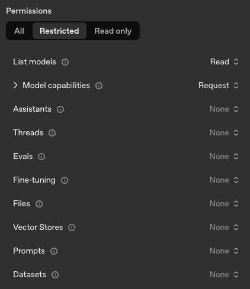

# Setup

AI Bridge runs inside the Coder control plane (`coderd`), requiring no separate compute to deploy or scale. Once enabled, `coderd` runs the `aibridged` in-memory and brokers traffic to your configured AI providers on behalf of authenticated users.

**Required**:

1. A **Premium** license with the [AI Governance Add-On](../ai-governance).
1. Feature must be [enabled](#activation) using the server flag
1. One or more [providers](#configure-providers) API key(s) must be configured

## Activation

You will need to enable AI Bridge explicitly:

```sh
CODER_AIBRIDGE_ENABLED=true coder server
# or
coder server --aibridge-enabled=true
```

## Configure Providers

AI Bridge proxies requests to upstream LLM APIs. Configure at least one provider before exposing AI Bridge to end users.

<div class="tabs">

### OpenAI

Set the following when routing [OpenAI-compatible](https://coder.com/docs/reference/cli/server#--aibridge-openai-key) traffic through AI Bridge:

- `CODER_AIBRIDGE_OPENAI_KEY` or `--aibridge-openai-key`
- `CODER_AIBRIDGE_OPENAI_BASE_URL` or `--aibridge-openai-base-url`

The default base URL (`https://api.openai.com/v1/`) works for the native OpenAI service. Point the base URL at your preferred OpenAI-compatible endpoint (for example, a hosted proxy or LiteLLM deployment) when needed.

If you'd like to create an [OpenAI key](https://platform.openai.com/api-keys) with minimal privileges, this is the minimum required set:



### Anthropic

Set the following when routing [Anthropic-compatible](https://coder.com/docs/reference/cli/server#--aibridge-anthropic-key) traffic through AI Bridge:

- `CODER_AIBRIDGE_ANTHROPIC_KEY` or `--aibridge-anthropic-key`
- `CODER_AIBRIDGE_ANTHROPIC_BASE_URL` or `--aibridge-anthropic-base-url`

The default base URL (`https://api.anthropic.com/`) targets Anthropic's public API. Override it for Anthropic-compatible brokers.

Anthropic does not allow [API keys](https://console.anthropic.com/settings/keys) to have restricted permissions at the time of writing (Nov 2025).

### Amazon Bedrock

Set the following when routing [Amazon Bedrock](https://coder.com/docs/reference/cli/server#--aibridge-bedrock-region) traffic through AI Bridge:

- `CODER_AIBRIDGE_BEDROCK_REGION` or `--aibridge-bedrock-region`
- `CODER_AIBRIDGE_BEDROCK_ACCESS_KEY` or `--aibridge-bedrock-access-key`
- `CODER_AIBRIDGE_BEDROCK_ACCESS_KEY_SECRET` or `--aibridge-bedrock-access-key-secret`
- `CODER_AIBRIDGE_BEDROCK_MODEL` or `--aibridge-bedrock-model`
- `CODER_AIBRIDGE_BEDROCK_SMALL_FAST_MODEL` or `--aibridge-bedrock-small-fast-model`

> [!NOTE]
> `CODER_AIBRIDGE_BEDROCK_BASE_URL` or `--aibridge-bedrock-base-url` may be used instead of `CODER_AIBRIDGE_BEDROCK_REGION`/`--aibridge-bedrock-region`
if you would like to specify a URL which does not follow the form of `https://bedrock-runtime.<region>.amazonaws.com` - for example if using a
proxy between AI Bridge and AWS Bedrock.

#### Obtaining Bedrock credentials

1. **Choose a region** where you want to use Bedrock.

2. **Generate API keys** in the [AWS Bedrock console](https://us-east-1.console.aws.amazon.com/bedrock/home?region=us-east-1#/api-keys/long-term/create) (replace `us-east-1` in the URL with your chosen region):
   - Choose an expiry period for the key.
   - Click **Generate**.
   - This creates an IAM user with strictly-scoped permissions for Bedrock access.

3. **Create an access key** for the IAM user:
   - After generating the API key, click **"You can directly modify permissions for the IAM user associated"**.
   - In the IAM user page, navigate to the **Security credentials** tab.
   - Under **Access keys**, click **Create access key**.
   - Select **"Application running outside AWS"** as the use case.
   - Click **Next**.
   - Add a description like "Coder AI Bridge token".
   - Click **Create access key**.
   - Save both the access key ID and secret access key securely.

4. **Configure your Coder deployment** with the credentials:

   ```sh
   export CODER_AIBRIDGE_BEDROCK_REGION=us-east-1
   export CODER_AIBRIDGE_BEDROCK_ACCESS_KEY=<your-access-key-id>
   export CODER_AIBRIDGE_BEDROCK_ACCESS_KEY_SECRET=<your-secret-access-key>
   coder server
   ```

### Additional providers and Model Proxies

AI Bridge can relay traffic to other OpenAI- or Anthropic-compatible services or model proxies like LiteLLM by pointing the base URL variables above at the provider you operate. Share feedback or follow along in the [`aibridge`](https://github.com/coder/aibridge) issue tracker as we expand support for additional providers.

</div>

> [!NOTE]
> See the [Supported APIs](./reference.md#supported-apis) section below for precise endpoint coverage and interception behavior.

## Data Retention

AI Bridge records prompts, token usage, and tool invocations for auditing and
monitoring purposes. By default, this data is retained for **60 days**.

Configure retention using `--aibridge-retention` or `CODER_AIBRIDGE_RETENTION`:

```sh
coder server --aibridge-retention=90d
```

Or in YAML:

```yaml
aibridge:
  retention: 90d
```

Set to `0` to retain data indefinitely.

For duration formats, how retention works, and best practices, see the
[Data Retention](../../admin/setup/data-retention.md) documentation.
