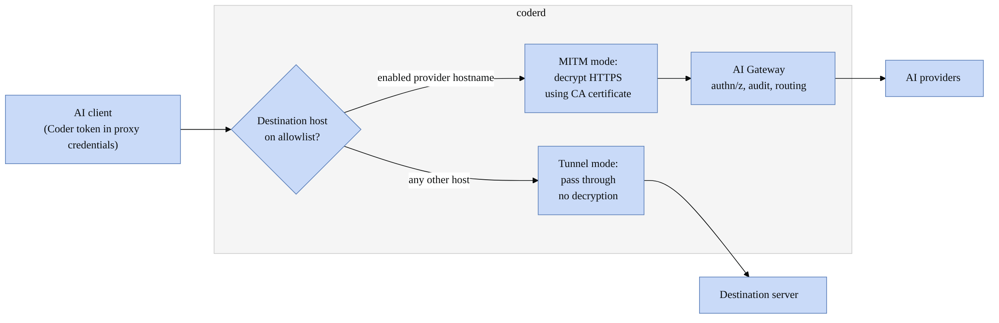

# AI Gateway Proxy

> [!NOTE]
> AI Gateway Proxy requires the [AI Governance Add-On](../../ai-governance.md).
> As of Coder v2.32, deployments without the add-on will not be able to
> access AI Gateway Proxy.

AI Gateway Proxy extends [AI Gateway](../index.md) to support clients that don't allow base URL overrides.
While AI Gateway requires clients to support custom base URLs, many popular AI coding tools lack this capability.

AI Gateway Proxy solves this by acting as an HTTP proxy that intercepts traffic to supported AI providers and forwards it to AI Gateway. Since most clients respect proxy configurations even when they don't support base URL overrides, this provides a universal compatibility layer for AI Gateway.

For a list of clients supported through AI Gateway Proxy, see [Client Configuration](../clients/index.md).

## How it works

AI Gateway Proxy operates in two modes depending on the destination:

* MITM (Man-in-the-Middle) mode for the hostnames of enabled AI providers:
  * Intercepts and decrypts HTTPS traffic using a configured CA certificate
  * Forwards requests to AI Gateway for authentication, auditing, and routing
  * Covers the hostname from each enabled provider's base URL

* Tunnel mode for all other traffic:
  * Passes requests through without decryption

Clients authenticate by passing their Coder token in the proxy credentials.

## When to use AI Gateway Proxy

Use AI Gateway Proxy when your AI tools don't support base URL overrides but do respect standard proxy configurations.

For clients that support base URL configuration, you can use [AI Gateway](../index.md) directly.
Nevertheless, clients with base URL overrides also work with the proxy, in case you want to use multiple AI clients and some of them do not support base URL configuration.

## Next steps

* [Set up AI Gateway Proxy](./setup.md) on your Coder deployment
