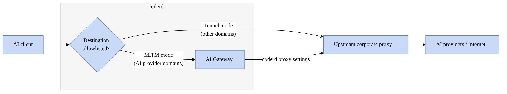

# Setup

AI Gateway Proxy runs inside the Coder control plane (`coderd`), requiring no separate compute to deploy or scale.
Once enabled, `coderd` runs the `aibridgeproxyd` in-memory and intercepts traffic to supported AI providers, forwarding it to AI Gateway.

**Required:**

1. AI Gateway must be enabled and configured (requires the [AI Governance Add-On](../../ai-governance.md)). See [AI Gateway Setup](../setup.md) for further information.
1. AI Gateway Proxy must be [enabled](#proxy-configuration) using the server flag.
1. A [CA certificate](#ca-certificate) must be configured for MITM interception.
1. [Clients](#client-configuration) must be configured to use the proxy and trust the CA certificate.

## Proxy Configuration

AI Gateway Proxy is disabled by default. To enable it, set the following configuration options:

```shell
CODER_AI_GATEWAY_ENABLED=true \
CODER_AI_GATEWAY_PROXY_ENABLED=true \
CODER_AI_GATEWAY_PROXY_CERT_FILE=/path/to/ca.crt \
CODER_AI_GATEWAY_PROXY_KEY_FILE=/path/to/ca.key \
coder server
# or via CLI flags:
coder server \
  --ai-gateway-enabled=true \
  --ai-gateway-proxy-enabled=true \
  --ai-gateway-proxy-cert-file=/path/to/ca.crt \
  --ai-gateway-proxy-key-file=/path/to/ca.key
```

Both the certificate and private key are required for AI Gateway Proxy to start.
See [CA Certificate](#ca-certificate) for how to generate and obtain these files.

By default, the proxy listener accepts plain HTTP connections.
To serve the listener over HTTPS, provide a TLS certificate and key:

```shell
CODER_AI_GATEWAY_PROXY_TLS_CERT_FILE=/path/to/listener.crt
CODER_AI_GATEWAY_PROXY_TLS_KEY_FILE=/path/to/listener.key
# or via CLI flags:
--ai-gateway-proxy-tls-cert-file=/path/to/listener.crt
--ai-gateway-proxy-tls-key-file=/path/to/listener.key
```

Both files must be provided together.
The TLS certificate must include a Subject Alternative Name (SAN) matching the hostname or IP address that clients use to connect to the proxy.
See [Proxy TLS Configuration](#proxy-tls-configuration) for how to generate and configure these files.

The proxy intercepts HTTPS traffic for hostnames matching the base URL of each enabled AI [Provider](../providers.md) configured in AI Gateway.
All other traffic is tunneled through without decryption.

For additional configuration options, see the [Coder server configuration](../../../reference/cli/server.md#options).

## Security Considerations

> [!WARNING]
> The AI Gateway Proxy should only be accessible within a trusted network and **must not** be directly exposed to the public internet.
> Without proper network restrictions, unauthorized users could route traffic through the proxy or intercept credentials.

### Encrypting client connections

By default, AI tools send the Coder session token in the proxy credentials over unencrypted HTTP.
This only applies to the initial connection between the client and the proxy.
Once connected:

* MITM mode: A TLS connection is established between the AI tool and the proxy (using the configured CA certificate), then traffic is forwarded securely to AI Gateway.
* Tunnel mode: A TLS connection is established directly between the AI tool and the destination, passing through the proxy without decryption.

As a best practice, apply one or more of the following to protect credentials during the initial connection:

* TLS listener (recommended): Enable TLS directly on the proxy so clients connect over HTTPS.
See [Proxy TLS Configuration](#proxy-tls-configuration) for configuration steps.
* Internal network only: If the proxy and all clients are on the same trusted network, credentials are not exposed to external attackers.
* TLS-terminating load balancer: Place a TLS-terminating load balancer in front of the proxy that terminates TLS and forwards requests over HTTP.

### Restricting proxy access

Requests to non-allowlisted domains are tunneled through the proxy, but connections to private and reserved IP ranges are blocked by default.
The IP validation and TCP connect happen atomically, preventing DNS rebinding attacks where the resolved address could change between the check and the connection.
To prevent unauthorized use, restrict network access to the proxy so that only authorized clients can connect.

In case the Coder access URL resolves to a private address, it is automatically exempt from this restriction so the proxy can always reach its own deployment.
If you need to allow access to additional internal networks via the proxy, use the Allowlist CIDRs option ([`CODER_AI_GATEWAY_PROXY_ALLOWED_PRIVATE_CIDRS`](../../../reference/cli/server.md#--ai-gateway-proxy-allowed-private-cidrs)):

```shell
CODER_AI_GATEWAY_PROXY_ALLOWED_PRIVATE_CIDRS=10.0.0.0/8,172.16.0.0/12
# or via CLI flag:
--ai-gateway-proxy-allowed-private-cidrs=10.0.0.0/8,172.16.0.0/12
```

## CA Certificate

AI Gateway Proxy uses a CA (Certificate Authority) certificate to perform MITM interception of HTTPS traffic.
When AI tools connect to AI provider domains through the proxy, the proxy presents a certificate signed by this CA.
AI tools must trust this CA certificate, otherwise, the connection will fail.

### Self-signed certificate

Use a self-signed certificate when your organization doesn't have an internal CA, or when you want a dedicated CA specifically for AI Gateway Proxy.

Generate a CA certificate specifically for AI Gateway Proxy:

1) Generate a private key:

```shell
openssl genrsa -out ca.key 4096
chmod 400 ca.key
```

1) Create a self-signed CA certificate (valid for 10 years):

```shell
openssl req -new -x509 -days 3650 \
  -key ca.key \
  -out ca.crt \
  -subj "/CN=AI Gateway Proxy CA"
```

Configure AI Gateway Proxy with both files:

```shell
CODER_AI_GATEWAY_PROXY_CERT_FILE=/path/to/ca.crt
CODER_AI_GATEWAY_PROXY_KEY_FILE=/path/to/ca.key
```

### Corporate CA certificate

If your organization has an internal CA that clients already trust, you can have it issue an intermediate CA certificate for AI Gateway Proxy.
This simplifies deployment since AI tools that already trust your organization's root CA will automatically trust certificates signed by the intermediate.

Your organization's CA issues a certificate and private key pair for the proxy. Configure the proxy with both files:

```shell
CODER_AI_GATEWAY_PROXY_CERT_FILE=/path/to/intermediate-ca.crt
CODER_AI_GATEWAY_PROXY_KEY_FILE=/path/to/intermediate-ca.key
```

### Securing the private key

> [!WARNING]
> The CA private key is used to sign certificates for MITM interception.
> Store it securely and restrict access. If compromised, an attacker could intercept traffic from any client that trusts the CA certificate.

Best practices:

* Restrict file permissions so only the Coder process can read the key.
* Use a secrets manager to store the key where possible.

### Distributing the certificate

AI tools need to trust the CA certificate before connecting through the proxy.

For **self-signed certificates**, AI tools must be configured to trust the CA certificate. The certificate (without the private key) is available at:

```shell
https://<coder-url>/api/v2/ai-gateway/proxy/ca-cert.pem
```

For **corporate CA certificates**, if the systems where AI tools run already trust your organization's root CA, and the intermediate certificate chains correctly to that root, no additional certificate distribution is needed.
Otherwise, AI tools must be configured to trust the intermediate CA certificate from the endpoint above.

How you configure AI tools to trust the certificate depends on the tool and operating system. See [Client Configuration](#client-configuration) for details.

## Proxy TLS Configuration

By default, the AI Gateway Proxy listener accepts plain HTTP connections.
When TLS is enabled, the proxy serves over HTTPS, encrypting the connection between AI tools and the proxy.

The TLS certificate is separate from the [MITM CA certificate](#ca-certificate).
The CA certificate is used to sign dynamically generated certificates during MITM interception.
The TLS certificate identifies the proxy itself, like any standard web server certificate.

The AI Gateway Proxy enforces a minimum TLS version of 1.2.

### Configuration

In addition to the required proxy configuration, set the following to enable TLS on the proxy:

```shell
CODER_AI_GATEWAY_PROXY_TLS_CERT_FILE=/path/to/listener.crt
CODER_AI_GATEWAY_PROXY_TLS_KEY_FILE=/path/to/listener.key
# or via CLI flags:
--ai-gateway-proxy-tls-cert-file=/path/to/listener.crt
--ai-gateway-proxy-tls-key-file=/path/to/listener.key
```

Both files must be provided together. If only one is set, the proxy will fail to start.

### Self-signed certificate

Use a self-signed certificate when your organization doesn't have an internal CA, or when you want a dedicated certificate specifically for the AI Gateway Proxy.

The TLS certificate must include a Subject Alternative Name (SAN) matching the hostname or IP address that clients use to connect to the proxy.
Without a matching SAN, clients will reject the connection.

1) Generate a private key:

```shell
openssl genrsa -out listener.key 4096
chmod 400 listener.key
```

1) Create a self-signed certificate:

```shell
openssl req -new -x509 -days 365 \
  -key listener.key \
  -out listener.crt \
  -subj "/CN=<proxy-host>" \
  -addext "subjectAltName=DNS:<proxy-host>,IP:<proxy-ip>"
```

Replace `<proxy-host>` and `<proxy-ip>` with the hostname and IP address that clients use to connect to the proxy.

### Corporate CA certificate

If your organization has an internal CA, have it issue a leaf certificate for the proxy.
The certificate must include a SAN matching the proxy's hostname or IP address.

If clients already trust your organization's root CA, no additional certificate configuration is needed for the TLS connection to the proxy.

### Trusting the TLS certificate

For **self-signed certificates**, AI tools must be configured to trust the TLS certificate.

For **corporate CA certificates**, if the systems where AI tools run already trust your organization's root CA, no additional configuration is needed.

How you configure AI tools to trust the certificate depends on the tool and operating system.
See [Client Configuration](#client-configuration) for details.

## Upstream proxy

If your organization requires all outbound traffic to pass through a corporate proxy, you can configure AI Gateway Proxy to chain requests to an upstream proxy.

> [!NOTE]
> AI Gateway Proxy must be the first proxy in the chain.
> AI tools must be configured to connect directly to AI Gateway Proxy, which then forwards tunneled traffic to the upstream proxy.

### How it works

Tunneled requests (non-allowlisted domains) are forwarded to the upstream proxy configured via [`CODER_AI_GATEWAY_PROXY_UPSTREAM`](../../../reference/cli/server.md#--ai-gateway-proxy-upstream).

MITM'd requests (AI provider domains) are forwarded to AI Gateway, which then communicates with AI providers.
To ensure AI Gateway also routes requests through the upstream proxy, make sure to configure the proxy settings for the Coder server process.



> [!NOTE]
> When an upstream proxy is configured, AI Gateway Proxy validates the destination IP before forwarding the request.
> However, the upstream proxy re-resolves DNS independently, so a small DNS rebinding window exists between the validation and the actual connection.
> Ensure your upstream proxy enforces its own restrictions on private and reserved IP ranges.

### Configuration

Configure the upstream proxy URL:

```shell
CODER_AI_GATEWAY_PROXY_UPSTREAM=http://<corporate-proxy-url>:8080
```

For HTTPS upstream proxies, if the upstream proxy uses a certificate not trusted by the system, provide the CA certificate:

```shell
CODER_AI_GATEWAY_PROXY_UPSTREAM=https://<corporate-proxy-url>:8080
CODER_AI_GATEWAY_PROXY_UPSTREAM_CA=/path/to/corporate-ca.crt
```

If the system already trusts the upstream proxy's CA certificate, [`CODER_AI_GATEWAY_PROXY_UPSTREAM_CA`](../../../reference/cli/server.md#--ai-gateway-proxy-upstream-ca) is not required.

## Client Configuration

To use AI Gateway Proxy, AI tools must be configured to:

1. Route traffic through the proxy
1. Trust the proxy's CA certificate

### Configuring the proxy

The preferred approach is to configure the proxy directly in the AI tool's settings, as this avoids routing unnecessary traffic through the proxy.
Consult the tool's documentation for specific instructions.

Alternatively, most tools support the standard `HTTPS_PROXY` environment variable, though this is not guaranteed for all tools:

```shell
export HTTPS_PROXY="https://coder:${CODER_SESSION_TOKEN}@<proxy-host>:8888"
```

Note: if [TLS is not enabled](#proxy-tls-configuration) on the proxy, replace `https://` with `http://` in the proxy URL.

`HTTPS_PROXY` is used for requests to `https://` URLs, which includes all supported AI provider domains.

> [!NOTE]
> `HTTP_PROXY` is not required since AI providers only use `HTTPS`.
> Leaving it unset avoids routing unnecessary traffic through the proxy.

In order for AI tools that communicate with AI Gateway Proxy to authenticate with Coder via AI Gateway, the Coder session token needs to be passed in the proxy credentials as the password field.

### Trusting the CA certificate

The preferred approach is to configure the CA certificate directly in the AI tool's settings, as this limits the scope of the trusted certificate to that specific application.
Consult the tool's documentation for specific instructions.

> [!NOTE]
> If using a [corporate CA certificate](#corporate-ca-certificate) and the system already trusts your organization's root CA, no additional certificate configuration is required.

Download the certificate:

```shell
curl -o coder-ai-gateway-proxy-ca.pem \
  -H "Coder-Session-Token: ${CODER_SESSION_TOKEN}" \
  https://<coder-url>/api/v2/ai-gateway/proxy/ca-cert.pem
```

Replace `<coder-url>` with your Coder deployment URL.

When [TLS is enabled](#proxy-tls-configuration) on the proxy, AI tools must trust both the [MITM CA certificate](#ca-certificate) and the [TLS certificate](#proxy-tls-configuration).
Combine both certificates into a single PEM file:

```shell
cat coder-ai-gateway-proxy-ca.pem listener.crt > combined-ca.pem
```

Use this combined file for any of the environment variables listed below.

#### Environment variables

Different AI tools use different runtimes, each with their own environment variable for CA certificates:

| Environment Variable  | Runtime                   |
|-----------------------|---------------------------|
| `NODE_EXTRA_CA_CERTS` | Node.js                   |
| `SSL_CERT_FILE`       | OpenSSL, Python, curl     |
| `REQUESTS_CA_BUNDLE`  | Python `requests` library |
| `CURL_CA_BUNDLE`      | curl                      |

Set the environment variables associated with the AI tool's runtime.
If you're unsure which runtime the tool uses, or if you use multiple AI tools, the simplest approach is to set all of them:

```shell
export NODE_EXTRA_CA_CERTS="/path/to/coder-ai-gateway-proxy-ca.pem"
export SSL_CERT_FILE="/path/to/coder-ai-gateway-proxy-ca.pem"
export REQUESTS_CA_BUNDLE="/path/to/coder-ai-gateway-proxy-ca.pem"
export CURL_CA_BUNDLE="/path/to/coder-ai-gateway-proxy-ca.pem"
```

#### System trust store

When tool-specific or environment variable configuration is not possible, you can add the certificate to the system trust store.
This makes the certificate trusted by all applications on the system.

On Linux:

```shell
sudo cp coder-ai-gateway-proxy-ca.pem /usr/local/share/ca-certificates/
sudo update-ca-certificates
```

For other operating systems, refer to the system's documentation for instructions on adding trusted certificates.

### Coder workspaces

For AI tools running inside Coder workspaces, template administrators can pre-configure the proxy settings and CA certificate in the workspace template.
This provides a seamless experience where users don't need to configure anything manually.

The [AI Gateway Proxy module](https://registry.coder.com/modules/coder/aibridge-proxy) helps with proxy setup.
It downloads the proxy's CA certificate into the workspace and exposes Terraform outputs.
The module does not set proxy environment variables globally on the workspace.

> [!NOTE]
> The module source path retains the former `aibridge-proxy` name even though the feature is now called AI Gateway Proxy.

For tool-specific configuration details, check the [client compatibility table](../clients/index.md#compatibility) for clients that require proxy-based integration.

## Troubleshooting

### TLS certificate verification failures

TLS verification can fail on either leg of the connection: between AI Gateway Proxy and Coder, or between the AI tool and the proxy.

#### AI Gateway Proxy to Coder

When the Coder access URL uses HTTPS, AI Gateway Proxy must trust the TLS certificate served at that URL (either Coder's
own certificate or a load balancer's, if TLS is terminated there) to forward intercepted requests to AI Gateway.
This primarily affects deployments using a self-signed or internal CA, since publicly trusted CAs are typically already
in the system trust store.
If the certificate is signed by a CA not in the system trust store, the connection fails and the Coder server logs:

```shell
WARN: Cannot read TLS response from mitm'd server tls: failed to verify certificate: x509: certificate signed by unknown authority
```

To resolve, add the CA that signed that certificate to the [system trust store](#system-trust-store) of the host running
AI Gateway Proxy (the same host as `coderd`, since the proxy runs in-process), then restart Coder so AI Gateway Proxy
reloads the trust store.

#### Client to AI Gateway Proxy

If an AI tool fails with:

```shell
x509: certificate signed by unknown authority
```

it has not been configured to trust the proxy's
MITM CA certificate. See [Trusting the CA certificate](#trusting-the-ca-certificate). If
[TLS is enabled on the listener](#proxy-tls-configuration), the tool must trust that certificate as well.

### Requests are not being intercepted

The proxy intercepts HTTPS traffic only for hostnames matching the base URL of an enabled AI [Provider](../providers.md) configured in AI
Gateway. Check that the provider is enabled and its base URL matches the hostname the tool is connecting to. Verify that
`HTTPS_PROXY` points at the proxy. When interception is working, coderd logs:

```shell
routing MITM request to aibridged
```

for each intercepted request.

### Authentication failures

The Coder token must be supplied as the password in the proxy credentials, for example
`https://coder:${CODER_SESSION_TOKEN}@<proxy-host>:8888`. When a CONNECT request has no usable token, the proxy replies
with `407 Proxy Authentication Required` and logs:

```shell
WARN  rejecting CONNECT request  host=... provider=... reason=missing_credentials
```

`reason=missing_credentials` means no `Proxy-Authorization` header was sent. `reason=invalid_credentials` means a header
was sent but no token could be read from the password field.

A `401 Unauthorized` from AI Gateway means the token was
rejected as expired or invalid.

> [!NOTE]
> Some clients may send the first request without credentials and retry on a `407` response.
> An initial `missing_credentials` warning can accompany a connection that ultimately succeeds.

Confirm the token is current and set in the password field of the proxy credentials.
See [Client Configuration](#client-configuration) for how to configure the proxy credentials.

### Connections to internal services are blocked

Tunneled requests to private or reserved IP ranges are blocked by default. When a request is blocked, coderd logs:

```shell
WARN  blocking connection to private/reserved IP  hostname=... port=... resolved_ip=...
```

To allow specific internal networks, set
[`CODER_AI_GATEWAY_PROXY_ALLOWED_PRIVATE_CIDRS`](#restricting-proxy-access).
