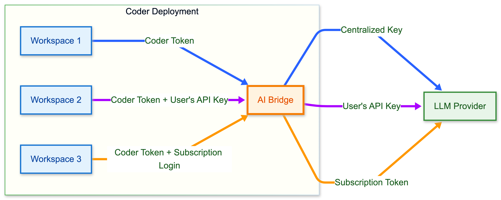

> [!NOTE]
> AI Gateway is part of [AI Governance](../ai-governance.md), which is
> included with a Premium license.

AI Gateway uses different credentials for different kinds of connections:

- AI clients use a Coder API token to authenticate with AI Gateway as a user.
- Standalone gateway replicas use AI Gateway keys to connect to the Coder control plane.
- AI Gateway uses provider credentials configured by an administrator to authenticate to upstream AI providers.
- In [Bring Your Own Key (BYOK)](#bring-your-own-key-byok) mode, a user also supplies a personal provider credential or subscription token.

These credentials are not interchangeable.
A gateway key does not authenticate an AI client, and a Coder API token does not authenticate a standalone replica.

## Authenticate AI clients

AI Gateway authenticates clients with the same Coder API token that a user uses for the rest of the Coder API.
No separate AI Gateway login is required for client traffic.
For token creation, expiration, and revocation, refer to [Sessions and API tokens](../../admin/users/sessions-tokens.md).

Authenticating with a Coder token avoids distributing centralized provider API keys, such as OpenAI or Anthropic keys, to individual users.
AI Gateway handles upstream credentials centrally and forwards each request to the configured provider on the user's behalf.

The exact environment variable or setting name differs between tools.
Refer to the list of [supported clients](./clients/index.md) and your tool's documentation for details.

### Create a Coder API token

You can generate a token from the Coder dashboard or the CLI.

From the dashboard, go to **Account settings** > **Tokens** and create a new token.
For long-lived tokens, refer to [Sessions and API tokens](../../admin/users/sessions-tokens.md#generate-a-long-lived-api-token-on-behalf-of-yourself).
For headless or service-account use, refer to [Headless authentication](../../admin/users/headless-auth.md).

From the CLI, print your current session token with [`coder login token`](../../reference/cli/login_token.md):

```sh
coder login token
```

Or create a new long-lived token with a name and lifetime:

```sh
coder tokens create --lifetime 30d -n my-ai-token
```

Use short lifetimes for automation and CI to limit the blast radius if a token leaks.

### Retrieve your session token

If you're logged in with the Coder CLI, retrieve your current session token with [`coder login token`](../../reference/cli/login_token.md):

```sh
export ANTHROPIC_API_KEY=$(coder login token)
export ANTHROPIC_BASE_URL="https://coder.example.com/api/v2/ai-gateway/anthropic"
```

### AI Gateway Proxy authentication

For tools that don't support a configurable base URL,
[AI Gateway Proxy](./ai-gateway-proxy/index.md) intercepts traffic and forwards it to AI Gateway.
The Coder token is supplied in the proxy URL:

```sh
export HTTPS_PROXY="https://coder:$(coder login token)@<proxy-host>:8888"
```

The client machine also needs to trust the proxy's CA certificate.
For full setup, refer to [AI Gateway Proxy setup](./ai-gateway-proxy/setup.md).

## Authenticate standalone gateway replicas

AI Gateway keys are scoped to the Coder deployment.
A [standalone AI gateway](./standalone.md) uses one of these keys to connect to `coderd`.
Only the built-in **owner** role can create, list, and delete these keys.
Coder custom roles are organization-scoped and cannot grant the site-level `ai_gateway_key` permissions.

Create a key with a descriptive name:

```sh
coder ai-gateway keys create standalone-production
```

The command displays the plaintext key once.
Save it immediately in your secret manager, because you cannot retrieve it later.
Coder stores only a short prefix of the key for display and a SHA-256 hash for authentication, never the full secret.

Names must be unique, 64 characters or fewer, and use only lowercase letters, numbers, and hyphens.
A name cannot start or end with a hyphen or contain consecutive hyphens.
Gateway keys do not expire and cannot be scoped or restricted.

Configure the standalone process with either of the following options, but not both:

- `CODER_AI_GATEWAY_KEY` or `--key` supplies the key directly.
- `CODER_AI_GATEWAY_KEY_FILE` or `--key-file` reads the key from a file.

A user login and `CODER_SESSION_TOKEN` are not used by `coder ai-gateway start`.
The same gateway key can authenticate multiple replicas.
Separate keys make it easier to rotate or revoke each deployment independently.

List keys and the most recent heartbeat for each:

```sh
coder ai-gateway keys list
```

A replica records a heartbeat when its control connection is established, then refreshes it every 60 seconds while that connection is active.
The heartbeat reports control-connection liveness rather than client request volume.
Coder stores one timestamp per key, so replicas that share a key cannot be distinguished.

For usage and flags, refer to the generated CLI reference for [creating](../../reference/cli/ai-gateway_keys_create.md), [listing](../../reference/cli/ai-gateway_keys_list.md), and [deleting](../../reference/cli/ai-gateway_keys_delete.md) gateway keys.

### Rotate a gateway key

Rotate a key with a rolling restart.
Run more than 1 replica behind a load balancer so client traffic continues during the rollout:

1. Create a new gateway key.
1. Update the Kubernetes Secret, environment variable, or key file used by every replica.
1. Restart or roll out the standalone deployment so every replica uses the new key.
1. Verify readiness and confirm that the new key has a recent heartbeat.
1. Delete the old key.

Delete a key by name or ID:

```sh
coder ai-gateway keys delete standalone-production
```

Add `--yes` to skip the confirmation prompt in automation.

Deleting a key rejects new connections immediately.
An established session closes when its next heartbeat detects the deletion, within 60 seconds.
The replica then tries to reconnect, receives HTTP 401, and treats that as fatal: the process exits non-zero rather than retrying.
Stop or update every replica before deleting its key for an orderly rotation.

## Authenticate to upstream providers

Administrators configure provider credentials in the Coder dashboard or with the [AI Providers API](../../reference/api/aiproviders.md).
Standalone replicas fetch this provider configuration from `coderd`, so do not copy centralized provider credentials into each standalone deployment.

For provider setup and credential failover, refer to [Provider configuration](./providers.md).

## Bring Your Own Key (BYOK)

In addition to centralized key management, AI Gateway supports Bring Your Own Key (BYOK) mode.
Users can provide their own LLM API keys or provider subscriptions,
such as Claude Pro or Max and ChatGPT Plus or Pro,
while AI Gateway continues to provide observability and governance.



In BYOK mode, users need two credentials:

- A Coder API token to authenticate with AI Gateway.
- Their own LLM credential, such as a personal API key or subscription token, which AI Gateway forwards to the upstream provider.

BYOK and centralized modes can be used together.
When a user provides their own credential, AI Gateway forwards it directly.
When no user credential is present, AI Gateway uses the administrator-configured provider key.
This approach offers centralized keys as a default
while allowing individual users to bring their own key.

> [!NOTE]
> When a BYOK credential is present, [key failover](./providers.md#key-failover)
> is skipped.

Coder Agents requests routed through AI Gateway are in-process control plane requests, not external client requests that send their own AI Gateway bearer token.
Coder Agents use the same global BYOK setting.
When BYOK is enabled, users can save personal API keys for any enabled AI provider from the Agents settings page.
Refer to [Agents credential selection](../agents/models.md#credential-selection) for the Agents-specific behavior.

Visit individual [client pages](./clients/index.md) for configuration details.

### Enable or disable BYOK

BYOK is enabled by default.
Administrators can disable it for the embedded gateway with `--ai-gateway-allow-byok=false` or `CODER_AI_GATEWAY_ALLOW_BYOK=false`:

```sh
coder server --ai-gateway-allow-byok=false
```

For a standalone gateway, set the option on each replica:

```sh
CODER_AI_GATEWAY_ALLOW_BYOK=false coder ai-gateway start
```

Each replica enforces its own local value, which governs only the traffic that replica handles.
The standalone process does not receive the `coderd` value, so set the option on every replica that should reject BYOK requests.
When disabled, BYOK requests are rejected with a `403 Forbidden` response, and only centralized provider credentials are permitted.
