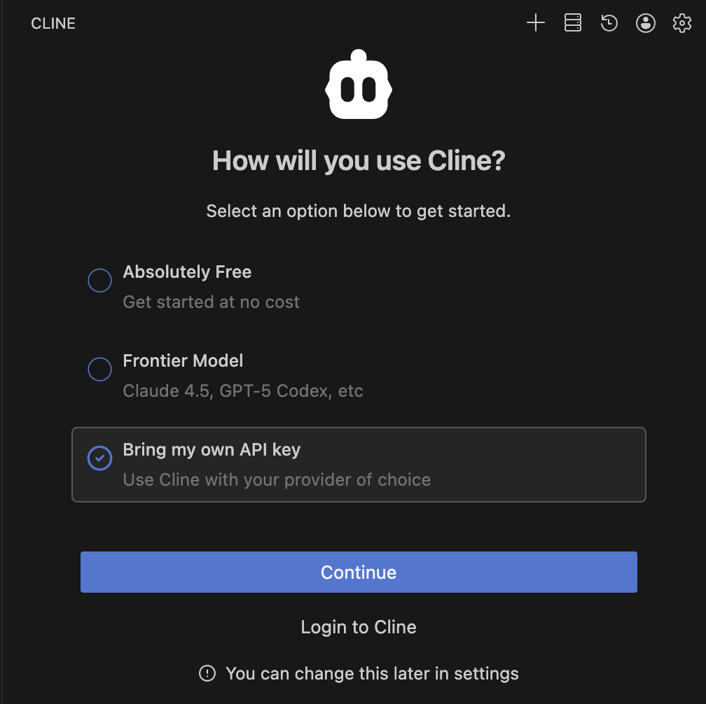
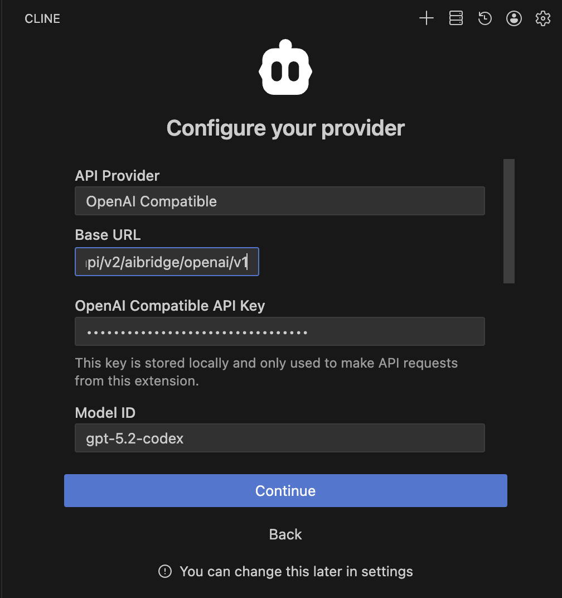
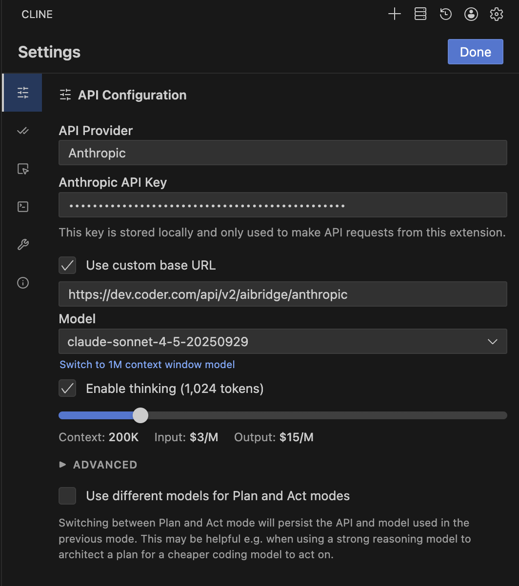
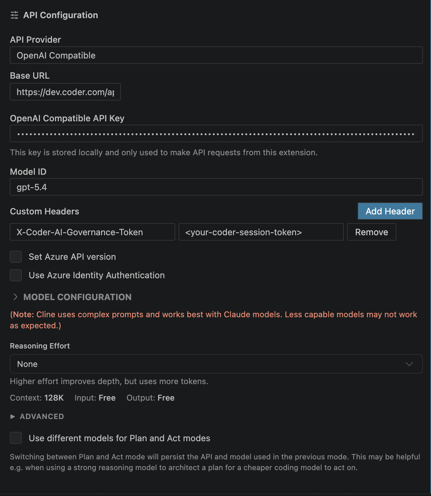

# Cline

Cline supports both OpenAI and Anthropic models and can be configured to use AI Gateway by setting providers.

## Configuration

To configure Cline to use AI Gateway, follow these steps:

## Centralized API Key

### OpenAI Compatible

1. Open Cline in VS Code.
1. Go to **Settings**.
1. **API Provider**: Select **OpenAI Compatible**.
1. **Base URL**: Enter `https://coder.example.com/api/v2/aibridge/openai/v1`.
1. **OpenAI Compatible API Key**: Enter your **[Coder Session Token](../../../admin/users/sessions-tokens.md#generate-a-long-lived-api-token-on-behalf-of-yourself)**.
1. **Model ID** (Optional): Enter the model you wish to use (e.g., `gpt-5.2-codex`).

### Anthropic

1. Open Cline in VS Code.
1. Go to **Settings**.
1. **API Provider**: Select **Anthropic**.
1. **Anthropic API Key**: Enter your **Coder Session Token**.
1. **Base URL**: Enter `https://coder.example.com/api/v2/aibridge/anthropic` after checking **_Use custom base URL_**.
1. **Model ID** (Optional): Select your desired Claude model.

## BYOK (Personal API Key)

### OpenAI Compatible

1. Open Cline in VS Code.
1. Go to **Settings**.
1. **API Provider**: Select **OpenAI Compatible**.
1. **Base URL**: Enter `https://coder.example.com/api/v2/aibridge/openai/v1`.
1. **OpenAI Compatible API Key**: Enter your personal OpenAI API key.
1. **Model ID** (Optional): Enter the model you wish to use (e.g., `gpt-5.2-codex`).
1. **Custom Headers**: Add `X-Coder-AI-Governance-Token` with your **[Coder Session Token](../../../admin/users/sessions-tokens.md#generate-a-long-lived-api-token-on-behalf-of-yourself)**.

**References:** [Cline Configuration](https://github.com/cline/cline)
