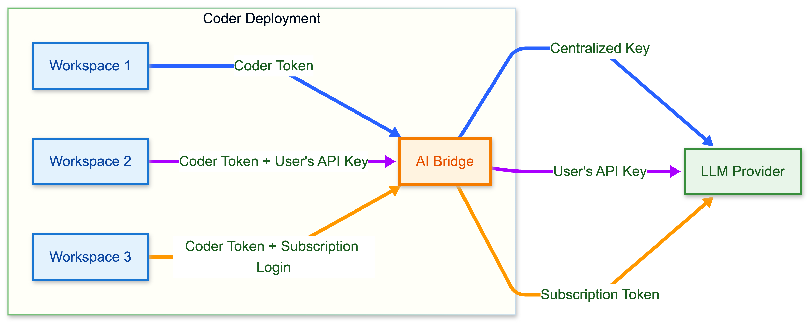

# Client Configuration

Once AI Gateway is setup on your deployment, the AI coding tools used by your users will need to be configured to route requests via AI Gateway.

There are two ways to connect AI tools to AI Gateway:

- Base URL configuration (Recommended): Most AI tools allow customizing the base URL for API requests. This is the preferred approach when supported.
- AI Gateway Proxy: For tools that don't support base URL configuration, [AI Gateway Proxy](../ai-gateway-proxy/index.md) can intercept traffic and forward it to AI Gateway.

## Base URLs

Most AI coding tools allow the "base URL" to be customized. In other words, when a request is made to OpenAI's API from your coding tool, the API endpoint such as [`/v1/chat/completions`](https://platform.openai.com/docs/api-reference/chat) will be appended to the configured base. Therefore, instead of the default base URL of `https://api.openai.com/v1`, you'll need to set it to `https://coder.example.com/api/v2/aibridge/openai/v1`.

The exact configuration method varies by client — some use environment variables, others use configuration files or UI settings:

- **OpenAI-compatible clients**: Set the base URL (commonly via the `OPENAI_BASE_URL` environment variable) to `https://coder.example.com/api/v2/aibridge/openai/v1`
- **Anthropic-compatible clients**: Set the base URL (commonly via the `ANTHROPIC_BASE_URL` environment variable) to `https://coder.example.com/api/v2/aibridge/anthropic`

Replace `coder.example.com` with your actual Coder deployment URL.

## Authentication

Instead of distributing provider-specific API keys (OpenAI/Anthropic keys) to users, they authenticate to AI Gateway using their **Coder session token** or **API key**:

- **OpenAI clients**: Users set `OPENAI_API_KEY` to their Coder session token or API key
- **Anthropic clients**: Users set `ANTHROPIC_API_KEY` to their Coder session token or API key

> [!NOTE]
> Only Coder-issued tokens can authenticate users against AI Gateway.
> AI Gateway will use provider-specific API keys to [authenticate against upstream AI services](../setup.md#configure-providers).

Again, the exact environment variable or setting naming may differ from tool to tool. See a list of [supported clients](#all-supported-clients) below and consult your tool's documentation for details.

### Retrieving your session token

If you're logged in with the Coder CLI, you can retrieve your current session
token using [`coder login token`](../../../reference/cli/login_token.md):

```sh
export ANTHROPIC_API_KEY=$(coder login token)
export ANTHROPIC_BASE_URL="https://coder.example.com/api/v2/aibridge/anthropic"
```

Alternatively, [generate a long-lived API token](../../../admin/users/sessions-tokens.md#generate-a-long-lived-api-token-on-behalf-of-yourself) via the Coder dashboard.

## Bring Your Own Key (BYOK)

In addition to centralized key management, AI Gateway supports **Bring Your
Own Key** (BYOK) mode. Users can provide their own LLM API keys or use
provider subscriptions (such as Claude Pro/Max or ChatGPT Plus/Pro) while
AI Gateway continues to provide observability and governance.



In BYOK mode, users need two credentials:

- A **Coder session token** to authenticate with AI Gateway.
- Their **own LLM credential** (personal API key or subscription token) which AI Gateway forwards
  to the upstream provider.

BYOK and centralized modes can be used together. When a user provides
their own credential, AI Gateway forwards it directly. When no user
credential is present, AI Gateway falls back to the admin-configured
provider key. This lets organizations offer centralized keys as a default
while allowing individual users to bring their own.

See individual client pages for configuration details.

## Compatibility

The table below shows tested AI clients and their compatibility with AI Gateway.

| Client                           | OpenAI | Anthropic | Notes                                                                                                                                                  |
|----------------------------------|--------|-----------|--------------------------------------------------------------------------------------------------------------------------------------------------------|
| [Mux](./mux.md)                  | ✅      | ✅         |                                                                                                                                                        |
| [Claude Code](./claude-code.md)  | -      | ✅         |                                                                                                                                                        |
| [Codex CLI](./codex.md)          | ✅      | -         |                                                                                                                                                        |
| [OpenCode](./opencode.md)        | ✅      | ✅         |                                                                                                                                                        |
| [Factory](./factory.md)          | ✅      | ✅         |                                                                                                                                                        |
| [Cline](./cline.md)              | ✅      | ✅         |                                                                                                                                                        |
| [Kilo Code](./kilo-code.md)      | ✅      | ✅         |                                                                                                                                                        |
| [Roo Code](./roo-code.md)        | ✅      | ✅         |                                                                                                                                                        |
| [VS Code](./vscode.md)           | ✅      | ❌         | Only supports Custom Base URL for OpenAI.                                                                                                              |
| [JetBrains IDEs](./jetbrains.md) | ✅      | ❌         | Works in Chat mode via "Bring Your Own Key".                                                                                                           |
| [Zed](./zed.md)                  | ✅      | ✅         |                                                                                                                                                        |
| [GitHub Copilot](./copilot.md)   | ⚙️     | -         | Requires [AI Gateway Proxy](../ai-gateway-proxy/index.md). Uses per-user GitHub tokens.                                                                |
| WindSurf                         | ❌      | ❌         | No option to override base URL.                                                                                                                        |
| Cursor                           | ❌      | ❌         | Override for OpenAI broken ([upstream issue](https://forum.cursor.com/t/requests-are-sent-to-incorrect-endpoint-when-using-base-url-override/144894)). |
| Sourcegraph Amp                  | ❌      | ❌         | No option to override base URL.                                                                                                                        |
| Kiro                             | ❌      | ❌         | No option to override base URL.                                                                                                                        |
| Gemini CLI                       | ❌      | ❌         | No Gemini API support. Upvote [this issue](https://github.com/coder/aibridge/issues/27).                                                               |
| Antigravity                      | ❌      | ❌         | No option to override base URL.                                                                                                                        |
|

*Legend: ✅ supported, ⚙️ requires AI Gateway Proxy, ❌ not supported, - not applicable.*

## Configuring In-Workspace Tools

AI coding tools running inside a Coder workspace, such as IDE extensions, can be configured to use AI Gateway.

While users can manually configure these tools with a long-lived API key, template admins can provide a more seamless experience by pre-configuring them. Admins can automatically inject the user's session token with `data.coder_workspace_owner.me.session_token` and the AI Gateway base URL into the workspace environment.

In this example, Claude Code respects these environment variables and will route all requests via AI Gateway.

```hcl
data "coder_workspace_owner" "me" {}

data "coder_workspace" "me" {}

resource "coder_agent" "dev" {
    arch = "amd64"
    os   = "linux"
    dir  = local.repo_dir
    env = {
        ANTHROPIC_BASE_URL : "${data.coder_workspace.me.access_url}/api/v2/aibridge/anthropic",
        ANTHROPIC_AUTH_TOKEN : data.coder_workspace_owner.me.session_token
    }
    ... # other agent configuration
}
```

## External and Desktop Clients

You can also configure AI tools running outside of a Coder workspace, such as local IDE extensions or desktop applications, to connect to AI Gateway.

The configuration is the same: point the tool to the AI Gateway [base URL](#base-urls) and use a Coder API key for authentication.

Users can generate a long-lived API key from the Coder UI or CLI. Follow the instructions at [Sessions and API tokens](../../../admin/users/sessions-tokens.md#generate-a-long-lived-api-token-on-behalf-of-yourself) to create one.

## All Supported Clients

<children></children>
