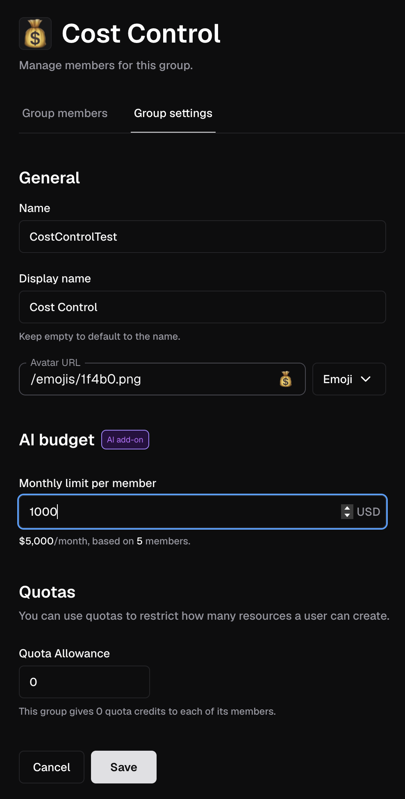
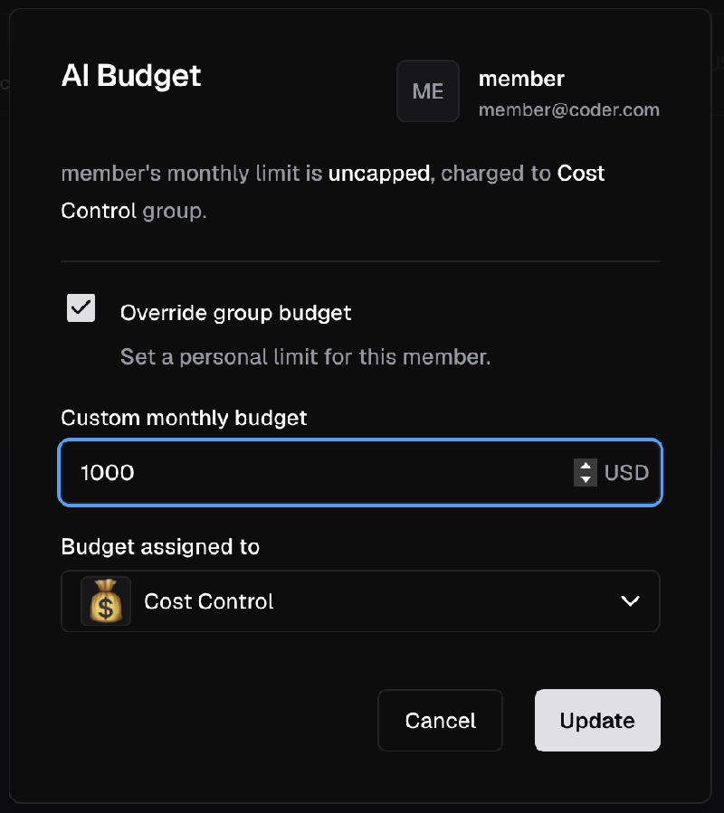

# AI Governance Cost Control

> [!NOTE]
> AI Gateway is part of [AI Governance](../ai-governance.md), which is
> included with a Premium license.

AI Governance Cost Control governs AI spend in two complementary ways:

- **Enforcement** stops a user's requests routed via AI Gateway once their
  spend reaches their budget.
- **Reporting** shows what each user and group has approximately spent in the
  current budget period.

AI Governance Cost Control requires:

- Coder v2.36 or later.
- AI Gateway [enabled and configured](./setup.md) with at least one provider.

> [!NOTE]
> AI Governance Cost Control reports approximate spend rather than billed cost.
> These figures will not match your provider invoices exactly. For details, visit [How spend is calculated](#how-spend-is-calculated).

These terms appear throughout this page and in the Coder dashboard:

| Term                  | What it means                                                                         | Where it is set                        |
|-----------------------|---------------------------------------------------------------------------------------|----------------------------------------|
| **Budget period**     | The window spend accumulates in before it resets. Defaults to the UTC calendar month. | Deployment settings                    |
| **Budget policy**     | The rule that selects a user's effective group. Defaults to the highest budget.       | Deployment settings                    |
| **Group budget**      | A spend limit granted to each member of a group.                                      | **Groups** > {group} > **Settings**    |
| **User override**     | A spend limit for one user that supersedes their group budget.                        | **Groups** > {group} > **Members** tab |
| **Effective group**   | The group that supplies a user's budget and has their spend associated with it.       | Resolved automatically                 |
| **Approximate spend** | A user's approximate spend in the current budget period.                              | Calculated from usage                  |

## Deployment settings

Two deployment-wide settings govern budget resolution and the reset window. Each
accepts a single value today.

| Setting       | Flag                 | Environment variable     | Supported values | Default   |
|---------------|----------------------|--------------------------|------------------|-----------|
| Budget policy | `--ai-budget-policy` | `CODER_AI_BUDGET_POLICY` | `highest`        | `highest` |
| Budget period | `--ai-budget-period` | `CODER_AI_BUDGET_PERIOD` | `month`          | `month`   |

- **Budget policy** determines which budget wins when a user belongs to more
  than one budgeted group. `highest` selects the largest.
- **Budget period** sets the reset window. `month` is the UTC calendar month, so
  spend resets at 00:00 UTC on the first day of each month.

These settings are deployment-wide.

## Budget

**Every user's spend is recorded against a group.** A user only has a budget
when one is set on a group they belong to, or when they are given a user
override.

> [!NOTE]
> When AI Governance Cost Control is first deployed, users have **unlimited
> spend** until an administrator sets budgets. Their spend is recorded against
> the `Everyone` group.

### Group budget

Setting a group budget requires the Owner, User Admin, Organization Admin, or
Organization User Admin [role](../../admin/users/groups-roles.md).

A group budget applies to each member individually rather than to the group as a
whole. For example, if a group has ten members and a budget of $200 USD, each
member can spend $200 USD and the group has a total spend limit of $2,000 USD.

1. Go to **Groups** and select a group.
1. Select **Settings**.
1. Under **AI budget**, set **Monthly limit per member**.
1. Select **Save**.



Budget values behave as follows:

- An empty field means no limit. The field displays `unlimited`.
- `$0 USD` blocks every request routed via AI Gateway from members whose
  effective group is this group.
- The maximum is `$1,000,000 USD` per member per budget period.

Note: Members who belong to other groups with budgets are still governed by
whichever group the budget policy selects. See
[Effective group resolution](#effective-group-resolution).

### User override

Adding or removing an override requires the Owner or User Admin
[role](../../admin/users/groups-roles.md). Other administrator roles can view
overrides but cannot change them.

Override a group budget when one user needs a different limit from the rest of
their group.

1. Go to **Groups**, select a group, then open the **Members** tab.
1. Find the member to apply the override to, open their action menu, and select
   **Manage AI budget**.
1. Enable **Override group budget**.
1. Set **Custom monthly budget**, then choose the group in
   **Budget assigned to**.
1. Select **Update**.



Overrides behave as follows:

- A user can have only one override at a time.
- An override supersedes every group budget the user belongs to.
- Spend is always attributed to a group, so an override must name the assigned
  group. This group can be different from the group selected in the **Members**
  tab. The user must belong to the assigned group.
- The `$0 USD` to `$1,000,000 USD` range applies to overrides as well.
- Disabling **Override group budget** removes the override and returns the user
  to the budget of their [effective group](#effective-group-resolution).

### Effective group resolution

A user can belong to several groups that have budgets, and can also hold an
override. AI Gateway resolves a single effective group for each request, in this
order:

1. The user's [override](#user-override) takes precedence over every group
   budget.
1. Otherwise, the [budget policy](#deployment-settings) selects one of the
   groups the user belongs to. The default policy, `highest`, selects the group
   with the largest budget.
1. If none of those groups has a budget, the user has *effectively* unlimited
   spend and their spend is recorded against the `Everyone` group.

> [!NOTE]
> Groups with identical budgets are ranked by the organization membership the
> user joined first, then by group ID. To see the effective group currently
> assigned to a user, see [Monitor spend](#monitor-spend). The effective group is
> deployment-wide, so it can be a group in a different organization.

Recorded spend is immutable. Changing which budget applies to a user affects
future requests only: spend that Coder has already recorded stays with the group
it was attributed to, so a user's history can span several groups. The effective
group is resolved at request time, so changing a group budget can change which
group applies to a user on future requests.

## How enforcement works

AI Gateway checks each request before forwarding it upstream. The check compares
the user's spend in the current budget period with the budget that applies to the
request:

- Spend below the budget: the request proceeds.
- Spend at or above the budget: AI Gateway returns `403 Forbidden` with a
  message that describes the issue.

Users without a budget have **unlimited spend**, so their requests proceed
without enforcement. A blocked user's access resumes when the budget period
resets, when an administrator raises the budget, or when an override is added.

> [!NOTE]
> Enforcement is approximate. A request's cost is known only after the provider
> response reaches AI Gateway, so concurrent in-flight requests can carry a user
> slightly past their budget. Subsequent requests are blocked after the recorded
> spend reaches the budget.

### Notifications

The first time a user's spend crosses a threshold within a budget period, Coder
notifies the user and deployment-wide Owners and User Admins, excluding the
affected user:

| Threshold | User notification              | Admin notification                       |
|-----------|--------------------------------|------------------------------------------|
| 85%       | You're approaching your budget | `<username>` is approaching their budget |
| 100%      | You've reached your budget     | `<username>` has reached their budget    |

- A single expensive request can cross both thresholds at once.
- Budgets of `$0 USD` and unpriced usage cross no thresholds.
- Notifications are informational. Enforcement does not depend on them.

For delivery methods, see
[Notifications](../../admin/monitoring/notifications/index.md).

## How spend is calculated

Coder multiplies the token usage of each request by the published price of the
model that served it. Prices come from a curated [models.dev](https://models.dev)
snapshot that ships with every Coder release, so no configuration is required.

Spend accumulates only from the moment v2.36 is deployed. Upgrading mid-month
therefore produces a partial first period.

To see which models are priced in the release version you run, consult the
price book for your Coder version:

```text
https://github.com/coder/coder/blob/release/<VERSION>/coderd/aibridge/prices/data/prices.json
```

Replace `<VERSION>` with your Coder minor version, for example `2.36`.

> [!IMPORTANT]
> Approximate spend can differ from provider-reported amounts, and some usage might not count toward spend:
>
> - Approximate spend excludes negotiated discounts, committed-use pricing, and
>   provider-specific billing rules.
> - Requests to models that are missing from the price table record token usage
>   but add nothing to a user's spend. A user who only calls unpriced models is
>   effectively unlimited.

Monitor `coder_ai_gateway_cost_control_unpriced_token_usage_records_total`,
labeled by `provider`, `provider_type`, and `model`, to detect unpriced usage.
Use the `(provider_type, model)` tuple to find the price to set. Any non-zero
value means spend is under-counted. Because the price book ships with the
release, a newly launched model is unpriced until you upgrade Coder or set a
price for it yourself.

### Set model prices

Use the experimental `coder exp ai-model-prices` command to set prices for
models the price book does not cover. It requires AI Governance, which is
included with a Premium license, and the `ai_model_price:update` permission.
Run `coder exp ai-model-prices --help` for the full reference.

List the prices this deployment holds, optionally narrowed to one provider or
model:

```sh
coder exp ai-model-prices list --provider anthropic
```

Price a single model. Prices are micro-units per million tokens, so `3000000`
is $3.00 per million tokens. Use `null` for a price you do not have, and `0` to
declare a model free:

```sh
coder exp ai-model-prices update --provider anthropic --model my-model \
  --input-price 3000000 --output-price 15000000 \
  --cache-read-price null --cache-write-price null
```

Price several models at once from a JSON document in the same shape as the
price book:

```sh
coder exp ai-model-prices update prices.json
```

> [!IMPORTANT]
>
> - Prices are not retroactive. Usage recorded before you set a price stays
>   unpriced, so past spend does not change.
> - You can only set prices for models the price book does not cover.
> - This command is experimental and can change without notice.

## Monitor spend

Spend reporting is available in the Coder dashboard and as a CSV export.
Prometheus metrics report enforcement and pricing gaps.

### Dashboard

Visibility follows the viewer's role:

| Who                                                  | Sees                                                                 |
|------------------------------------------------------|----------------------------------------------------------------------|
| Every user                                           | Their own spend and budget, or unlimited state, in their avatar menu |
| Members of a group                                   | The group's spend and budget, and their own member row               |
| Owners, User Admins, and organization administrators | Spend and budgets for every group and every member                   |

- The **Groups** page compares each group's spend with the combined limits of
  the members it covers.
- The **Members** tab of a group reports each member's spend, their budget, and
  its source, labeled `Custom limit` for an override or `Group limit` for a
  group budget. If the effective group is another group in the same organization,
  the row shows `Budget managed by another group`. If the effective group is in a
  different organization, the row shows a dash and explains that the group is not
  visible there. Because the organization's `Everyone` group includes every
  member, its **Members** tab is a quick way to look up any user's effective
  group.
- The avatar menu reports the signed-in user's own spend for the budget period
  as `$<spend> / $<budget> USD`, or `$<spend> / Unlimited USD` when no budget
  applies.

Administrators can also use the
[Get user AI spend](../../reference/api/enterprise.md#get-user-ai-spend) API
endpoint to see a user's current effective group.

### CSV Export

Users who can read group-member data for the organization can export approximate
spend for reporting and internal cost allocation. The export is available through
the API only.

```sh
curl -H "Coder-Session-Token: $CODER_SESSION_TOKEN" \
  "https://coder.example.com/api/v2/organizations/<organization>/ai/spend/export"
```

- Without parameters, the export covers the current budget period.
- To select a range, pass `period_start` and `period_end` together as RFC 3339
  timestamps. A range can span at most 31 days.
- Each row breaks spend down by user, group, model, and provider, with the
  underlying token counts.

### Prometheus Metrics

Prometheus metrics report blocked requests, users over budget, unpriced usage,
and enforcement latency. For the full metric list, including types and labels,
see [Prometheus metrics](../../admin/integrations/prometheus.md).

## Migrate from Coder Agents Cost Control

In v2.36, AI Governance Cost Control replaces Coder Agents Cost Control. The
legacy Coder Agents Spend page remains available until v2.37.

> [!WARNING]
> Spend limits configured under **Admin settings** > **AI** > **Spend** are no
> longer enforced by Coder Agents. To enforce spend, set an AI Governance budget.

To migrate existing limits:

1. Record the limits currently set under **Admin settings** > **AI** >
   **Spend**, including the default limit and any group or user overrides.
1. Recreate group limits as [group budgets](#group-budget).
1. Recreate per-user limits as [user overrides](#user-override).

Expect the following differences:

- No deployment-wide default exists. Each group that needs a limit requires its
  own budget.
- The UTC calendar month is the only period. Daily and weekly periods are not
  currently supported.
- Users in several budgeted groups receive the highest budget. Coder Agents Cost
  Control applied the lowest.
- Budgets cover priced AI Gateway traffic. Chat, IDE extensions, and CLI agents
  draw on the same budget when their provider and model are priced. See
  [How spend is calculated](#how-spend-is-calculated).
- Recorded spend does not carry over. Every user starts the first period at
  $0 USD.
- Coder Agents users who exceed their budget see a usage limit error in chat.
  The error details include the AI Governance budget limit.

## Next steps

- [Monitoring](./monitoring.md)
- [Auditing AI sessions](./audit.md)
- [AI Gateway API reference](../../reference/api/enterprise.md)
