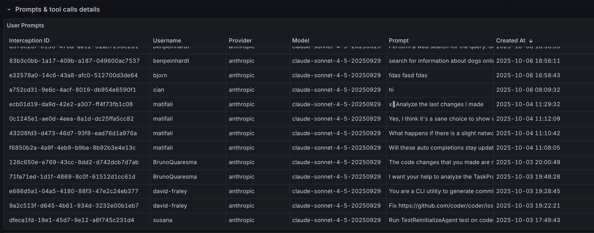
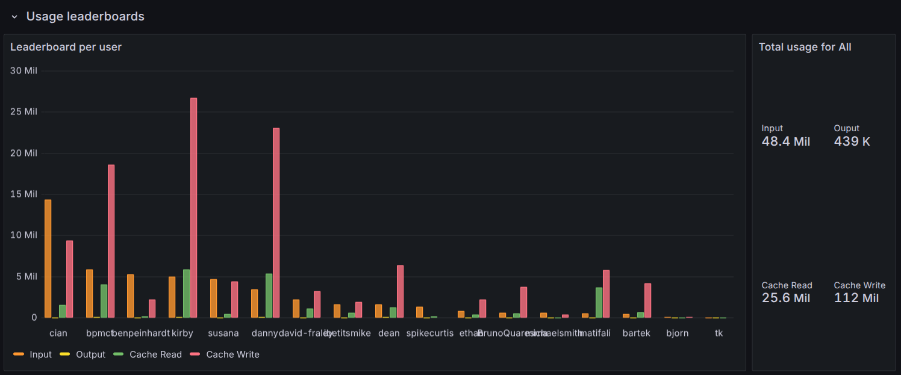
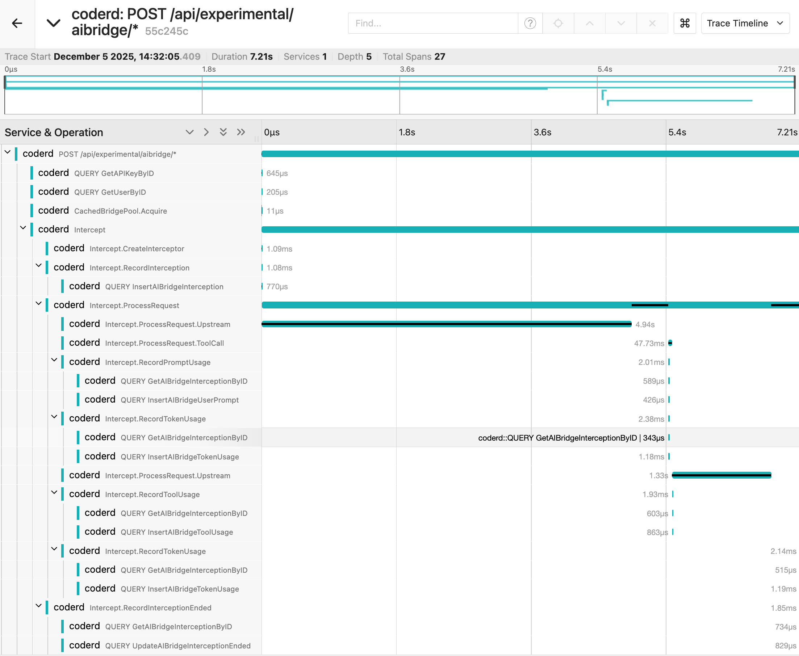

# Monitoring

> [!NOTE]
> AI Gateway requires the [AI Governance Add-On](../ai-governance.md).
> As of Coder v2.32, deployments without the add-on will not be able to
> access AI Gateway.

AI Gateway records the last `user` prompt, token usage, model reasoning, and every tool invocation for each intercepted request. Each capture is tied to a single "interception" that maps back to the authenticated Coder identity, making it easy to attribute spend and behaviour.





We provide an example Grafana dashboard that you can import as a starting point for your metrics. See [the Grafana dashboard README](../../../examples/monitoring/dashboards/grafana/aibridge/README.md).

These logs and metrics can be used to determine usage patterns, track costs, and evaluate tooling adoption.

## Provider metrics

AI Gateway (the in-process daemon) and AI Gateway Proxy (the external
proxy) each export Prometheus metrics describing the configured
provider pool and its reload loop. See
[Provider Configuration](./providers.md) for the lifecycle these
metrics describe.

| Metric                                                                   | Type    | Labels                                     | Purpose                                                                                                                                    |
|--------------------------------------------------------------------------|---------|--------------------------------------------|--------------------------------------------------------------------------------------------------------------------------------------------|
| `coder_ai_gateway_provider_info`                                         | gauge   | `provider_name`, `provider_type`, `status` | One series per configured provider. Value is always `1`; the `status` label (`enabled`, `disabled`, `error`) carries the alertable signal. |
| `coder_ai_gateway_providers_last_reload_timestamp_seconds`               | gauge   |                                            | Unix timestamp of the last reload attempt, success or failure.                                                                             |
| `coder_ai_gateway_providers_last_reload_success_timestamp_seconds`       | gauge   |                                            | Unix timestamp of the last reload that successfully refreshed the pool.                                                                    |
| `coder_ai_gateway_proxy_provider_info`                                   | gauge   | `provider_name`, `provider_type`, `status` | Same shape as `coder_ai_gateway_provider_info` but reported by the external proxy.                                                         |
| `coder_ai_gateway_proxy_providers_last_reload_timestamp_seconds`         | gauge   |                                            | Last reload attempt timestamp in the external proxy.                                                                                       |
| `coder_ai_gateway_proxy_providers_last_reload_success_timestamp_seconds` | gauge   |                                            | Last successful reload timestamp in the external proxy.                                                                                    |
| `coder_ai_gateway_proxy_connect_sessions_total`                          | counter | `type` (`mitm`, `tunneled`)                | CONNECT sessions established by the proxy.                                                                                                 |
| `coder_ai_gateway_proxy_mitm_requests_total`                             | counter | `provider`                                 | MITM requests handled.                                                                                                                     |
| `coder_ai_gateway_proxy_inflight_mitm_requests`                          | gauge   | `provider`                                 | In-flight MITM requests.                                                                                                                   |
| `coder_ai_gateway_proxy_mitm_responses_total`                            | counter | `code`, `provider`                         | MITM responses by HTTP status code.                                                                                                        |

> [!IMPORTANT]
> The AI Gateway metric prefixes were renamed: `coder_aibridged_*` became
> `coder_ai_gateway_*` and `coder_aibridgeproxyd_*` became
> `coder_ai_gateway_proxy_*`. This rename covers every AI Gateway metric,
> including the interception, token, prompt, tool, and circuit-breaker counters
> listed in the [Prometheus reference](../../admin/integrations/prometheus.md).
> The legacy `coder_aibridged_*` and `coder_aibridgeproxyd_*` names are still
> emitted with identical values during the v2.35 and v2.36 deprecation window.
> They are planned for removal in v2.37. Migrate dashboards and alerts to the new
> names now. Do not relabel new names back to old names while legacy names are
> still emitted, because that creates duplicate legacy series in the same scrape.
> After legacy names are removed, use `metric_relabel_configs` only if you need a
> temporary compatibility bridge for dashboards that still use the old names:
>
> ```yaml
> metric_relabel_configs:
>   # Proxy rule must come first; the gateway regex below also matches proxy metrics.
>   - source_labels: [__name__]
>     regex: 'coder_ai_gateway_proxy_(.*)'
>     target_label: __name__
>     replacement: 'coder_aibridgeproxyd_${1}'
>   - source_labels: [__name__]
>     regex: 'coder_ai_gateway_(.*)'
>     target_label: __name__
>     replacement: 'coder_aibridged_${1}'
> ```

### Suggested alerts

Alert on any provider entering a non-`enabled` status:

```promql
sum by (provider_name, status) (coder_ai_gateway_provider_info{status!="enabled"}) > 0
```

Alert when the reload loop is firing but failing to refresh the pool
for longer than a few minutes:

```promql
(coder_ai_gateway_providers_last_reload_timestamp_seconds
  - coder_ai_gateway_providers_last_reload_success_timestamp_seconds) > 300
```

Repeat the same query against `coder_ai_gateway_proxy_*` if you run the
external proxy.

## Structured Logging

AI Gateway can emit structured logs for every interception event to your
existing log pipeline. This is useful for exporting data to external SIEM or
observability platforms. See [Structured Logging](./setup.md#structured-logging)
in the setup guide for configuration and a full list of record types.

## Exporting Data

AI Gateway interception data can be exported for external analysis, compliance reporting, or integration with log aggregation systems.

### REST API

You can retrieve AI Gateway sessions via the Coder API, with filtering and pagination support.

```sh
curl -X GET "https://coder.example.com/api/v2/ai-gateway/sessions" \
  -H "Coder-Session-Token: $CODER_SESSION_TOKEN"
```

Available query filters:

- `client` - Filter by client name.
  <details>
  <summary>Possible <code>client</code> values</summary>

  > [!NOTE]
  > Client classification is done on best effort basis using the `User-Agent` header;
  not all clients send these headers in an easily-identifiable manner.

  - `Claude Code`
  - `Codex`
  - `Zed`
  - `GitHub Copilot (VS Code)`
  - `GitHub Copilot (CLI)`
  - `Kilo Code`
  - `Coder Agents`
  - `Mux`
  - `Cursor`
  - `OpenCode`
  - `Unknown`

  </details><br>
- `initiator` - Filter by user ID or username
- `provider` - Filter by AI provider (e.g., `openai`, `anthropic`)
- `model` - Filter by model name
- `started_after` - Filter sessions after a timestamp
- `started_before` - Filter sessions before a timestamp

See the [API documentation](../../reference/api/aigateway.md) for full details.

## Data Retention

AI Gateway data is retained for **60 days by default**. Configure the retention
period to balance storage costs with your organization's compliance and analysis
needs.

For configuration options and details, see [Data Retention](./setup.md#data-retention)
in the AI Gateway setup guide.

## Tracing

AI Gateway supports tracing via [OpenTelemetry](https://opentelemetry.io/),
providing visibility into request processing, upstream API calls, and MCP server
interactions.

### Enabling Tracing

AI Gateway tracing is enabled when tracing is enabled for the Coder server.
To enable tracing set `CODER_TRACE_ENABLE` environment variable or
[--trace](https://coder.com/docs/reference/cli/server#--trace) CLI flag:

```sh
export CODER_TRACE_ENABLE=true
```

```sh
coder server --trace
```

### What is Traced

AI Gateway creates spans for the following operations:

| Span Name                                   | Description                                          |
|---------------------------------------------|------------------------------------------------------|
| `CachedBridgePool.Acquire`                  | Acquiring a request bridge instance from the pool    |
| `Intercept`                                 | Top-level span for processing an intercepted request |
| `Intercept.CreateInterceptor`               | Creating the request interceptor                     |
| `Intercept.ProcessRequest`                  | Processing the request through the bridge            |
| `Intercept.ProcessRequest.Upstream`         | Forwarding the request to the upstream AI provider   |
| `Intercept.ProcessRequest.ToolCall`         | Executing a tool call requested by the AI model      |
| `Intercept.RecordInterception`              | Recording creating interception record               |
| `Intercept.RecordPromptUsage`               | Recording prompt/message data                        |
| `Intercept.RecordTokenUsage`                | Recording token consumption                          |
| `Intercept.RecordToolUsage`                 | Recording tool/function calls                        |
| `Intercept.RecordInterceptionEnded`         | Recording the interception as completed              |
| `ServerProxyManager.Init`                   | Initializing MCP server proxy connections            |
| `StreamableHTTPServerProxy.Init`            | Setting up HTTP-based MCP server proxies             |
| `StreamableHTTPServerProxy.Init.fetchTools` | Fetching available tools from MCP servers            |

Example trace of an interception using Jaeger backend:



### Capturing Logs in Traces

> [!NOTE]
> Enabling log capture may generate a large volume of trace events.

To include log messages as trace events, enable trace log capture
by setting `CODER_TRACE_LOGS` environment variable or using
[--trace-logs](https://coder.com/docs/reference/cli/server#--trace-logs) flag:

```sh
export CODER_TRACE_ENABLE=true
export CODER_TRACE_LOGS=true
```

```sh
coder server --trace --trace-logs
```
